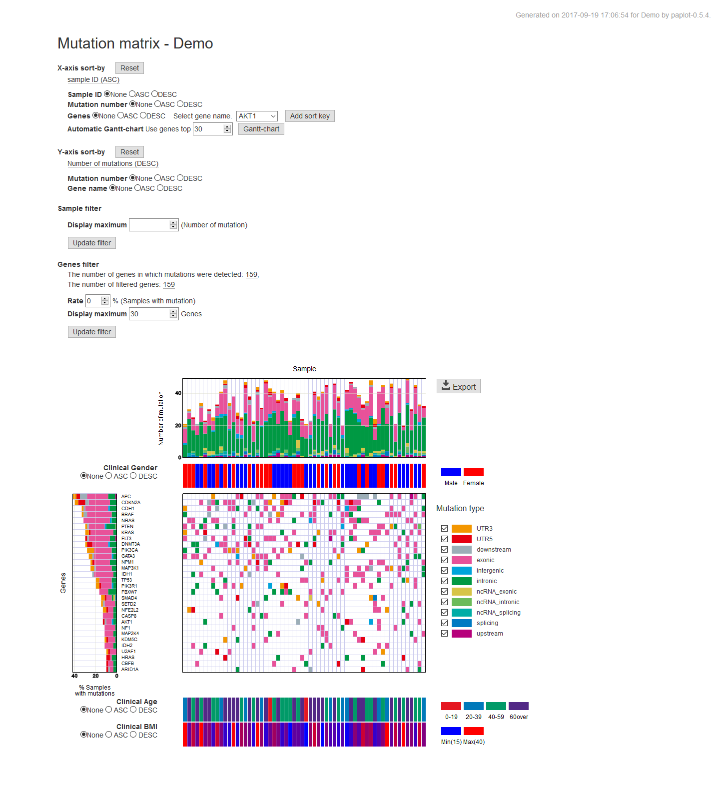

************************
はじめに
************************

| paplotはゲノム解析結果を自動でグラフ化するツールです。
|
| ゲノムを解析して、このようなテキストファイルができたとします。
|

.. image:: image/mutation_list.PNG
  :scale: 100%

| このあと何をしますか？
| グラフを作成しないでしょうか？
| 毎回手動で作成したり、似たようなスクリプトを書いていませんか？
| データの抽出条件、ソート条件を変えて再度グラフを作成していないでしょうか？
|
| paplotはこの作業を自動化して、皆さんのゲノム解析を少しだけ楽にする…かもしれません。
|

作成できるレポートの種類
----------------------------

1. QC (Quality Control) レポート

bamファイルの品質を表示します。

.. image:: image/qc_dummy.PNG
  :scale: 100%

2. CA (Chromosomal Aberration) レポート

Structural Variation (SV) 等、Chromosome間の変異を円形のplotで可視化し、棒グラフでその分布を表示します。

.. image:: image/sv_dummy.PNG
  :scale: 100%

3. mutation-matrix レポート

検出したmutation について縦軸を遺伝子(Gene), 横軸をサンプル(Sample) として、変異タイプ別に表示します。

4. signature レポート

検出したmutation についてsignatureとその集積を積み上げグラフで表示します。

.. image:: image/sig_dummy.PNG
  :scale: 100%

`pmsignature <https://github.com/friend1ws/pmsignature/>`_ を使用した表現も可能です。

.. image:: image/pmsig_dummy.PNG
  :scale: 100%

.. |new| image:: image/tab_001.gif
