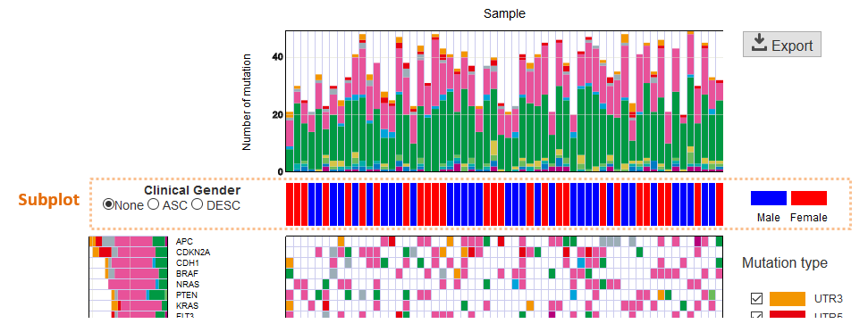
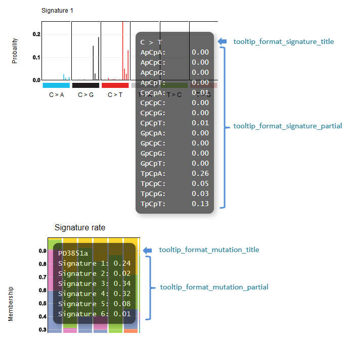
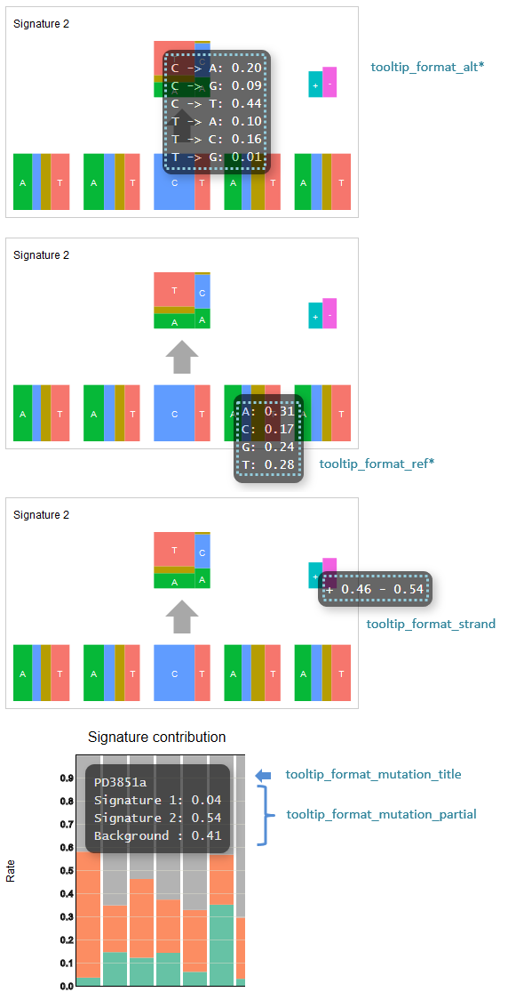

*******************************
設定ファイル解説
*******************************

.. _conf_mm:

=======================
1. Mutation Matrix
=======================

----------------------------------------------------------
全設定項目
----------------------------------------------------------

.. code-block:: cfg

  ###################### Mutation Matrix
  [mutation]
  # 遺伝子のサンプルに対する検出比 (%)
  # 値より小さい遺伝子はプロット対象から除外する
  # 0 の場合はすべて出力する
  use_gene_rate = 0

  # 入力されていた場合、その遺伝子のみ出力する
  # 未入力の場合、検出された遺伝子すべて出力する
  # , 区切りで複数指定可能
  #
  # limited_gene = TP,TTN,APC,BRAF,CDH1,FLT3
  limited_gene = 
  
  # 入力されていた場合、その遺伝子はプロット対象から除外する
  # , 区切りで複数指定可能
  #
  # nouse_gene = NONE,MUC4
  nouse_gene =

  # 入力されていた場合、その変異タイプ (group) のみ出力する
  # 未入力の場合、検出された変異タイプすべて出力する
  # , 区切りで複数指定可能
  #
  # limited_group = exome,splicing
  limited_group = 
  
  # 入力されていた場合、その変異タイプはプロット対象から除外する
  # , 区切りで複数指定可能
  # 空白行を除去する場合、_blank_ と記入する
  nouse_group = _blank_,unknown,synonymous_SNV
  
  # 変異タイプのプロット色を指定する。変異タイプ名:(RGB もしくは色名)
  # , 区切りで複数指定可能
  # 未入力の変異タイプはデフォルト色を使用する
  group_color = stopgain:#E85299,frameshift_deletion:#F39600,frameshift_insertion:#E60011,nonframeshift_deletion:#9CAEB7
  
  # ポップアップの表示内容
  # 詳細は次項目「ポップアップの表示内容」に記載
  tooltip_format_checker_title1 = Sample:{id}, Gene:{gene}, {#sum_item_value}
  tooltip_format_checker_partial = Mutation Type[{group}]
  tooltip_format_gene_title = Gene:{gene}, {#sum_item_value}
  tooltip_format_gene_partial = Mutation Type:{group}, {#item_value}
  tooltip_format_id_title = Sample:{id}, {#sum_item_value}
  tooltip_format_id_partial = Mutation Type:{group}, {#item_value}
  
  # 入力フォーマット (自分のデータに合わせて変更する)
  [result_format_mutation]
  
  # 複数入力時に使用
  suffix = 
  
  # データ区切り
  sept = \t
  
  # ヘッダ有り無し (ない場合はFalse)
  header = True
  
  # コメント行の先頭文字
  comment = #
  
  # 変異タイプが 1 行に複数入力されている場合の区切り文字
  sept_func = ;
  
  # 遺伝子が 1 行に複数入力されている場合の区切り文字
  sept_gene = ;
  
  # -----------------------
  # 使用する列名を定義
  # -----------------------
  # グループ化するデータの列名 (ここでは変異タイプを使用する)
  col_group = MutationType
  # 遺伝子の列名
  col_gene = Gene
  # サンプル名の列名
  col_opt_id = Sample
  
  # 出力フォーマット
  # 通常、変更する必要はありません。
  [merge_format_mutation]
  # カラムがない場合、何で埋めるか
  lack_column_complement = NA

----

.. _mm_tooltip:

----------------------------------------------------------
ポップアップの表示内容
----------------------------------------------------------

表示箇所ごとに6種類設定しますが、書き方は同一です。

**設定項目と表示との対応**

.. image:: image/conf_mut4.PNG
  :scale: 100%

記載方法は `ユーザ定義フォーマット <./data_common.html#user-format>`_ を参照してください。

データ列とは別に以下も特殊キーワードとして使用することができます。

 Mutation Matrixの集計について
 ``limited_group`` や ``nouse_group`` 等のオプションを使用して変異を限定した場合、使用しなかった変異はカウントしません。

:{#number_id}:      サンプル数
:{#number_gene}:    遺伝子数
:{#number_mutaion}: 変異の数 (同一サンプルが同一遺伝子で複数回検出されても1としてカウントする)
:{#sum_mutaion}:    検出した変異の総数
:{#item_value}:     積み上げグラフの1項目の値
:{#sum_item_value}: 積み上げグラフの合計値

----

.. _mm_subplot:

----------------------------------------------
サブプロットとしてクリニカルデータを追加
----------------------------------------------

| `このセクションで生成するレポートを見る <http://genomon-project.github.io/paplot/mutation_subplot/graph_subplot.html>`_ 
| `このセクションで使用するデータセットを見る <https://github.com/Genomon-Project/paplot/blob/master/example/mutation_subplot>`_ 
| `このセクションで使用するデータセットをダウンロードする <https://github.com/Genomon-Project/paplot/blob/master/example/mutation_subplot.zip?raw=true>`_ 

クリニカルデータのような変異以外のサンプルに関する情報をサブプロットとして Mutation Matrix に追加することができます。

example では別ファイルとして以下のデータファイルを用意しています。

.. code-block:: cfg
  :caption: データファイルから一部抜粋 (example/mutation_subplot/data_subplot.csv)
  
  Sample,Gender,Age,BMI
  SAMPLE00,F,30,40
  SAMPLE01,F,62,25
  SAMPLE02,F,59,34
  SAMPLE03,M,66,26
  SAMPLE04,M,53,40
  SAMPLE05,F,79,27
  SAMPLE06,M,64,29
  SAMPLE07,M,54,22
  SAMPLE08,F,55,35

今回の例では、Sample、Gender、Age、BMIを用意していますが、そのうち、必須項目は Sample (サンプル名) です。
変異のファイルとサブデータのファイルがサンプル名で紐づけられることが重要です。

設定ファイルにサブプロットの設定を追加します。

**重要** : path にサブプロットデータファイルのパスを記入してください。

``[mutation_subplot_type1_1]`` セクションを追加し、次のように設定します。

.. code-block:: cfg
  :caption: example/mutation_subplot/paplot.cfg
  
  ### sample for subplot
  [mutation_subplot_type1_1]

  # サブプロットのタイトル
  title = Clinical Gender

  # サブプロットのデータファイルのパスを設定します
  path = {unzip_path}/example/mutation_subplot/data_subplot.csv

  # データ区切り
  sept = ,

  # ヘッダ有り無し (ヘッダがない場合は False)
  header = True

  # コメント行の先頭文字
  comment = 

  # -----------------------
  # 使用する列名を定義
  # -----------------------
  # サンプル名の列名 (ヘッダがない場合は列番号)
  col_id = Sample
  # データの列名
  col_value = Gender
  
  # 表示形式 (欄外参照)
  # fix/range/gradient から選択
  mode = fix
  
  # サブプロットの色と凡例 (欄外参照)
  name_set = M:Male:blue, F:Female:red

サブプロットの表示位置
--------------------------

サブプロットの表示位置は 2 つあり、type1 はサンプルグラフの下に、type2 は最後に表示します。

type1 を表示する場合はセクション名を ``[mut_subplot_type1_*]`` とします。

type2 を表示する場合はセクション名を ``[mut_subplot_type2_*]`` とします。

``*`` には 1 から始まる連番を入れてください。1 から順に上から下へ表示します。

サブプロットの表示形式
--------------------------

表示形式 (mode) は3種類あり、fix/range/gradient から選択します。

.. image:: image/conf_mut3.PNG
  :scale: 100%

name_set の書き方
-----------------------

サブプロットの色と凡例を定義します。

``{値}:{表示文字列}:{セルの色}`` を各値ごとに記入します。``{セルの色}`` は省略可能です。

mode = fix の場合

.. code-block:: cfg
  
  name_set = 0:Male:blue, 1:Female:red, 2:Unknown:gray

mode = range の場合

``{値}`` には範囲開始の値を記入します。

.. code-block:: cfg
  
  name_set = 0:0-19, 20:20-39, 40:40-59, 60:60over

mode = gradient の場合

最初と最後の値を記入します。``{値}`` に MIN/MAX を使用すると、データから自動的に設定します。

.. code-block:: cfg

  # 自動設定の場合
  name_set = MIN:min, MAX:max

  # 手動設定の場合
  name_set = 0:min (0), 40:max (40)
  

編集した設定ファイルを使用して paplot を実行します。

.. code-block:: bash

  paplot mutation {unzip_path}/example/mutation_subplot/data.csv ./tmp mutation_subplot \
  --config_file {unzip_path}/example/mutation_subplot/paplot.cfg

----

.. _conf_qc:

=======================
2. QC
=======================

---------------------------------
全設定項目
---------------------------------

.. code-block:: cfg
  
  ###################### qc
  [qc]
  # (none)
  
  # 入力フォーマット (自分のデータに合わせて変更する)
  [result_format_qc]
  
  # 複数入力時に使用
  suffix = .qc.csv
  
  # データ区切り
  sept = ,
  
  # ヘッダ有り無し (ない場合は False)
  header = True
  
  # コメント行の先頭文字
  comment = #
  
  # 使用する列名を定義
  col_opt_id = Sample
  col_opt_key1 = AverageDepth
  
  # 出力フォーマット
  # 通常、変更する必要はありません。
  [merge_format_qc]
  # カラムがない場合、何で埋めるか
  lack_column_complement = NA
  
  # 領域選択用のグラフ設定
  [qc_chart_brush]
  stack = {key1}
  name_set = Average depth:#E3E5E9
  
  # グラフ設定 (グラフごとに用意する)
  [qc_chart_1]
  title = Depth average
  title_y = Average of depth
  stack1 = {key1}
  name_set = Average depth:#2478B4
  tooltip_format1 = Sample:{id}
  tooltip_format2 = {key1:.2}

----

.. _qc_tooltip:

----------------------------------------
ポップアップの表示内容
----------------------------------------

| 記載方法は `ユーザ定義フォーマット <./data_common.html#user-format>`_ を参照してください。

----

.. _conf_ca:

==================================
3. Chromosomal Aberration
==================================

---------------------------------
全設定項目
---------------------------------

.. code-block:: cfg
  
  ###################### sv
  [genome]
  # ゲノムサイズを羅列したファイル (CSV形式)
  # 初期値は hg19 で 標準ファイルは paplot インストールディレクトリ配下の genome ディレクトリにあります
  #
  # for example.
  # (linux)
  # path = ~/tmp/genome/hg19.csv
  # (windows)
  # path = C:\genome\hg19_part.csv
  path = 
  
  [ca]
  # 使用する染色体 (, で区切る)
  use_chrs = 1,2,3,4,5,6,7,8,9,10,11,12,13,14,15,16,17,18,19,20,21,22,X,Y
  
  # 円形のプロットにて染色体の色を指定する場合、次のようにします (色名もしくは RGB 値が使用可能です)
  # use_chrs = 1:Chr1:crimson, 2:Chr2:lightpink, 3:Chr3:mediumvioletred, 4:Chr4:violet, 5:Chr5:darkmagenta, 6:Chr6:#F39600
  
  # 積み上げグラフの染色体分割サイズ (bps)
  selector_split_size = 5000000
  
  ##################
  # group setting
  # [result_format_ca] col_opt_group が設定されている場合のみ有効
  ##################
  
  # 入力されていた場合、そのグループのみ出力する
  # 未入力の場合、検出されたグループすべて出力する
  # , 区切りで複数指定可能
  #
  limited_group = stopgain,frameshift_deletion,frameshift_insertion
  
  # 入力されていた場合、そのグループはプロット対象から除外する
  # , 区切りで複数指定可能
  # 空白行を除去する場合、_blank_ と記入する
  nouse_group = _blank_,unknown,synonymous_SNV
  
  # グループのプロット色を指定する。グループ名:(色名もしくは RGB 値)
  # , 区切りで複数指定可能
  # 未入力のグループはデフォルト色を使用する
  group_colors = stopgain:#E85299,frameshift_deletion:#F39600,frameshift_insertion:#E60011
  
  # 円形プロットのポップアップ表示内容
  tooltip_format = [{chr1}] {break1:,}; [{chr2}] {break2:,}
  
  # 入力フォーマット (自分のデータに合わせて変更する)
  [result_format_ca]
  
  # 複数入力時に使用
  suffix = .result.txt
  
  # データ区切り
  sept = \t
  
  # ヘッダ有り無し (ヘッダがない場合は False)
  header = True
  
  # コメント行の先頭文字
  comment = #
  
  # -----------------------
  # 使用する列名を定義
  # -----------------------
  
  # 切断点 1 の染色体
  col_chr1 = Chr_1
  
  # 切断点 1 の位置
  col_break1 = Pos_1
  
  # 切断点 2 の染色体
  col_chr2 = Chr_2
  
  # 切断点 2 の位置
  col_break2 = Pos_2
  
  # グループ化するデータの列名
  col_opt_group = 
  
  # サンプル名の列名
  col_opt_id =
  
  # 出力フォーマット
  # 通常、変更する必要はありません。
  [merge_format_ca]
  # カラムがない場合、何で埋めるか
  lack_column_complement = NA
  # データ区切り
  sept = ,

----

.. _ca_usechrs:

---------------------------------
表示する染色体を限定する
---------------------------------

設定ファイルで次の項目を編集してください。

.. code-block:: cfg

  [ca]
  # 使用する染色体 (, で区切る)
  # 初期値
  # use_chrs = 1,2,3,4,5,6,7,8,9,10,11,12,13,14,15,16,17,18,19,20,21,22,X,Y
  
  # 染色体 1、5、7 を使用する場合
  use_chrs = 1,5,7

編集した設定ファイルは次のようにしてコマンドから指定します。

``paplot {input files} {output directory} {title} --config_file {config file}``

----

.. _ca_genome:

-------------------------------
ヒト以外のゲノムを使用する
-------------------------------

ゲノムサイズが入力されたファイルが必要です。

先頭列に染色体名、2 列目にサイズをカンマ ``,`` もしくはタブ区切りで入力してください。

.. code-block:: cfg
  
  1,249250621
  2,243199373
  3,198022430
  7,159138663
  8,146364022
  X,141213431
  Y,135534747
  9_gl000201_random,36148
  11_gl000202_random,40103
  17_gl000204_random,81310
  17_gl000205_random,174588
  Un_gl000214,137718

染色体名は分析したいファイルの Chr1、Chr2 で使用されている名称と同じでなければなりません。

.. image:: image/qa_genome_size.PNG

用意したゲノムサイズのファイルを設定ファイルに指定してください。

.. code-block:: cfg

  [genome]
  # ゲノムサイズのファイル (CSV 形式)
  # 初期値は hg19 で 標準ファイルは paplot インストールディレクトリ配下の genome ディレクトリにあります
  # 
  # for example.
  # (linux)
  # path = ~/tmp/genome/hg19.csv
  # (windows)
  # path = C:\genome\hg19_part.csv
  path = {ここにゲノムサイズのファイルのパスを指定する}

----

.. _ca_tooltip:

----------------------------------------
ポップアップの表示内容
----------------------------------------

| 記載方法は `ユーザ定義フォーマット <./data_common.html#user-format>`_ を参照してください。
| SV には Mutation Matrix のような特殊キーワードはありません。
|

----

.. _conf_signature:

===============================
4. Mutational Signature
===============================

----------------------------------------------------------
全設定項目
----------------------------------------------------------

.. code-block:: cfg
  
  ###################### Mutational Signature
  [signature]

  # ポップアップの表示内容
  tooltip_format_signature_title = {sig}
  tooltip_format_signature_partial = {route}: {#sum_item_value:6.2}
  tooltip_format_mutation_title = {id}
  tooltip_format_mutation_partial = {sig}: {#sum_item_value:.2}
  
  # Mutational Signature のY軸最大値 (-1 の場合、それぞれのデータの最大値を使用する)
  signature_y_max = -1
  
  # signatureのbarの色
  alt_color_CtoA = #1BBDEB
  alt_color_CtoG = #211D1E
  alt_color_CtoT = #E62623
  alt_color_TtoA = #CFCFCF
  alt_color_TtoC = #ACD577
  alt_color_TtoG = #EDC7C4
  
  # 入力フォーマット (自分のデータに合わせて変更する)
  [result_format_signature]

  # 入力形式 (現在は json のみ)
  format = json

  # background を使用しているかどうか
  background = True
  
  # jsonファイルのkey名
  key_id = id
  key_mutation = mutation
  key_signature = signature
  key_mutation_count = mutation_count

----

.. _sig_tooltip:

----------------------------------------------------------
ポップアップの表示内容
----------------------------------------------------------

| 記載方法は `ユーザ定義フォーマット <./data_common.html#user-format>`_ を参照してください。
| 
| 表示箇所ごとに 4 種類設定しますが、書き方は同一です。
| それぞれ次のキーワードが使用できます。
|

**tooltip_format_signature_title**

================== =================================================================
キーワード         解説                                                        
================== =================================================================
{sig}              変異シグネチャの色別グループのラベル。'C > A' や 'C > G' 等
{#sum_group_value} 変異シグネチャの色別グループの合計値
================== =================================================================

**tooltip_format_signature_partial**

================== =================================================================
キーワード         解説                                                        
================== =================================================================
{route}            変異シグネチャの棒グラフ 1 本分のラベル。'ApCpA' や 'CpCpA' 等
{#sum_item_value}  変異シグネチャの棒グラフ 1 本分の値
================== =================================================================

**tooltip_format_mutation_title (積み上げグラフ)**

================== =================================================================
キーワード         解説                                                        
================== =================================================================
{id}               `key_id` で入力したサンプル名です。
{#sum_mutaion_all} 全変異数
================== =================================================================

**tooltip_format_mutation_partial (積み上げグラフ)**

================== ====================================================================
キーワード         解説                                                        
================== ====================================================================
{sig}              変異シグネチャの名前 "Signature {番号}" で表示します。
{#sum_item_value}  積み上げグラフの合計値
================== ====================================================================

**デフォルトでの設定内容と表示との対応**

.. code-block:: cfg

  # 変異シグネチャ - タイトル
  tooltip_format_signature_title = {sig}
  
  # 変異シグネチャ - 各項目
  tooltip_format_signature_partial = {route}: {#sum_item_value:6.2}
  
  # 寄与度グラフ - タイトル
  tooltip_format_mutation_title = {id}
  
  # 寄与度グラフ - 変異シグネチャごと
  tooltip_format_mutation_partial = {sig}: {#sum_item_value:.2}
  

----

.. _conf_pmsignature:

=======================
5. pmsignature
=======================

----------------------------------------------------------
全設定項目
----------------------------------------------------------

.. code-block:: cfg
  
  ###################### pmsignature
  [pmsignature]

  # ポップアップの表示内容
  tooltip_format_ref1 = A: {a:.2}
  tooltip_format_ref2 = C: {c:.2}
  tooltip_format_ref3 = G: {g:.2}
  tooltip_format_ref4 = T: {t:.2}
  tooltip_format_alt1 = C -> A: {ca:.2}
  tooltip_format_alt2 = C -> G: {cg:.2}
  tooltip_format_alt3 = C -> T: {ct:.2}
  tooltip_format_alt4 = T -> A: {ta:.2}
  tooltip_format_alt5 = T -> C: {tc:.2}
  tooltip_format_alt6 = T -> G: {tg:.2}
  tooltip_format_strand = + {plus:.2} - {minus:.2}
  tooltip_format_mutation_title = {id}
  tooltip_format_mutation_partial = {sig}: {#sum_item_value:.2}
  
  # pmsignature の四角形の色
  color_A = #06B838
  color_C = #609CFF
  color_G = #B69D02
  color_T = #F6766D
  color_plus = #00BEC3
  color_minus = #F263E2
  
  # 入力フォーマット (自分のデータに合わせて変更する)
  [result_format_pmsignature]

  # 入力形式 (現在は json のみ)
  format = json

  # background を使用しているかどうか
  background = True

  # json ファイルの key 名
  key_id = id
  key_mutation = mutation
  key_ref = ref
  key_alt = alt
  key_strand = strand
  key_mutation_count = mutation_count

----

.. _pm_tooltip:

----------------------------------------------------------
ポップアップの表示内容
----------------------------------------------------------

| 記載方法は `ユーザ定義フォーマット <./data_common.html#user-format>`_ を参照してください。
| 
| 表示箇所ごとに4種類設定しますが、書き方は同一です。
| それぞれ次のキーワードが使用できます。
|

**tooltip_format_ref* (pmsignature 下段の 5 つの四角形)**

================== ============================================================
キーワード         解説                                                        
================== ============================================================
{a}                A の値
{c}                C の値
{g}                G の値
{t}                T の値
================== ============================================================

**tooltip_format_alt* (pmsignature 上段の 1 つの四角形)**

================== ============================================================
キーワード         解説                                                        
================== ============================================================
{ca}               C → Aの値
{cg}               C → Gの値
{ct}               C → Tの値
{ta}               T → Aの値
{tc}               T → Cの値
{tg}               T → Gの値
================== ============================================================

**tooltip_format_strand**

================== ============================================================
キーワード         解説                                                        
================== ============================================================
{plus}             プラスの値
{minus}            マイナスの値
================== ============================================================

**tooltip_format_mutation_title (積み上げグラフ)**

================== ============================================================
キーワード         解説                                                        
================== ============================================================
{id}               `key_id` で入力したサンプル名です。
{#sum_mutaion_all} 全変異数
================== ============================================================

**tooltip_format_mutation_partial (積み上げグラフ)**

================== ===============================================================
キーワード         解説                                                        
================== ===============================================================
{sig}              変異シグネチャの名前 "Signature {番号}" で表示します。
{#sum_item_value}  積み上げグラフの合計値
================== ===============================================================

**デフォルトでの設定内容と表示との対応**

.. code-block:: cfg

  # pmsignature - 下段の 5 つの四角形
  tooltip_format_ref1 = A: {a:.2}
  tooltip_format_ref2 = C: {c:.2}
  tooltip_format_ref3 = G: {g:.2}
  tooltip_format_ref4 = T: {t:.2}

  # pmsignature - 上段の四角形
  tooltip_format_alt1 = C -> A: {ca:.2}
  tooltip_format_alt2 = C -> G: {cg:.2}
  tooltip_format_alt3 = C -> T: {ct:.2}
  tooltip_format_alt4 = T -> A: {ta:.2}
  tooltip_format_alt5 = T -> C: {tc:.2}
  tooltip_format_alt6 = T -> G: {tg:.2}

  # pmsignature - strand
  tooltip_format_strand = + {plus:.2} - {minus:.2}
  
  # 寄与度グラフ - タイトル
  tooltip_format_mutation_title = {id}
  
  # 寄与度グラフ - 変異シグネチャごと
  tooltip_format_mutation_partial = {sig}: {#sum_item_value:.2}
  

.. |new| image:: image/tab_001.gif
