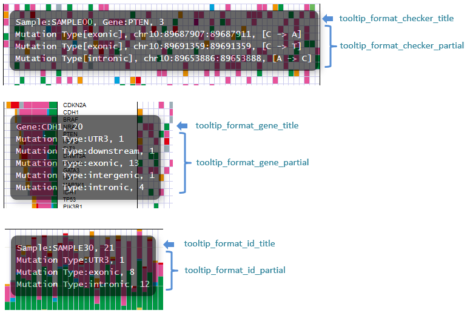
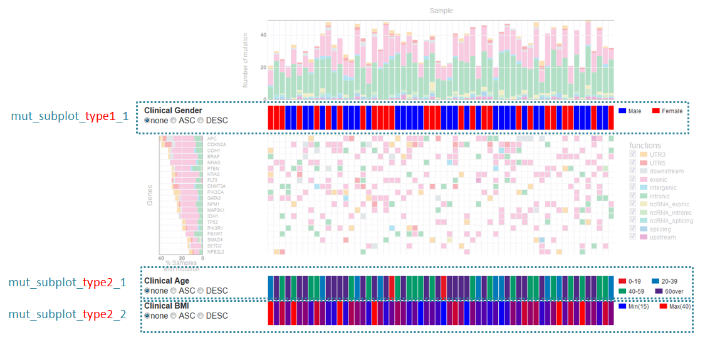
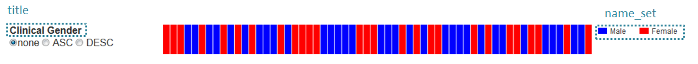
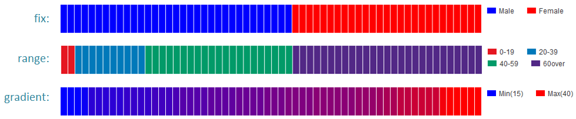
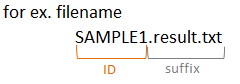
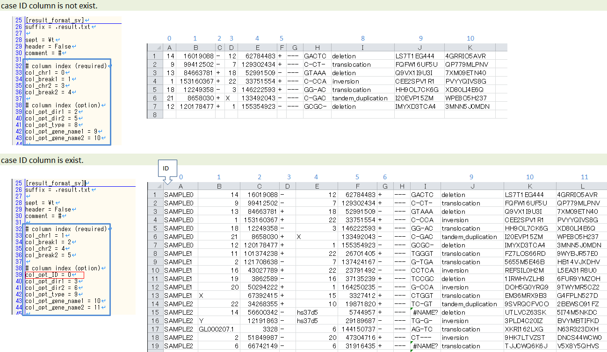

**************************
自分のデータを使用する
**************************

自分のデータを使用するにはconfigファイルを編集して自分のファイルフォーマットを指定します。

configファイルのサンプルは以下にあります。

``{paplotをインストールしたディレクトリ}/example/example.cfg``

Genomonデータを使用する場合は各バージョンの設定ファイルを用意していますので、 :doc:`genomon` 参照してください。

.. warning::
  
  | 必須項目はハイライトで示しています。正しく設定してください。
  | サンプル名の指定方法については、 :ref:`suffixとID<suffix>` も参照してください。

1. 全般
------------

.. code-block:: cfg
  :linenos:

  ###################### general
  [style]
  # グラフのレイアウトファイル
  # ~/tmp/paplot/style/rainbow.js
  path = 
  
  # index.html の備考欄に出力するテキスト(HTMLタブ使用可, 半角英数字のみ)
  remarks = 

2. SV
--------------

.. code-block:: cfg
  :linenos:
  :emphasize-lines: 10,20,28,31,34,41,42,43,44,52
  
  ###################### sv
  [genome]
  # ゲノムサイズのファイル（CSV形式）（デフォルトはhg19, installディレクトリ配下のgenomeディレクトリにあります）
  #
  # for example.
  # (linux)
  # path = ~/tmp/genome/hg19.csv
  # (windows)
  # path = C:\genome\hg19_part.csv
  path = 

  [sv]
  # 使用するchromosomes (,で区切る)
  use_chrs = 1,2,3,4,5,6,7,8,9,10,11,12,13,14,15,16,17,18,19,20,21,22,X,Y

  # 入力フォーマット (自分のデータに合わせて変更する)
  [result_format_sv]
  
  # suffix (col_pos_IDが指定されていない場合、ファイル名のsuffixより前をIDとする)
  suffix = .result.txt

  # データ区切り(タブ区切りの場合)
  # sept = \t
  # ,区切りの場合
  # sept = ,
  # スペース区切りの場合
  # sept = " "
  sept = \t
  
  # 先頭1行がヘッダかどうか (先頭行がヘッダの場合はTrue)
  header = False
  
  # 先頭に指定文字がある行は飛ばす
  comment = #
  
  ##### データ列の位置
  # ヘッダ行がある場合、カラム名 (テキスト) を入力する
  # ヘッダ行がない場合、カラムインデックス (数値) を入力する
  
  # 必須
  col_chr1 = Chr_1
  col_break1 = Pos_1
  col_chr2 = Chr_2
  col_break2 = Pos_2

  # 任意
  col_opt_dir1 = Dir_1
  col_opt_dir2 = Dir_2
  col_opt_type = Variant_Type
  col_opt_gene_name1 = Gene_1
  col_opt_gene_name2 = Gene_2
  col_opt_ID =
  
  # 出力フォーマット (data_sv.csv)
  [merge_format_sv]
  
  # カラムがない場合、何で埋めるか
  lack_column_complement = NA
  
  # データ区切り
  sept = ,

3. QC
------------

.. code-block:: cfg
  :linenos:
  :emphasize-lines: 14,16,17,18,21,22,23,24,25,26,27,28,29,30,31,34
  
  ###################### qc
  [qc]
  # qcでどのグラフを表示するか (表示しない場合Falseにする)
  chart_coverage=True
  chart_average=True
  chart_mapped=True
  chart_insert=True
  chart_duplicate=True
  chart_length=True

  # 入力フォーマット (自分のデータに合わせて変更する)
  # 項目はSVとほぼ同
  [result_format_qc]
  suffix = 

  sept = \t
  header = True
  comment = #

  # column index (required)
  col_duplicate_reads = #_duplicate_reads
  col_mapped_reads = #_mapped_reads
  col_total_reads = #_total_reads
  col_average_depth = average_depth
  col_mean_insert_size = mean_insert_size
  col_ratio_2x = 2x_ratio
  col_ratio_10x = 10x_ratio
  col_ratio_20x = 20x_ratio
  col_ratio_30x = 30x_ratio
  col_read_length_r1 = read_length_r1
  col_read_length_r2 = read_length_r2

  # column index (option)
  col_opt_ID = id

  # 出力フォーマット (data_qc.csv)
  # 記載項目はSVとほぼ同
  [merge_format_qc]
  lack_column_complement = NA
  sept = ,

4. mutation
------------

.. code-block:: cfg
  :linenos:
  :emphasize-lines: 50,51,52,53,56,58,63,66,70,72,74,76,78,80

  ###################### mutation
  [mut]
  # geneのサンプルに対する検出比(%) 
  # 値より小さいgeneはplot対象から除外する
  # 0の場合はすべて出力する
  use_gene_rate = 0

  # 入力されていた場合、そのgeneのみ出力する
  # 未入力の場合、検出されたgeneすべて出力する
  # , 区切りで複数指定可能
  #
  # limited_genes = TP,TTN,APC,BRAF,CDH1,FLT3
  limited_genes = 
  
  # 入力されていた場合、そのgeneはplot対象から除外する
  # , 区切りで複数指定可能
  #
  # nouse_genes = NONE,MUC4
  nouse_genes =

  # 入力されていた場合、その変異タイプ(func)のみ出力する
  # 未入力の場合、検出されたfuncすべて出力する
  # , 区切りで複数指定可能
  #
  # limited_funcs = exome,splicing
  limited_funcs = 
  
  # 入力されていた場合、そのfuncはplot対象から除外する
  # , 区切りで複数指定可能
  # 空白行を除去する場合、(blank)と記入する
  nouse_funcs = (blank),unknown,synonymous_SNV
  
  # funcのplot色を指定する。func名:(RGBもしくはカラー名)
  # , 区切りで複数指定可能
  # 未入力のfuncはデフォルト色を使用する
  func_colors = stopgain:#E85299,frameshift_deletion:#F39600,frameshift_insertion:#E60011,nonframeshift_deletion:#9CAEB7
  
  # ポップアップウィンドウの表示内容
  # 詳細は以下
  tooltip_format_checker_title1 = ID:{id}, gene:{gene}, {#sum_item_value}
  tooltip_format_checker_partial = type[{func}], {chr}:{start}:{end}, [{ref} -----> {alt}]
  tooltip_format_gene_title = gene:{gene}, {#sum_item_value}
  tooltip_format_gene_partial = func:{func}, {#item_value}
  tooltip_format_id_title = ID:{id}, {#sum_item_value}
  tooltip_format_id_partial = func:{func}, {#item_value}
  
  # 入力フォーマット (自分のデータに合わせて変更する)
  # 項目はSVとほぼ同
  [result_format_mutation]
  suffix = 
  sept = \t
  header = True
  comment = #
  
  # funcが1セルに複数入力されている場合の区切り文字
  sept_func = ";"
  # geneが1セルに複数入力されている場合の区切り文字
  sept_gene = ";"
  
  # column index (required)

  # func列
  col_func = Merge_Func
  
  # gene列
  col_gene = Gene.refGene
  
  # column index (option)
  # chromosome
  col_opt_chr = Chr
  # 開始位置
  col_opt_start = Start
  # 終了位置
  col_opt_end = End
  # リファレンスの塩基配列
  col_opt_ref = Ref
  # 対象の塩基配列
  col_opt_alt = Alt
  # id (sample) 列
  col_opt_ID = id
  
  # 出力フォーマット (data_mut.csv)
  # 記載項目はSVとほぼ同
  [merge_format_mutation]
  lack_column_complement = NA
  sept = ,

**ポップアップウィンドウの表示内容**

| ポップアップで表示する内容はある程度変更することができます。
| 表示箇所ごとに6種類設定できますが、書き方は同一です。
| 

::

  tooltip_format_checker_partial = type[{func}], {chr}:{start}:{end}, [{ref} -----> {alt}]
  
  表示例：
  type[exome], chr1:2000:2001, [A -----> T]

| {}で囲った文字がキーワードで、実際の値に置き換えられます。
| キーワードとはconfigファイルで各データ列を設定した項目のうち、``col_`` もしくは ``col_opt_`` を除いた名前です。
|

.. hlist::

 - col_func = Merge_Func
 - col_gene = Gene.refGene
 - col_opt_chr = Chr
 - col_opt_start = Start
 - col_opt_end = End
 - col_opt_ref = Ref
 - col_opt_alt = Alt
 - col_opt_ID = id

| デフォルトで設定しているのは上記ですが、任意で増やすことができます。
| その場合は、実際のデータの列名を指定してください。
|
| ``col_opt_new = New_columun_name``
| 
| データ列とは別に以下も特殊キーワードとして使用することができます。
| 全てconfigファイルにより除外されたmutationを除いた数です。
|

:{#number_id}:      サンプル数
:{#number_gene}:    遺伝子数
:{#number_mutaion}: mutation数(同一サンプルが同一遺伝子で複数回検出されても1としてカウントする)
:{#sum_mutaion}:    mutation総検出数
:{#item_value}:     積み上げグラフの1項目の値
:{#sum_item_value}: 積み上げグラフの合計値

::

  数値計算させることもできます。その場合、計算式を{}で囲います。
  
  {#number_mutaion_gene/#number_id*100}%
  
  表示例：
  3.33333333333333%
  
  表示桁数を指定したい場合は計算式の後に ":.2" と書きます。小数点以下3桁の場合は ":.3" と書きます。
  
  {#number_mutaion_gene/#number_id*100:.2}%
  
  表示例：
  3.33%

**デフォルトでの設定内容と表示との対応**

.. code-block:: cfg

  # グリッド - タイトル
  tooltip_format_checker_title1 = ID:{ID}, gene:{gene}, {#sum_item_value}
  
  # グリッド - funcごと
  tooltip_format_checker_partial = type[{func}], {chr}:{start}:{end}, [{ref} -----> {alt}]
  
  # 遺伝子グラフ - タイトル
  tooltip_format_gene_title = gene:{gene}, {#sum_item_value}
  
  # 遺伝子グラフ - funcごと
  tooltip_format_gene_partial = func:{func}, {#item_value}
  
  # サンプルグラフ - funcごと
  tooltip_format_id_title = ID:{id}, {#sum_item_value}
  
  # サンプルグラフfuncごと
  tooltip_format_id_partial = func:{func}, {#item_value}

**サブプロットについて**

| mutation-matrixグラフでは解析結果とは別にサンプルに対する情報を表示することができます。
| 
| 表示場所は2つあり、type1はサンプルグラフの下に、type2は最後に表示します。
| 
| type1を表示する場合はセクション名を[mut_subplot_type1_*]とします。
| type2を表示する場合はセクション名を[mut_subplot_type2_*]とします。
| 
| ``*`` には1から始まる連番を入れてください。1から順に表示します。
| 

.. code-block:: cfg
  :linenos:
  
  # mut_subplot_type1_1
  [mut_subplot_type1_1]
  
  # ファイルのパス
  path = /path/to/file1
  
  ###########################
  # ファイルフォーマット
  
  # ファイルのデータ区切り
  sept = ,
  
  # 先頭1行がヘッダかどうか
  header = True
  
  # コメント行
  comment = #
  
  # 表示データの列
  col_value = average_depth
  
  # id 列（main plotと紐づけられること）
  col_ID = id
  
  ###########################
  # サブプロットのフォーマット
  
  # サブプロットのタイトル
  title = bam's average depth
  
  # 表示形式
  # fix, range, gradientから選択
  mode = gradient
  
  # 凡例のフォーマット
  # 値:表示文字列:セルの色を各値ごとに記入する。セルの色は省略可能
  #
  # mode=fixの場合
  # name_set = 0:Male:blue, 1:Female:red, 2:Unknown:gray
  # 
  # mode=fixの場合、値には範囲開始の値を入れる
  # name_set = 0:0-19, 20:20-39, 40:40-59, 60:60over
  # 
  # mode = gradientの場合、最初と最後の値を入れる。MIN/MAXを使用すると、データから自動的に設定する
  # 自動設定の場合
  # name_set = MIN:min, MAX:max
  # 手動設定の場合
  # name_set = 0:min (0), 40:max (40)
  name_set = MIN:min, MAX:max
  
  # mut_subplot_type2_1
  [mut_subplot_type2_1]
  title = Clinical Gender
  path = /path/to/file2
  sept = ,
  header = True
  comment = 
  col_value = gender
  col_ID = barcode
  mode = fix
  name_set = 0:Male:blue, 1:Female:red, 2:Unknown:gray
  
  #mut_subplot_type2_2
  [mut_subplot_type2_2]
  title = Clinical Age
  path = /path/to/file3
  sept = ,
  header = True
  comment = 
  col_value = age
  col_ID = barcode
  mode = range
  name_set = 0:0-19, 20:20-39, 40:40-59, 60:60over

**titleとnameset**

**表示モードの違い**

.. _suffix:

suffixとID
-----------------------------

| paplotではサンプル名が必要です。ファイル入力では、以下のことに注意してください。
| 

 - case1: 1ファイルのみ入力
   複数サンプルの結果が、1ファイルにまとめられていると想定しています。サンプル名となる列を ``col_opt_ID`` で必ず指定してください。

 - case2: サンプルごとに分かれた複数のファイルを入力し、データ中にサンプル名となるものはない。
   ファイル名の一部をサンプル名として使用します。 ``suffix`` を必ず指定してください。

 - case3: サンプルごとに分かれた複数のファイルを入力し、データ中にサンプル名となるデータがある。
   サンプル名となる列を ``col_opt_ID`` で必ず指定してください。

列と設定の対応
-----------------------------

  

**SVの場合**

====================  ===============  ==========  =============================
name                  input type       required    description
====================  ===============  ==========  =============================
col_chr1              text             o           chromosome of break point 1
col_break1            numeric          o           position of break point 1
col_chr2              text             o           chromosome of break point 2
col_break2            numeric          o           position of break point 2
col_opt_ID            text             x           サンプルを識別できる名称
col_opt_dir1          text             x           direction of break point 1
col_opt_dir2          text             x           direction of break point 2
col_opt_type          text             x           type of variation
col_opt_gene_name1    text             x           gene name of break point 1
col_opt_gene_name2    text             x           gene name of break point 2
====================  ===============  ==========  =============================

.. note::
  
  任意設定の5項目はポップアップでの詳細表示にのみ使用されます。
  
   - col_opt_dir1
   - col_opt_dir2
   - col_opt_gene_name1
   - col_opt_gene_name2
   - col_opt_type
   
   .. image:: image/option_sv.PNG
     :scale: 100%
   
**QCの場合**

========================  =============  ==========  =============================
name                      input type     required    description
========================  =============  ==========  =============================
col_total_reads           numeric        o           number of total reads
col_mapped_reads          numeric        o           number of mapped reads
col_duplicate_reads       numeric        o           number of duplicate reads
col_mean_insert_size      numeric        o           mean of insert size
col_average_depth         numeric        o           average of depth
col_read_length_r1        numeric        o           number of read_length_r1
col_read_length_r2        numeric        o           number of read_length_r2
col_ratio_2x              0.0～1.0       o           coverage (depth=2)
col_ratio_10x             0.0～1.0       o           coverage (depth=10)
col_ratio_20x             0.0～1.0       o           coverage (depth=20)
col_ratio_30x             0.0～1.0       o           coverage (depth=30)
col_opt_ID                text           x           サンプルを識別できる名称
========================  =============  ==========  =============================

作成したconfigファイルは ``pa_plot`` コマンドの ``--config_file`` オプションで指定します。

実行例

.. code-block:: bash

  pa_plot qc "example/qc/*.csv" ./tmp DUMMY --config_file example/example.cfg

