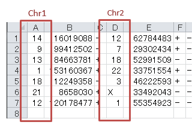

*******************************
設定ファイル解説
*******************************

.. _conf_mm:

=======================
1. Mutation Matrix
=======================

----------------------------------------------------------
全設定項目
----------------------------------------------------------

.. code-block:: cfg

  ###################### Mutation Matrix
  [mut]
  # geneのサンプルに対する検出比(%) 
  # 値より小さいgeneはplot対象から除外する
  # 0の場合はすべて出力する
  use_gene_rate = 0

  # 入力されていた場合、そのgeneのみ出力する
  # 未入力の場合、検出されたgeneすべて出力する
  # , 区切りで複数指定可能
  #
  # limited_genes = TP,TTN,APC,BRAF,CDH1,FLT3
  limited_genes = 
  
  # 入力されていた場合、そのgeneはplot対象から除外する
  # , 区切りで複数指定可能
  #
  # nouse_genes = NONE,MUC4
  nouse_genes =

  # 入力されていた場合、その変異タイプ(func)のみ出力する
  # 未入力の場合、検出されたfuncすべて出力する
  # , 区切りで複数指定可能
  #
  # limited_funcs = exome,splicing
  limited_funcs = 
  
  # 入力されていた場合、そのfuncはplot対象から除外する
  # , 区切りで複数指定可能
  # 空白行を除去する場合、_blank_ と記入する
  nouse_funcs = _blank_,unknown,synonymous_SNV
  
  # funcのplot色を指定する。func名:(RGBもしくは色名)
  # , 区切りで複数指定可能
  # 未入力のfuncはデフォルト色を使用する
  func_colors = stopgain:#E85299,frameshift_deletion:#F39600,frameshift_insertion:#E60011,nonframeshift_deletion:#9CAEB7
  
  # ポップアップウィンドウの表示内容
  # 詳細はページ下段の「ポップアップウィンドウの表示内容」に記載
  tooltip_format_checker_title1 = ID:{id}, gene:{gene}, {#sum_item_value}
  tooltip_format_checker_partial = type[{func}], {chr}:{start}:{end}, [{ref} -----> {alt}]
  tooltip_format_gene_title = gene:{gene}, {#sum_item_value}
  tooltip_format_gene_partial = func:{func}, {#item_value}
  tooltip_format_id_title = ID:{id}, {#sum_item_value}
  tooltip_format_id_partial = func:{func}, {#item_value}
  
  # 入力フォーマット (自分のデータに合わせて変更する)
  [result_format_mutation]
  
  # 複数入力時に使用
  suffix = 
  
  # データ区切り
  sept = \t
  
  # ヘッダ有り無し（ない場合はFalse)
  header = True
  
  # コメント行の先頭文字
  comment = #
  
  # funcが1セルに複数入力されている場合の区切り文字
  sept_func = ";"
  
  # geneが1セルに複数入力されている場合の区切り文字
  sept_gene = ";"
  
  ##################
  # Column index (required)
  ##################

  # func列
  col_func = Merge_Func
  
  # gene列
  col_gene = Gene.refGene
  
  ##################
  # column index (option)
  ##################
  
  # 染色体
  col_opt_chr = Chr
  # 開始位置
  col_opt_start = Start
  # 終了位置
  col_opt_end = End
  # リファレンスの塩基配列
  col_opt_ref = Ref
  # 対象の塩基配列
  col_opt_alt = Alt
  # id (sample) 列
  col_opt_ID = id
  
  # 出力フォーマット
  # 通常、変更する必要はありません。
  [merge_format_mutation]
  # カラムがない場合、何で埋めるか
  lack_column_complement = NA
  # データ区切り
  sept = ,

----

.. _mm_tooltip:

----------------------------------------------------------
ポップアップウィンドウの表示内容
----------------------------------------------------------

| 記載方法は `ユーザ定義フォーマット <./data_common.html#user-format>`_ を参照してください。
| 
| 表示箇所ごとに6種類設定しますが、書き方は同一です。
| データ列とは別に以下も特殊キーワードとして使用することができます。
|
| Mutation Matrixの集計について
| limited_funcs や nouse_funcs 等のオプションを使用して変異を限定した場合、使用しなかった変異はカウントしません。
| 
|

:{#number_id}:      サンプル数
:{#number_gene}:    遺伝子数
:{#number_mutaion}: 変異の数(同一サンプルが同一遺伝子で複数回検出されても1としてカウントする)
:{#sum_mutaion}:    検出した変異の総数
:{#item_value}:     積み上げグラフの1項目の値
:{#sum_item_value}: 積み上げグラフの合計値

**デフォルトでの設定内容と表示との対応**

.. code-block:: cfg

  # グリッド - タイトル
  tooltip_format_checker_title1 = ID:{ID}, gene:{gene}, {#sum_item_value}
  
  # グリッド - funcごと
  tooltip_format_checker_partial = type[{func}], {chr}:{start}:{end}, [{ref} -----> {alt}]
  
  # 遺伝子グラフ - タイトル
  tooltip_format_gene_title = gene:{gene}, {#sum_item_value}
  
  # 遺伝子グラフ - funcごと
  tooltip_format_gene_partial = func:{func}, {#item_value}
  
  # サンプルグラフ - タイトル
  tooltip_format_id_title = ID:{id}, {#sum_item_value}
  
  # サンプルグラフ - funcごと
  tooltip_format_id_partial = func:{func}, {#item_value}

.. image:: image/conf_mut4.PNG
  :scale: 100%

----

.. _mm_subplot:

----------------------------------------------
サブプロットとしてクリニカルデータを追加
----------------------------------------------

| `view report <http://genomon-project.github.io/paplot/mutation/graph_subplot.html>`_ 
| `view dataset <https://github.com/Genomon-Project/paplot/blob/master/example/mutation_subplot>`_ 
| `download dataset <https://github.com/Genomon-Project/paplot/blob/master/example/mutation_subplot.zip?raw=true>`_ 

変異以外のサンプルに関する情報（例えばクリニカルデータ）をサブプロットとして Mutation Matrix に追加することができます。

.. image:: image/data_mut3.PNG

exampleでは別ファイルとして以下のデータファイルを用意しています。

データファイルから一部抜粋

.. code-block:: cfg
  :caption: example/mutation_subplot/data_subplot.csv
  
  ID,gender,age,BMI
  SAMPLE00,F,30,40
  SAMPLE01,F,62,25
  SAMPLE02,F,59,34
  SAMPLE03,M,66,26
  SAMPLE04,M,53,40
  SAMPLE05,F,79,27
  SAMPLE06,M,64,29
  SAMPLE07,M,54,22
  SAMPLE08,F,55,35

今回の例では、サンプルID(ID)、gender、age、BMIを用意していますが、そのうち、必須項目はサンプルID(ID)です。
変異のファイルとサブデータのファイルがサンプルIDで紐づけられることが重要です。

設定ファイルにサブプロットの設定を追加します。

[mutation_subplot_type1_1] セクションを追加し、次のように設定します。

.. code-block:: cfg
  :caption: example/mutation_subplot/paplot.cfg
  
  ### sample for subplot
  [mutation_subplot_type1_1]

  # サブプロットのタイトル
  title = Clinical Gender

  # サブプロットのデータファイルのパスを設定します
  path = {unzip_path}/example/mutation_subplot/data_subplot.csv

  # データ区切り
  sept = ,

  # ヘッダ有り無し（ない場合はFalse)
  header = True

  # コメント行の先頭文字
  comment = 

  # 列名（ヘッダがない場合は列番号）
  col_value = gender

  # サンプルIDの列名（ヘッダがない場合は列番号）
  col_id = ID
  
  # 表示形式 (欄外参照)
  # fix/range/gradient から選択
  mode = fix
  
  # サブプロットの色と凡例 (欄外参照)
  name_set = M:Male:blue, F:Female:red

サブプロットの表示位置
--------------------------

サブプロットの表示位置は2つあり、type1はサンプルグラフの下に、type2は最後に表示します。

type1を表示する場合はセクション名を [mut_subplot_type1_*] とします。

type2を表示する場合はセクション名を [mut_subplot_type2_*] とします。

``*`` には1から始まる連番を入れてください。1から順に表示します。

サブプロットの表示形式
--------------------------

表示形式 (mode) は3種類あり、fix/range/gradient から選択します。

name_setの書き方
-----------------------

サブプロットの色と凡例を定義します。

``{値}:{表示文字列}:{セルの色}`` を各値ごとに記入します。セルの色は省略可能です。

mode = fixの場合

.. code-block:: cfg
  
  name_set = 0:Male:blue, 1:Female:red, 2:Unknown:gray

mode = rangeの場合

値には範囲開始の値を記入します。

.. code-block:: cfg
  
  name_set = 0:0-19, 20:20-39, 40:40-59, 60:60over

mode = gradientの場合

最初と最後の値を記入します。MIN/MAXを使用すると、データから自動的に設定します。

.. code-block:: cfg

  # 自動設定の場合
  name_set = MIN:min, MAX:max

  # 手動設定の場合
  name_set = 0:min (0), 40:max (40)
  

編集した設定ファイルを使用して ``paplot`` を実行します。

.. code-block:: bash

  paplot mutation {unzip_path}/example/mutation_subplot/data.csv ./tmp mutation_subplot \
  --config_file {unzip_path}/example/mutation_subplot/paplot.cfg

----

.. _conf_qc:

=======================
2. QC
=======================

---------------------------------
全設定項目
---------------------------------

.. code-block:: cfg
  
  ###################### qc
  [qc]
  # (none)
  
  # 入力フォーマット (自分のデータに合わせて変更する)
  [result_format_qc]
  
  # 複数入力時に使用
  suffix = .qc.csv
  
  # データ区切り
  sept = ,
  
  # ヘッダ有り無し（ない場合はFalse)
  header = True
  
  # コメント行の先頭文字
  comment = #
  
  ##################
  # Column index (required)
  ##################
  
  # (none)
  
  ##################
  # Column index (option)
  ##################
  
  col_opt_duplicate_reads = duplicate_reads
  col_opt_mapped_reads = mapped_reads
  col_opt_total_reads = total_reads
  col_opt_average_depth = average_depth
  col_opt_mean_insert_size = mean_insert_size
  col_opt_ratio_2x = 2x_rt
  col_opt_ratio_10x = 10x_rt
  col_opt_ratio_20x = 20x_rt
  col_opt_ratio_30x = 30x_rt
  col_opt_read_length_r1 = read_length_r1
  col_opt_read_length_r2 = read_length_r2
  col_opt_id = file_name
  
  # 出力フォーマット
  # 通常、変更する必要はありません。
  [merge_format_qc]
  # カラムがない場合、何で埋めるか
  lack_column_complement = NA
  # データ区切り
  sept = ,
  
  # 領域選択用のグラフ設定
  [qc_chart_brush]
  title = 
  title_y = 
  stack = {average_depth}
  name_set = average:#E3E5E9
  tooltip_format = 
  
  # グラフ設定(グラフごとに用意する)
  [qc_chart_1]
  title = depth coverage
  title_y = coverage
  stack1 = {ratio_30x}
  stack2 = {ratio_20x-ratio_30x}
  stack3 = {ratio_10x-ratio_20x}
  stack4 = {ratio_2x-ratio_10x}
  name_set = ratio_30x:#2478B4, ratio_20x:#FF7F0E, ratio_10x:#2CA02C, ratio_2x:#D62728
  tooltip_format1 = ID:{id}
  tooltip_format2 = ratio_2x: {ratio_2x:.2}
  tooltip_format3 = ratio_10x: {ratio_10x:.2}
  tooltip_format4 = ratio_20x: {ratio_20x:.2}
  tooltip_format5 = ratio_30x: {ratio_30x:.2}

----

.. _qc_tooltip:

----------------------------------------
ポップアップウィンドウの表示内容
----------------------------------------

| 記載方法は `ユーザ定義フォーマット <./data_common.html#user-format>`_ を参照してください。
|

----

.. _conf_ca:

==================================
3. Chromosomal Aberration
==================================

---------------------------------
全設定項目
---------------------------------

.. code-block:: cfg
  
  ###################### sv
  [genome]
  # ゲノムサイズのファイル（CSV形式）（初期値は hg19 で 標準ファイルは paplot インストールディレクトリ配下の genome ディレクトリにあります）
  #
  # for example.
  # (linux)
  # path = ~/tmp/genome/hg19.csv
  # (windows)
  # path = C:\genome\hg19_part.csv
  path = 
  
  [ca]
  # 使用する染色体 (,で区切る)
  use_chrs = 1,2,3,4,5,6,7,8,9,10,11,12,13,14,15,16,17,18,19,20,21,22,X,Y
  
  # if setting label-text & color
  # use_chrs = 1:Chr1:crimson, 2:Chr2:lightpink, 3:Chr3:mediumvioletred, 4:Chr4:violet, 5:Chr5:darkmagenta, 6:Chr6:mediumpurple
  
  # 積み上げグラフの染色体分割サイズ (bps)
  selector_split_size = 5000000
  
  ##################
  # group setting
  # [result_format_ca] col_opt_group が設定されている場合のみ有効
  ##################
  
  # 入力されていた場合、そのgroupのみ出力する
  # 未入力の場合、検出されたgroupすべて出力する
  # , 区切りで複数指定可能
  #
  limited_group = stopgain,frameshift_deletion,frameshift_insertion
  
  # 入力されていた場合、そのgroupはplot対象から除外する
  # , 区切りで複数指定可能
  # 空白行を除去する場合、_blank_ と記入する
  nouse_group = _blank_,unknown,synonymous_SNV
  
  # groupのplot色を指定する。group名:(RGBもしくはカラー名)
  # , 区切りで複数指定可能
  # 未入力のgroupはデフォルト色を使用する
  group_colors = stopgain:#E85299,frameshift_deletion:#F39600,frameshift_insertion:#E60011
  
  # 入力フォーマット (自分のデータに合わせて変更する)
  [result_format_ca]
  
  # 複数入力時に使用
  suffix = .result.txt
  
  # データ区切り
  sept = \t
  
  # ヘッダ有り無し（ない場合はFalse)
  header = True
  
  # コメント行の先頭文字
  comment = #
  
  ##################
  # Column index (required)
  ##################
  
  col_chr1 = Chr_1
  col_break1 = Pos_1
  col_chr2 = Chr_2
  col_break2 = Pos_2
  
  ##################
  # Column index (option)
  ##################
  
  col_opt_dir1 = Dir_1
  col_opt_dir2 = Dir_2
  col_opt_type = Variant_Type
  col_opt_gene_name1 = Gene_1
  col_opt_gene_name2 = Gene_2
  col_opt_group = 
  col_opt_id =
  
  # 出力フォーマット
  # 通常、変更する必要はありません。
  [merge_format_ca]
  # カラムがない場合、何で埋めるか
  lack_column_complement = NA
  # データ区切り
  sept = ,

----

.. _ca_usechrs:

---------------------------------
表示する染色体を限定する
---------------------------------

設定ファイルで次の項目を編集してください。

.. code-block:: cfg

  [ca]
  # 使用する染色体 (,で区切る)
  # default
  # use_chrs = 1,2,3,4,5,6,7,8,9,10,11,12,13,14,15,16,17,18,19,20,21,22,X,Y
  
  # 染色体 1、5、7 を使用する場合
  use_chrs = 1,5,7

編集した設定ファイルは次のようにしてコマンドから指定します。

``paplot {input files} {output directory} {title} --config_file {config file}``

----

.. _ca_genome:

-------------------------------
ヒト以外のゲノムを使用する
-------------------------------

ゲノムサイズが入力されたファイルが必要です。

先頭列に染色体名、2列目にサイズをカンマ ``,`` もしくはタブ区切りで入力してください。

.. code-block:: cfg
  
  1,249250621
  2,243199373
  3,198022430
  7,159138663
  8,146364022
  X,141213431
  Y,135534747
  9_gl000201_random,36148
  11_gl000202_random,40103
  17_gl000204_random,81310
  17_gl000205_random,174588
  Un_gl000214,137718

染色体名は分析したいファイルのChr1、Chr2で使用されている名称と同じでなければなりません。

用意したゲノムサイズのファイルを設定ファイルに指定してください。

.. code-block:: cfg

  [genome]
  # ゲノムサイズのファイル（CSV形式）（初期値は hg19 で 標準ファイルは paplot インストールディレクトリ配下の genome ディレクトリにあります）
  #
  # for example.
  # (linux)
  # path = ~/tmp/genome/hg19.csv
  # (windows)
  # path = C:\genome\hg19_part.csv
  path = {ここにゲノムサイズのファイルのパスを指定する}

----

.. _ca_tooltip:

----------------------------------------
ポップアップウィンドウの表示内容
----------------------------------------

| 記載方法は `ユーザ定義フォーマット <./data_common.html#user-format>`_ を参照してください。
| SVには Mutation Matrix のような特殊キーワードはありません。
|

----

.. _conf_signature:

===============================
4. Mutational Signature
===============================

----------------------------------------------------------
全設定項目
----------------------------------------------------------

.. code-block:: cfg
  
  ###################### Mutational Signature
  [signature]

  # ポップアップウィンドウの表示内容
  # 詳細はページ下段の「ポップアップウィンドウの表示内容」に記載
  tooltip_format_signature_title = {sig}
  tooltip_format_signature_partial = {route}: {#sum_item_value:6.2}
  tooltip_format_mutation_title = {id}
  tooltip_format_mutation_partial = {sig}: {#sum_item_value:.2}
  
  # Mutational Signature のY軸最大値 (-1の場合、それぞれのデータの最大値を使用する)
  signature_y_max = -1
  
  # signatureのbarの色
  alt_color_CtoA = #1BBDEB
  alt_color_CtoG = #211D1E
  alt_color_CtoT = #E62623
  alt_color_TtoA = #CFCFCF
  alt_color_TtoC = #ACD577
  alt_color_TtoG = #EDC7C4
  
  # 入力フォーマット (自分のデータに合わせて変更する)
  [result_format_signature]

  # 入力形式 (現在はjsonのみ)
  format = json

  # background を使用しているかどうか
  background = True
  
  # jsonファイルのkey名
  key_id = id
  key_mutation = mutation
  key_signature = signature
  key_mutation_count = mutation_count

----

.. _sig_tooltip:

----------------------------------------------------------
ポップアップウィンドウの表示内容
----------------------------------------------------------

| 記載方法は `ユーザ定義フォーマット <./data_common.html#user-format>`_ を参照してください。
| 
| 表示箇所ごとに4種類設定しますが、書き方は同一です。
| それぞれ次のキーワードが使用できます。
|

**tooltip_format_signature_title**

================== ============================================================
キーワード         解説                                                        
================== ============================================================
{sig}              変異シグネチャの色別グループのラベル。'C > A' や 'C > G' 等
{#sum_group_value} 変異シグネチャの色別グループの合計値
================== ============================================================

**tooltip_format_signature_partial**

================== ============================================================
キーワード         解説                                                        
================== ============================================================
{route}            変異シグネチャの棒グラフ1本分のラベル。'ApCpA' や 'CpCpA' 等
{#sum_item_value}  変異シグネチャの棒グラフ1本分の値
================== ============================================================

**tooltip_format_mutation_title (積み上げグラフ)**

================== ============================================================
キーワード         解説                                                        
================== ============================================================
{id}               `key_id` で入力したサンプル名です。
{#sum_mutaion_all} 全変異数
================== ============================================================

**tooltip_format_mutation_partial (積み上げグラフ)**

================== ===============================================================
キーワード         解説                                                        
================== ===============================================================
{sig}              変異シグネチャの名前 "Signature {番号}" で表示します。
{#sum_item_value}  積み上げグラフの合計値
================== ===============================================================

**デフォルトでの設定内容と表示との対応**

.. code-block:: cfg

  # signature - タイトル
  tooltip_format_signature_title = {sig}
  
  # signature - 各項目
  tooltip_format_signature_partial = {route}: {#sum_item_value:6.2}
  
  # 積み上げグラフ - タイトル
  tooltip_format_mutation_title = {id}
  
  # 積み上げグラフ - 変異シグネチャごと
  tooltip_format_mutation_partial = {sig}: {#sum_item_value:.2}
  
.. image:: image/conf_sig1.PNG
  :scale: 100%

----

.. _conf_pmsignature:

=======================
5. pmsignature
=======================

----------------------------------------------------------
全設定項目
----------------------------------------------------------

.. code-block:: cfg
  
  ###################### pmsignature
  [pmsignature]

  # ポップアップウィンドウの表示内容
  # 詳細はページ下段の「ポップアップウィンドウの表示内容」に記載
  tooltip_format_ref1 = A: {a:.2}
  tooltip_format_ref2 = C: {c:.2}
  tooltip_format_ref3 = G: {g:.2}
  tooltip_format_ref4 = T: {t:.2}
  tooltip_format_alt1 = C -> A: {ca:.2}
  tooltip_format_alt2 = C -> G: {cg:.2}
  tooltip_format_alt3 = C -> T: {ct:.2}
  tooltip_format_alt4 = T -> A: {ta:.2}
  tooltip_format_alt5 = T -> C: {tc:.2}
  tooltip_format_alt6 = T -> G: {tg:.2}
  tooltip_format_strand = + {plus:.2} - {minus:.2}
  tooltip_format_mutation_title = {id}
  tooltip_format_mutation_partial = {sig}: {#sum_item_value:.2}
  
  # pmsignatureのboxの色
  color_A = #06B838
  color_C = #609CFF
  color_G = #B69D02
  color_T = #F6766D
  color_plus = #00BEC3
  color_minus = #F263E2
  
  # 入力フォーマット (自分のデータに合わせて変更する)
  [result_format_pmsignature]

  # 入力形式 (現在はjsonのみ)
  format = json

  # background を使用しているかどうか
  background = True

  # jsonファイルのkey名
  key_id = id
  key_mutation = mutation
  key_ref = ref
  key_alt = alt
  key_strand = strand
  key_mutation_count = mutation_count

----

.. _pm_tooltip:

----------------------------------------------------------
ポップアップウィンドウの表示内容
----------------------------------------------------------

| 記載方法は `ユーザ定義フォーマット <./data_common.html#user-format>`_ を参照してください。
| 
| 表示箇所ごとに4種類設定しますが、書き方は同一です。
| それぞれ次のキーワードが使用できます。
|

**tooltip_format_ref* (pmsignature 下段の5つのbox)**

================== ============================================================
キーワード         解説                                                        
================== ============================================================
{a}                Aの値
{c}                Cの値
{g}                Gの値
{t}                Tの値
================== ============================================================

**tooltip_format_alt* (pmsignature 上段の1つのbox)**

================== ============================================================
キーワード         解説                                                        
================== ============================================================
{ca}               C->Aの値
{cg}               C->Gの値
{ct}               C->Tの値
{ta}               T->Aの値
{tc}               T->Cの値
{tg}               T->Gの値
================== ============================================================

**tooltip_format_strand**

================== ============================================================
キーワード         解説                                                        
================== ============================================================
{plus}             プラスの値
{minus}            マイナスの値
================== ============================================================

**tooltip_format_mutation_title (積み上げグラフ)**

================== ============================================================
キーワード         解説                                                        
================== ============================================================
{id}               `key_id` で入力したサンプル名です。
{#sum_mutaion_all} 全変異数
================== ============================================================

**tooltip_format_mutation_partial (積み上げグラフ)**

================== ===============================================================
キーワード         解説                                                        
================== ===============================================================
{sig}              変異シグネチャの名前 "Signature {番号}" で表示します。
{#sum_item_value}  積み上げグラフの合計値
================== ===============================================================

**デフォルトでの設定内容と表示との対応**

.. code-block:: cfg

  # pmsignature - 下段の5つのbox
  tooltip_format_ref1 = A: {a:.2}
  tooltip_format_ref2 = C: {c:.2}
  tooltip_format_ref3 = G: {g:.2}
  tooltip_format_ref4 = T: {t:.2}

  # pmsignature - 上段のbox
  tooltip_format_alt1 = C -> A: {ca:.2}
  tooltip_format_alt2 = C -> G: {cg:.2}
  tooltip_format_alt3 = C -> T: {ct:.2}
  tooltip_format_alt4 = T -> A: {ta:.2}
  tooltip_format_alt5 = T -> C: {tc:.2}
  tooltip_format_alt6 = T -> G: {tg:.2}

  # pmsignature - strand
  tooltip_format_strand = + {plus:.2} - {minus:.2}
  
  # 積み上げグラフ - タイトル
  tooltip_format_mutation_title = {id}
  
  # 積み上げグラフ - 変異シグネチャごと
  tooltip_format_mutation_partial = {sig}: {#sum_item_value:.2}
  

.. |new| image:: image/tab_001.gif
