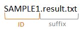

**************************
自分のデータを使用する
**************************

Genomon以外のデータを使用するにはconfigファイルを編集して自分のファイルフォーマットを指定します。

configファイルのサンプルは以下にあります。

``{paplotをインストールしたディレクトリ}/example/example.cfg``

Genomonデータを使用する場合は各バージョンの設定ファイルを用意していますので、 :doc:`genomon` 参照してください。

.. warning::
  
  | 必須項目はハイライトで示しています。正しく設定してください。
  | サンプル名の指定方法については、 :ref:`suffixとID<suffix>` も参照してください。

作成したconfigファイルは ``pa_plot`` コマンドの ``--config_file`` オプションで指定します。

実行例

.. code-block:: bash

  pa_plot qc "example/qc/*.csv" ./tmp DUMMY --config_file example/example.cfg

1. 全般
------------

.. code-block:: cfg
  :linenos:

  ###################### general
  [style]
  # グラフのレイアウトファイル
  # ~/tmp/paplot/style/rainbow.js
  path = 
  
  # index.html の備考欄に出力するテキスト(HTMLタブ使用可, 半角英数字のみ)
  remarks = 

2. QC
------------

記述方法詳細は :doc:`config_qc` を参照してください。

.. code-block:: cfg
  :linenos:
  :emphasize-lines: 8,10,11,12,18,19,20,21,22,23,24,25,26,27,28,29
  
  ###################### qc
  [qc]
  # (none)
  
  # 入力フォーマット (自分のデータに合わせて変更する)
  # 項目は欄外「ファイルフォーマット」参照
  [result_format_qc]
  suffix = .qc.csv
  
  sept = ,
  header = True
  comment = #
  
  # column index (required)
  # (none)
  
  # column index (option)
  col_opt_duplicate_reads = duplicate_reads
  col_opt_mapped_reads = mapped_reads
  col_opt_total_reads = total_reads
  col_opt_average_depth = average_depth
  col_opt_mean_insert_size = mean_insert_size
  col_opt_ratio_2x = 2x_rt
  col_opt_ratio_10x = 10x_rt
  col_opt_ratio_20x = 20x_rt
  col_opt_ratio_30x = 30x_rt
  col_opt_read_length_r1 = read_length_r1
  col_opt_read_length_r2 = read_length_r2
  col_opt_id = file_name
  
  # 出力フォーマット (data_qc.csv)
  # 項目は欄外「ファイルフォーマット」参照
  [merge_format_qc]
  lack_column_complement = NA
  sept = ,
  
  # 領域選択用のグラフ設定
  [qc_chart_brush]
  title = 
  title_y = 
  stack = {average_depth}
  name_set = average:#E3E5E9
  tooltip_format = 
  
  # グラフ設定(グラフごとに用意する)
  [qc_chart_1]
  title = depth coverage
  title_y = coverage
  stack1 = {ratio_30x}
  stack2 = {ratio_20x-ratio_30x}
  stack3 = {ratio_10x-ratio_20x}
  stack4 = {ratio_2x-ratio_10x}
  name_set = ratio_30x:#2478B4, ratio_20x:#FF7F0E, ratio_10x:#2CA02C, ratio_2x:#D62728
  tooltip_format1 = ID:{id}
  tooltip_format2 = ratio_2x: {ratio_2x:.2}
  tooltip_format3 = ratio_10x: {ratio_10x:.2}
  tooltip_format4 = ratio_20x: {ratio_20x:.2}
  tooltip_format5 = ratio_30x: {ratio_30x:.2}


3. SV
--------------

記述方法詳細は :doc:`config_sv` を参照してください。

.. code-block:: cfg
  :linenos:
  :emphasize-lines: 10,38,40,45,42,44,46,47,48,57
  
  ###################### sv
  [genome]
  # ゲノムサイズのファイル（CSV形式）（デフォルトはhg19, installディレクトリ配下のgenomeディレクトリにあります）
  #
  # for example.
  # (linux)
  # path = ~/tmp/genome/hg19.csv
  # (windows)
  # path = C:\genome\hg19_part.csv
  path = 
  
  [sv]
  # 使用するchromosomes (,で区切る)
  use_chrs = 1,2,3,4,5,6,7,8,9,10,11,12,13,14,15,16,17,18,19,20,21,22,X,Y
  
  # if setting label-text & color
  # use_chrs = 1:Chr1:crimson, 2:Chr2:lightpink, 3:Chr3:mediumvioletred, 4:Chr4:violet, 5:Chr5:darkmagenta, 6:Chr6:mediumpurple
  
  # 入力されていた場合、そのgroupのみ出力する
  # 未入力の場合、検出されたgroupすべて出力する
  # , 区切りで複数指定可能
  #
  limited_group = stopgain,frameshift_deletion,frameshift_insertion
  
  # 入力されていた場合、そのgroupはplot対象から除外する
  # , 区切りで複数指定可能
  # 空白行を除去する場合、_blank_ と記入する
  nouse_group = _blank_,unknown,synonymous_SNV
  
  # groupのplot色を指定する。group名:(RGBもしくはカラー名)
  # , 区切りで複数指定可能
  # 未入力のgroupはデフォルト色を使用する
  group_colors = stopgain:#E85299,frameshift_deletion:#F39600,frameshift_insertion:#E60011
  
  # 入力フォーマット (自分のデータに合わせて変更する)
  # 項目は欄外「ファイルフォーマット」参照
  [result_format_sv]
  suffix = .result.txt
  
  sept = \t
  header = False
  comment = #
  
  # column index (required)
  col_chr1 = Chr_1
  col_break1 = Pos_1
  col_chr2 = Chr_2
  col_break2 = Pos_2
  
  # column index (option)
  col_opt_dir1 = Dir_1
  col_opt_dir2 = Dir_2
  col_opt_type = Variant_Type
  col_opt_gene_name1 = Gene_1
  col_opt_gene_name2 = Gene_2
  col_opt_group = 
  col_opt_id =
  
  # 出力フォーマット (data_sv.csv)
  # 項目は欄外「ファイルフォーマット」参照
  [merge_format_sv]
  lack_column_complement = NA
  sept = ,

4. mutation-matrix
----------------------

記述方法詳細は :doc:`config_mut` を参照してください。

.. code-block:: cfg
  :linenos:
  :emphasize-lines: 50,51,52,53,56,58,63,66,70,72,74,76,78,80

  ###################### mutation
  [mut]
  # geneのサンプルに対する検出比(%) 
  # 値より小さいgeneはplot対象から除外する
  # 0の場合はすべて出力する
  use_gene_rate = 0

  # 入力されていた場合、そのgeneのみ出力する
  # 未入力の場合、検出されたgeneすべて出力する
  # , 区切りで複数指定可能
  #
  # limited_genes = TP,TTN,APC,BRAF,CDH1,FLT3
  limited_genes = 
  
  # 入力されていた場合、そのgeneはplot対象から除外する
  # , 区切りで複数指定可能
  #
  # nouse_genes = NONE,MUC4
  nouse_genes =

  # 入力されていた場合、その変異タイプ(func)のみ出力する
  # 未入力の場合、検出されたfuncすべて出力する
  # , 区切りで複数指定可能
  #
  # limited_funcs = exome,splicing
  limited_funcs = 
  
  # 入力されていた場合、そのfuncはplot対象から除外する
  # , 区切りで複数指定可能
  # 空白行を除去する場合、_blank_ と記入する
  nouse_funcs = _blank_,unknown,synonymous_SNV
  
  # funcのplot色を指定する。func名:(RGBもしくはカラー名)
  # , 区切りで複数指定可能
  # 未入力のfuncはデフォルト色を使用する
  func_colors = stopgain:#E85299,frameshift_deletion:#F39600,frameshift_insertion:#E60011,nonframeshift_deletion:#9CAEB7
  
  # ポップアップウィンドウの表示内容
  # 詳細は以下
  tooltip_format_checker_title1 = ID:{id}, gene:{gene}, {#sum_item_value}
  tooltip_format_checker_partial = type[{func}], {chr}:{start}:{end}, [{ref} -----> {alt}]
  tooltip_format_gene_title = gene:{gene}, {#sum_item_value}
  tooltip_format_gene_partial = func:{func}, {#item_value}
  tooltip_format_id_title = ID:{id}, {#sum_item_value}
  tooltip_format_id_partial = func:{func}, {#item_value}
  
  # 入力フォーマット (自分のデータに合わせて変更する)
  # 項目は欄外「ファイルフォーマット」参照
  [result_format_mutation]
  suffix = 
  sept = \t
  header = True
  comment = #
  
  # funcが1セルに複数入力されている場合の区切り文字
  sept_func = ";"
  # geneが1セルに複数入力されている場合の区切り文字
  sept_gene = ";"
  
  # column index (required)

  # func列
  col_func = Merge_Func
  
  # gene列
  col_gene = Gene.refGene
  
  # column index (option)
  # chromosome
  col_opt_chr = Chr
  # 開始位置
  col_opt_start = Start
  # 終了位置
  col_opt_end = End
  # リファレンスの塩基配列
  col_opt_ref = Ref
  # 対象の塩基配列
  col_opt_alt = Alt
  # id (sample) 列
  col_opt_ID = id
  
  # 出力フォーマット (data_mut.csv)
  # 項目は欄外「ファイルフォーマット」参照
  [merge_format_mutation]
  lack_column_complement = NA
  sept = ,

.. _suffix:

suffixとID
-----------------------------

| paplotではサンプル名が必要です。ファイル入力では、以下のことに注意してください。
| 

 - case1: 1ファイルのみ入力
 
   複数サンプルの結果が、1ファイルにすべてまとめられていると想定しています。サンプル名となる列を ``col_opt_ID`` で必ず指定してください。

 - case2: サンプルごとに分かれた複数のファイルを入力し、データ中にサンプル名となるものはない。
 
   ファイル名の一部をサンプル名として使用します。 ``suffix`` を必ず指定してください。

 - case3: サンプルごとに分かれた複数のファイルを入力し、データ中にサンプル名となるデータがある。
 
   サンプル名となる列を ``col_opt_ID`` で必ず指定してください。



.. data_format:

ファイルフォーマット
------------------------------

**入力ファイルフォーマット**

configファイル中、[result_format_*] というセクションでは入力ファイルのフォーマットを指定します。

:suffix:  :ref:`suffixとID<suffix>` を参照してください。

:sept: データ区切り。

.. code-block:: cfg

  # タブ区切りの場合
  sept = \t
  
  # ,区切りの場合
  sept = ,
  
  # スペース区切りの場合
  sept = " "

:header: 先頭1行がヘッダかどうか。先頭行がヘッダの場合はTrue。ヘッダなしの場合はFalse

:comment: 先頭に指定文字がある行は飛ばす

**出力ファイルフォーマット**

| configファイル中、[merge_format_*] というセクションでは出力ファイル(data_*.csv) のフォーマットを指定します。
| 通常、変更する必要はありません。
|

:sept: データ区切り。(入力ファイルフォーマットと同)

:lack_column_complement: カラムがない場合、何で埋めるか

.. _column:

列の指定方法
------------------------------

ヘッダの有り無しに合わせて、カラム名もしくはカラムインデックスを入力します。

.. image:: image/col_pos.PNG
  :scale: 100%

記入例

.. code-block:: cfg

  # ヘッダ行がある場合、カラム名 (テキスト) を入力する
  header = True
  col_chr1 = Chr_1
  col_break1 = Pos_1
  col_chr2 = Chr_2
  col_break2 = Pos_2

  # ヘッダ行がない場合、カラムインデックス (数値) を入力する
  header = False
  col_chr1 = 0
  col_break1 = 1
  col_chr2 = 3
  col_break2 = 4

  
.. _user_format:

ユーザ定義フォーマット
-----------------------------

| mouse overにより表示するポップアップのようにグラフそのものに影響を与えないような文字列はある程度変更することができます。
| 表示箇所ごとにそれぞれ設定しますが、書き方は同一です。
| 

設定例

::

  tooltip_format_checker_partial = type[{func}], {chr}:{start}:{end}, [{ref} -----> {alt}]
  
  表示例：
  type[exome], chr1:2000:2001, [A -----> T]

| {}で囲った文字がキーワードで、実際の値に置き換えられます。
| キーワードとはconfigファイルで各データ列を設定した項目のうち、``col_`` もしくは ``col_opt_`` を除いた名前です。
| 大文字と小文字の区別はありません。
| たとえば、CHR, Chr, chr はすべて同一とみなしますので、ご注意ください。
|
| デフォルトで設定しているのは下記ですが、任意で増やすことができます。
| その場合は、```col_opt_{任意の名前}``` として追加し、実際のデータの列名を指定してください。
|
| ``col_opt_new_option = columun_name``
| 

** mutation **

============= ==========
option名      キーワード
============= ==========
col_func      {func}
col_gene      {gene}
col_opt_chr   {chr}
col_opt_start {start}
col_opt_end   {end}
col_opt_ref   {ref}
col_opt_alt   {alt}
col_opt_id    {id}
============= ==========

** sv **

==================== ===============
option名             キーワード
==================== ===============
col_chr1             {chr1}
col_break1           {break1}
col_chr2             {chr2}
col_break2           {break2}
col_opt_id           {id}
col_opt_dir1         {dir1}
col_opt_dir2         {dir2}
col_opt_type         {type}
col_opt_gene_name1   {gene_name1}
col_opt_gene_name2   {gene_name2}
==================== ===============

** qc **

======================== ==================
option名                 キーワード
======================== ==================
col_opt_duplicate_reads  {duplicate_reads}
col_opt_mapped_reads     {mapped_reads}
col_opt_total_reads      {total_reads}
col_opt_average_depth    {average_depth}
col_opt_mean_insert_size {mean_insert_size}
col_opt_ratio_2x         {ratio_2x}
col_opt_ratio_10x        {ratio_10x}
col_opt_ratio_20x        {ratio_20x}
col_opt_ratio_30x        {ratio_30x}
col_opt_read_length_r1   {read_length_r1}
col_opt_read_length_r2   {read_length_r2}
col_opt_id               {id}
======================== ==================

::

  数値計算させることもできます。その場合、計算式を{}で囲います。
  
  {#number_mutaion_gene/#number_id*100}%
  
  表示例：
  3.33333333333333%
  
  表示桁数を指定したい場合は計算式の後に ":.2" と書きます。小数点以下3桁の場合は ":.3" と書きます。
  
  {#number_mutaion_gene/#number_id*100:.2}%
  
  表示例：
  3.33%

