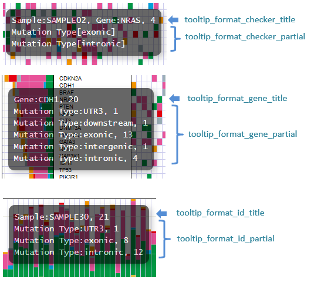

************************************************
Config 記述方法(mutation-matrix)
************************************************

-----------------------------
列と設定の対応
-----------------------------

=========================  =============  ==========  =============================
name                       input type     required    description
=========================  =============  ==========  =============================
col_func                   text           o           mutation type
col_gene                   text           o           gene name
col_opt_chr                text           ×           chromosome
col_opt_start              numeric        ×           開始位置
col_opt_end                numeric        ×           終了位置
col_opt_ref                text           ×           リファレンスの塩基配列
col_opt_alt                text           ×           対象の塩基配列
col_opt_id                 text           x           サンプルを識別できる名称
=========================  =============  ==========  =============================

| 列の指定方法方法については、 :ref:`列の指定方法<column>` を参照してください。
| suffixとIDの指定方法および、サンプル名の指定方法については、 :ref:`suffixとID<suffix>` を参照してください。
| 

----------------------------------------------------------
ポップアップウィンドウの表示内容
----------------------------------------------------------

| 記載方法は :ref:`ユーザ定義フォーマット<user_format>` を参照してください。
| 
| 表示箇所ごとに6種類設定しますが、書き方は同一です。
| データ列とは別に以下も特殊キーワードとして使用することができます。
|

:{#number_id}:      サンプル数
:{#number_gene}:    遺伝子数
:{#number_mutaion}: mutation数(同一サンプルが同一遺伝子で複数回検出されても1としてカウントする)
:{#sum_mutaion}:    mutation総検出数
:{#item_value}:     積み上げグラフの1項目の値
:{#sum_item_value}: 積み上げグラフの合計値

| サンプル数以外の5つの値はconfigファイルにより除外されたmutationを除いた数です。
| Genomonでは、functionが次の場合のmutationを除外していますので、全検出結果からこれらの数を引いた値になります。
|   nouse_funcs = _blank_,unknown,synonymous_SNV
|

**デフォルトでの設定内容と表示との対応**

.. code-block:: cfg

  # グリッド - タイトル
  tooltip_format_checker_title1 = ID:{ID}, gene:{gene}, {#sum_item_value}
  
  # グリッド - funcごと
  tooltip_format_checker_partial = type[{func}], {chr}:{start}:{end}, [{ref} -----> {alt}]
  
  # 遺伝子グラフ - タイトル
  tooltip_format_gene_title = gene:{gene}, {#sum_item_value}
  
  # 遺伝子グラフ - funcごと
  tooltip_format_gene_partial = func:{func}, {#item_value}
  
  # サンプルグラフ - funcごと
  tooltip_format_id_title = ID:{id}, {#sum_item_value}
  
  # サンプルグラフfuncごと
  tooltip_format_id_partial = func:{func}, {#item_value}

-----------------------------
サブプロットについて
-----------------------------

| mutation-matrixグラフでは解析結果とは別にサンプルに対する情報を表示することができます。
| 
| 表示場所は2つあり、type1はサンプルグラフの下に、type2は最後に表示します。
| 
| type1を表示する場合はセクション名を[mut_subplot_type1_*]とします。
| type2を表示する場合はセクション名を[mut_subplot_type2_*]とします。
| 
| ``*`` には1から始まる連番を入れてください。1から順に表示します。
| 

.. image:: image/conf_mut1.PNG
  :scale: 100%

.. code-block:: cfg
  :linenos:
  
  # mut_subplot_type1_1
  [mut_subplot_type1_1]
  
  # ファイルのパス
  path = /path/to/file1
  
  ###########################
  # ファイルフォーマット
  
  # ファイルのデータ区切り
  sept = ,
  
  # 先頭1行がヘッダかどうか
  header = True
  
  # コメント行
  comment = #
  
  # 表示データの列
  col_value = average_depth
  
  # id 列（main plotと紐づけられること）
  col_ID = id
  
  ###########################
  # サブプロットのフォーマット
  
  # サブプロットのタイトル
  title = bam's average depth
  
  # 表示形式
  # fix, range, gradientから選択
  mode = gradient
  
  # 凡例のフォーマット
  # 値:表示文字列:セルの色を各値ごとに記入する。セルの色は省略可能
  #
  # mode=fixの場合
  # name_set = 0:Male:blue, 1:Female:red, 2:Unknown:gray
  # 
  # mode=fixの場合、値には範囲開始の値を入れる
  # name_set = 0:0-19, 20:20-39, 40:40-59, 60:60over
  # 
  # mode = gradientの場合、最初と最後の値を入れる。MIN/MAXを使用すると、データから自動的に設定する
  # 自動設定の場合
  # name_set = MIN:min, MAX:max
  # 手動設定の場合
  # name_set = 0:min (0), 40:max (40)
  name_set = MIN:min, MAX:max
  
  # mut_subplot_type2_1
  [mut_subplot_type2_1]
  title = Clinical Gender
  path = /path/to/file2
  sept = ,
  header = True
  comment = 
  col_value = gender
  col_ID = barcode
  mode = fix
  name_set = 0:Male:blue, 1:Female:red, 2:Unknown:gray
  
  #mut_subplot_type2_2
  [mut_subplot_type2_2]
  title = Clinical Age
  path = /path/to/file3
  sept = ,
  header = True
  comment = 
  col_value = age
  col_ID = barcode
  mode = range
  name_set = 0:0-19, 20:20-39, 40:40-59, 60:60over

titleとnameset
--------------------------

.. image:: image/conf_mut2.PNG
  :scale: 100%

表示モードの違い
----------------------------

.. image:: image/conf_mut3.PNG
  :scale: 100%
