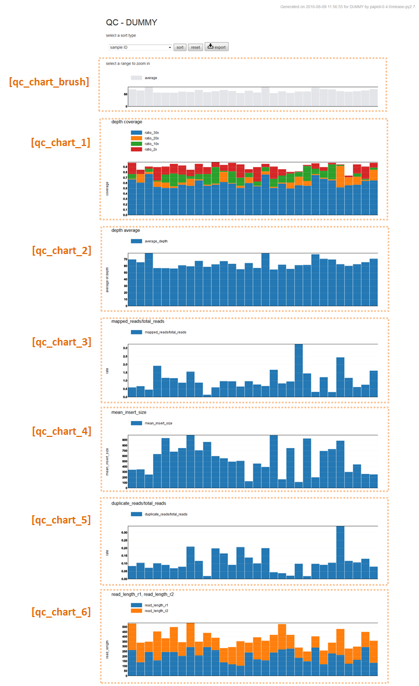
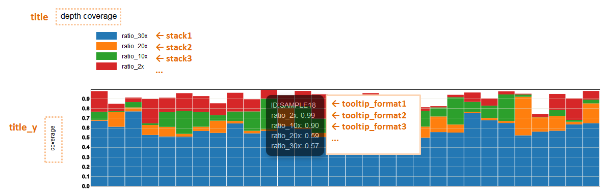
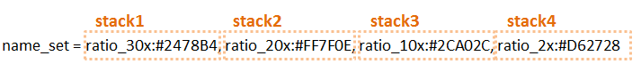
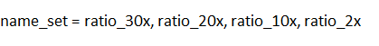

*******************************
Config 記述方法(QC)
*******************************

全設定項目は `こちら <./config.html#qc>`_ 

列と設定の対応
-----------------------------

=========================  =============  ==========  =============================
name                       input type     required    description
=========================  =============  ==========  =============================
col_opt_duplicate_reads    numeric        ×           number of total reads
col_opt_mapped_reads       numeric        ×           number of mapped reads
col_opt_total_reads        numeric        ×           number of duplicate reads
col_opt_average_depth      numeric        ×           mean of insert size
col_opt_mean_insert_size   numeric        ×           average of depth
col_opt_ratio_2x           numeric        ×           number of read_length_r1
col_opt_ratio_10x          numeric        ×           number of read_length_r2
col_opt_ratio_20x          0.0～1.0       ×           coverage (depth=2)
col_opt_ratio_30x          0.0～1.0       ×           coverage (depth=10)
col_opt_read_length_r1     0.0～1.0       ×           coverage (depth=20)
col_opt_read_length_r2     0.0～1.0       ×           coverage (depth=30)
col_opt_id                 text           x           サンプルを識別できる名称
=========================  =============  ==========  =============================

| 列の指定方法方法については、 :ref:`列の指定方法<column>` を参照してください。
| suffixとIDの指定方法および、サンプル名の指定方法については、 :ref:`suffixとID<suffix>` を参照してください。
| 

ユーザ定義グラフ
-----------------------------

| QCではすべてのグラフがユーザ定義になっています。
| ※ 積み上げグラフのみです。それ以外のグラフにすることはできません。
|
| configファイルの ``[qc_chart_*]``  というセクションに必要事項を記入します。
| [qc_chart_brush] (領域を選択できるグラフ) を先頭に[qc_chart_1],[qc_chart_2],[qc_chart_3] の順番に表示します。
| 必要な数だけ [qc_chart_*] セクションを増やすことができます。
|
| exampleでの設定例は次のようになっています。

** [qc_chart_*] 各セクションの設定内容 **

| 各セクションでは次のオプションを設定します。
|

:title: グラフのタイトル

:title_y: y軸のタイトル

:stack: 積み上げ要素。複数ある場合は積み上げる順にstack1, stack2, ... と連番に指定します。{ } 内にキーワードを設定します。キーワードについては :ref:`ユーザ定義フォーマット<user_format>` を参照してください。

:name_set: 積み上げ要素の凡例名と色。色は省略可能。省略した場合、デフォルト値を上から順番に使用します。

:tooltip_format: mouse over で表示されるポップアップウィンドウのフォーマット。複数行の場合は上から順にtooltip_format1, tooltip_format2, ... と連番に指定します。記載方法は :ref:`ユーザ定義フォーマット<user_format>` を参照してください。

name_set(色指定あり)

name_set(色指定なし)

** デフォルト色 **

.. image:: image/default_color.PNG
  :scale: 100%

