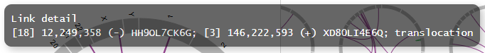

**************************
CAレポート
**************************

ここでは、exampleデータ (※) を基にして、CAレポートを出力するために必要な入力データを解説します。

※ exampleデータはpaplotをダウンロードして解凍したディレクトリ中、exampleディレクトリにあります。

.. _ca_minimal:

==========================
1. 最小データセット
==========================

| `view report <http://genomon-project.github.io/paplot/ca/graph_minimal.html>`_ 
| `view dataset <https://github.com/Genomon-Project/paplot/blob/master/example/ca_minimal>`_ 
| `download dataset <https://github.com/Genomon-Project/paplot/blob/master/example/ca_minimal.zip?raw=true>`_ 

paplotでcaレポートを作成するために最低限必要な項目はサンプルID(ID)、ブレークポイント1のchromosome (Chr1) とposition(Break1)、ブレークポイント2のchromosome (Chr2) とposition(Break2) の5つです。

データファイルから一部抜粋

.. code-block:: cfg
  :caption: example/ca_minimal/data.csv
  
  ID,Chr1,Break1,Chr2,Break2,
  SAMPLE1,14,16019088,12,62784483,
  SAMPLE1,9,99412502,7,129302434,
  SAMPLE1,13,84663781,18,52991509,
  SAMPLE2,11,101374238,22,26701405,
  SAMPLE2,2,121708638,7,137424167,
  SAMPLE3,22,34268355,10,19871820,
  SAMPLE3,8,107868940,hs37d5,20517614,
  SAMPLE4,8,135644313,3,116748248,
  SAMPLE4,7,6037836,21,34855497,
  SAMPLE4,7,109724564,14,106387943,

configファイルの[result_format_ca]セクションでデータの列名を次のように設定します。

.. code-block:: cfg
  :caption: example/ca_minimal/paplot.cfg
  
  [result_format_ca]
  # column index (required)
  col_chr1 = Chr1
  col_break1 = Break1
  col_chr2 = Chr2
  col_break2 = Break2
  
  # column index (option)
  col_opt_id = ID

編集したconfigファイルを使用して ``paplot`` を実行します。

.. code-block:: bash

  paplot ca {unzip_path}/example/ca_minimal/data.csv ./tmp ca_minimal \
  --config_file {unzip_path}/example/ca_minimal/paplot.cfg

----

.. _ca_noheader:

==========================
2. ヘッダなし
==========================

| `view report <http://genomon-project.github.io/paplot/ca/graph_noheader.html>`_ 
| `view dataset <https://github.com/Genomon-Project/paplot/blob/master/example/ca_noheader>`_ 
| `download dataset <https://github.com/Genomon-Project/paplot/blob/master/example/ca_noheader.zip?raw=true>`_ 

データファイルから一部抜粋

.. code-block:: cfg
  :caption: example/ca_noheader/data.csv
  
  SAMPLE00,intronic,GATA3
  SAMPLE00,UTR3,CDH1
  SAMPLE00,exonic,GATA3
  SAMPLE01,splicing,WASF3
  SAMPLE01,intronic,WASF3
  SAMPLE01,exonic,NRAS
  SAMPLE02,intronic,FBXW7
  SAMPLE02,intronic,GATA3
  SAMPLE02,ncRNA_intronic,ACVR2B
  SAMPLE03,exonic,CAP2
  SAMPLE03,intronic,PIK3CA
  SAMPLE03,downstream,SEPT12

データにヘッダ行がない場合、列名でなく列番号を設定します。

configファイルの[result_format_ca]セクションでデータの列番号を次のように設定します。

列番号は左から順に1始まりで数えます。

.. code-block:: cfg
  :caption: example/ca_noheader/paplot.cfg
  
  # column index (required)
  col_chr1 = 2
  col_break1 = 3
  col_chr2 = 4
  col_break2 = 5
  
  # column index (option)
  col_opt_id = 1

編集したconfigファイルを使用して ``paplot`` を実行します。

.. code-block:: bash

  paplot ca {unzip_path}/example/ca_noheader/data.csv ./tmp ca_noheader \
  --config_file {unzip_path}/example/ca_noheader/paplot.cfg

----

.. _ca_group:

==========================
3. 変異のグルーピング
==========================

| `view report <http://genomon-project.github.io/paplot/ca/graph_group.html>`_ 
| `view dataset <https://github.com/Genomon-Project/paplot/blob/master/example/ca_group>`_ 
| `download dataset <https://github.com/Genomon-Project/paplot/blob/master/example/ca_group.zip?raw=true>`_ 

最小構成で作成した変異には自動的にグループ機能が働いており、クロモソーム内の変異（緑）とクロモソーム間の変異（紫）に色分けされています。

ここでは、グループを手動で設定するように変更します。

データファイルから一部抜粋

.. code-block:: cfg
  :caption: example/ca_group/data.csv
  
  ID,Chr1,Break1,Chr2,Break2,type
  SAMPLE1,14,16019088,12,62784483,C
  SAMPLE1,9,99412502,7,129302434,B
  SAMPLE1,13,84663781,18,52991509,A
  SAMPLE2,11,101374238,22,26701405,B
  SAMPLE2,2,121708638,7,137424167,C
  SAMPLE2,16,43027789,22,23791492,C
  SAMPLE3,22,34268355,10,19871820,A
  SAMPLE3,14,56600342,hs37d5,5744957,B
  SAMPLE3,Y,12191863,hs37d5,29189687,A
  SAMPLE4,8,135644313,3,116748248,D
  SAMPLE4,7,6037836,21,34855497,D
  SAMPLE4,7,109724564,14,106387943,A

今回の例では、必須項目であるID、Chr1、Break1、Chr2、Break2 に加えて、type が追加してあります。

まず、グルーピングに使用する列名、type をconfigファイルに記載します。

configファイルの[result_format_ca]セクションでデータの列名を次のように設定します。

.. code-block:: cfg
  :caption: example/ca_group/paplot.cfg
  
  [result_format_ca]
  col_opt_group = type

オプションの列名は通常任意に設定できますが、グルーピングにおいては ``col_opt_group`` 固定にしてください。

これで ``type`` 列を使用してグルーピングされますが、追加で色も指定できます。

.. code-block:: cfg
  :caption: example/ca_group/paplot.cfg

  [ca]
  # グループの色指定
  group_colors = A:#66C2A5,B:#FC8D62,C:#8DA0CB,D:#E78AC3

  # 指定したグループのみ表示する
  limited_group = 
  
  # 指定したグループを表示しない
  nouse_group = 

編集したconfigファイルを使用して ``paplot`` を実行します。

.. code-block:: bash

  paplot ca {unzip_path}/example/ca_group/data.csv ./tmp ca_group \
  --config_file {unzip_path}/example/ca_group/paplot.cfg

----

.. _ca_option:

===================================
4. ポップアップの情報追加
===================================

| `view report <http://genomon-project.github.io/paplot/ca/graph_option.html>`_ 
| `view dataset <https://github.com/Genomon-Project/paplot/blob/master/example/ca_option>`_ 
| `download dataset <https://github.com/Genomon-Project/paplot/blob/master/example/ca_option.zip?raw=true>`_ 

マウスオーバーで表示する情報をカスタマイズすることができます。

最小構成で表示するポップアップはこのようになっています。

.. image:: image/data_ca1.png

ここにもう少し情報を追加して変異の詳細を確認できるように変更します。

変更後

データファイルから一部抜粋

.. code-block:: cfg
  :caption: example/ca_option/data.csv
  
  ID,Chr1,Break1,Dir1,Chr2,Break2,Dir2,Ref,Alt,func,gene1,gene2
  SAMPLE1,14,16019088,-,12,62784483,+,---,GACTC,deletion,LS7T1EG444,4GRRIO5AVR
  SAMPLE1,9,99412502,-,7,129302434,+,---,C-CT-,translocation,FQFW16UF5U,QP779MLPNV
  SAMPLE1,13,84663781,+,18,52991509,-,---,GTAAA,deletion,Q9VX1I9U3I,7XM09ETN40
  SAMPLE2,11,101374238,+,22,26701405,+,---,TGGGT,translocation,FZ7LOS66RD,9WYBJR57E0
  SAMPLE2,2,121708638,-,7,137424167,-,---,G-TGA,translocation,5655M5E46B,HB14VJXDHV
  SAMPLE2,16,43027789,+,22,23791492,-,---,CCTCA,inversion,REFSIL0H2M,L5EA31R8U0
  SAMPLE3,22,34268355,+,10,19871820,+,---,TC-GT,tandem_duplication,9SVRQCFVCO,2BEWSO91FZ
  SAMPLE3,14,56600342,-,hs37d5,5744957,+,---,--CAA,deletion,UTLVCZ63SK,5I74M5NKDC
  SAMPLE3,Y,12191863,-,hs37d5,29189687,-,---,TG-G-,inversion,3PLD4C20IZ,BVYMBTIFKD

今回の例では、必須項目であるID、Chr1、Break1、Chr2、Break2 に加えて、次の7つを追加してあります。

 - リファレンスの塩基 (Ref)
 - 変異の塩基(Alt)
 - 変異タイプ(func)
 - ブレークポイント1の遺伝子名(gene1)
 - ブレークポイント2の遺伝子名(gene2)
 - ブレークポイント1のDirection(Dir1)
 - ブレークポイント2のDirection(Dir2)

このうち、変異タイプ(func)と遺伝子名(gene1, gene2)、Direction(Dir1, Dir2)を使用します。

まず、ポップアップの情報として追加したい列名をconfigファイルに記載します。

configファイルの[result_format_ca]セクションでデータの列名を次のように設定します。

.. code-block:: cfg
  :caption: example/ca_option/paplot.cfg
  
  [result_format_ca]
  col_opt_type = func
  col_opt_gene_name1 = gene1
  col_opt_gene_name2 = gene2
  col_opt_dir1 = Dir1
  col_opt_dir2 = Dir2

オプションの列名は次の形式で記述します。 ``col_opt_{name} = {columun name}`` 

``{name}`` の部分は任意に設定できますが、 ``col_opt_`` を必ず先頭につけてください。

次に、ポップアップの表示内容を変更します。

.. code-block:: cfg
  :caption: example/ca_option/paplot.cfg
  
  [ca]
  # 最小構成での設定
  # tooltip_format = [{chr1}] {break1:,}; [{chr2}] {break2:,}
  # 次のように変更
  tooltip_format = [{chr1}] {break1:,} ({dir1}) {gene_name1}; [{chr2}] {break2:,} ({dir2}) {gene_name2}; {type}

編集したconfigファイルを使用して ``paplot`` を実行します。

.. code-block:: bash

  paplot ca {unzip_path}/example/ca_option/data.csv ./tmp ca_option \
  --config_file {unzip_path}/example/ca_option/paplot.cfg

ポップアップ ( ``tooltip_format`` ) 記述方法詳細は  :ref:`ユーザ定義フォーマット <user_format>` を参照してください。

.. |new| image:: image/tab_001.gif
