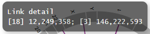

************************************
Chromosomal Aberration レポート
************************************

ここでは、サンプルデータ [*]_ を使用して、Chromosomal Aberration レポートを出力するために必要な入力データと設定方法を解説します。

.. [*] サンプルデータは paplot をダウンロードして解凍したディレクトリ中、example ディレクトリにあります。

.. _ca_minimal:

==========================
1. 最小データセット
==========================

| `このセクションで生成するレポートを見る <http://genomon-project.github.io/paplot/ca_minimal/graph_minimal.html>`__ 
| `このセクションで使用するデータセットを見る <https://github.com/Genomon-Project/paplot/blob/master/example/ca_minimal>`__ 
| `このセクションで使用するデータセットをダウンロードする <https://github.com/Genomon-Project/paplot/blob/master/example/ca_minimal.zip?raw=true>`__ 

paplot で Chromosomal Aberration レポートを作成するために最低限必要な項目は次の 5 つです。

 - サンプル名 (Sample)
 - 切断点 1 の染色体 (Chr1)
 - 切断点 1 の位置 (Break1)
 - 切断点 2 の染色体 (Chr2)
 - 切断点 2 の位置 (Break2) 

.. code-block:: cfg
  :caption: データファイルから一部抜粋 (example/ca_minimal/data.csv)
  
  Sample,Chr1,Break1,Chr2,Break2,
  SAMPLE1,14,16019088,12,62784483,
  SAMPLE1,9,99412502,7,129302434,
  SAMPLE1,13,84663781,18,52991509,
  SAMPLE2,11,101374238,22,26701405,
  SAMPLE2,2,121708638,7,137424167,
  SAMPLE3,22,34268355,10,19871820,
  SAMPLE3,8,107868940,hs37d5,20517614,
  SAMPLE4,8,135644313,3,116748248,
  SAMPLE4,7,6037836,21,34855497,
  SAMPLE4,7,109724564,14,106387943,

設定ファイルの ``[result_format_ca]`` セクションでデータの列名を次のように設定します。

.. code-block:: cfg
  :caption: example/ca_minimal/paplot.cfg
  
  [result_format_ca]
  col_chr1 = Chr1
  col_break1 = Break1
  col_chr2 = Chr2
  col_break2 = Break2
  col_opt_id = Sample

編集した設定ファイルを使用して paplot を実行します。

.. code-block:: bash

  paplot ca {unzip_path}/example/ca_minimal/data.csv ./tmp ca_minimal \
  --config_file {unzip_path}/example/ca_minimal/paplot.cfg

----

.. _ca_noheader:

==========================
2. ヘッダなし
==========================

| `このセクションで生成するレポートを見る <http://genomon-project.github.io/paplot/ca_noheader/graph_noheader.html>`__ 
| `このセクションで使用するデータセットを見る <https://github.com/Genomon-Project/paplot/blob/master/example/ca_noheader>`__ 
| `このセクションで使用するデータセットをダウンロードする <https://github.com/Genomon-Project/paplot/blob/master/example/ca_noheader.zip?raw=true>`__ 

.. code-block:: cfg
  :caption: データファイルから一部抜粋 (example/ca_noheader/data.csv)
  
  SAMPLE00,intronic,GATA3
  SAMPLE00,UTR3,CDH1
  SAMPLE00,exonic,GATA3
  SAMPLE01,splicing,WASF3
  SAMPLE01,intronic,WASF3
  SAMPLE01,exonic,NRAS
  SAMPLE02,intronic,FBXW7
  SAMPLE02,intronic,GATA3
  SAMPLE02,ncRNA_intronic,ACVR2B
  SAMPLE03,exonic,CAP2
  SAMPLE03,intronic,PIK3CA
  SAMPLE03,downstream,SEPT12

データにヘッダ行がない場合、列名でなく列番号を設定します。

設定ファイルの ``[result_format_ca]`` セクションでデータの列番号を次のように設定します。

列番号は左から順に 1 始まりで数えます。

.. code-block:: cfg
  :caption: example/ca_noheader/paplot.cfg
  
  [result_format_ca]
  # ヘッダオプションを False に設定
  header = False

  col_chr1 = 2
  col_break1 = 3
  col_chr2 = 4
  col_break2 = 5
  col_opt_id = 1

編集した設定ファイルを使用して paplot を実行します。

.. code-block:: bash

  paplot ca {unzip_path}/example/ca_noheader/data.csv ./tmp ca_noheader \
  --config_file {unzip_path}/example/ca_noheader/paplot.cfg

----

.. _ca_group:

==========================
3. 変異のグルーピング
==========================

| `このセクションで生成するレポートを見る <http://genomon-project.github.io/paplot/ca_group/graph_group.html>`__ 
| `このセクションで使用するデータセットを見る <https://github.com/Genomon-Project/paplot/blob/master/example/ca_group>`__ 
| `このセクションで使用するデータセットをダウンロードする <https://github.com/Genomon-Project/paplot/blob/master/example/ca_group.zip?raw=true>`__ 

最小構成で作成した変異には自動的にグルーピングされており、染色体内の変異 (緑) と染色体間の変異 (紫) に色分けされています。

ここでは、グループを手動で設定するように変更します。

.. code-block:: cfg
  :caption: データファイルから一部抜粋 (example/ca_group/data.csv)
  
  Sample,Chr1,Break1,Chr2,Break2,Label
  SAMPLE1,14,16019088,12,62784483,C
  SAMPLE1,9,99412502,7,129302434,B
  SAMPLE1,13,84663781,18,52991509,A
  SAMPLE2,11,101374238,22,26701405,B
  SAMPLE2,2,121708638,7,137424167,C
  SAMPLE2,16,43027789,22,23791492,C
  SAMPLE3,22,34268355,10,19871820,A
  SAMPLE3,14,56600342,hs37d5,5744957,B
  SAMPLE3,Y,12191863,hs37d5,29189687,A
  SAMPLE4,8,135644313,3,116748248,D
  SAMPLE4,7,6037836,21,34855497,D
  SAMPLE4,7,109724564,14,106387943,A

今回の例では、必須項目である Sample, Chr1, Break1, Chr2, Break2 列に加えて、Label 列が追加してあります。

まず、グルーピングに使用する列名 ``Label`` を設定ファイルに追加します。

設定ファイルの ``[result_format_ca]`` セクションでデータの列名を次のように設定します。

.. code-block:: cfg
  :caption: example/ca_group/paplot.cfg
  :name: example/ca_group/paplot.cfg_1
  
  [result_format_ca]
  col_opt_group = Label

これで ``Label`` 列を使用してグルーピングされますが、追加で色も指定できます。

.. code-block:: cfg
  :caption: example/ca_group/paplot.cfg
  :name: example/ca_group/paplot.cfg_2
  
  [ca]
  # グループの色指定
  # {値}:{色名もしくは RGB 値} をグループの数だけ , 区切りで記入する
  group_colors = A:#66C2A5,B:#FC8D62,C:#8DA0CB,D:#E78AC3

  # 指定したグループのみ表示する
  limited_group = 
  
  # 指定したグループを表示しない
  nouse_group = 

編集した設定ファイルを使用して paplot を実行します。

.. code-block:: bash

  paplot ca {unzip_path}/example/ca_group/data.csv ./tmp ca_group \
  --config_file {unzip_path}/example/ca_group/paplot.cfg

----

.. _ca_option:

===================================
4. ポップアップの情報追加
===================================

| `このセクションで生成するレポートを見る <http://genomon-project.github.io/paplot/ca_option/graph_option.html>`__ 
| `このセクションで使用するデータセットを見る <https://github.com/Genomon-Project/paplot/blob/master/example/ca_option>`__ 
| `このセクションで使用するデータセットをダウンロードする <https://github.com/Genomon-Project/paplot/blob/master/example/ca_option.zip?raw=true>`__ 

マウスカーソルを乗せた時に表示する情報 (ポップアップ) をカスタマイズすることができます。

最小構成で表示するポップアップはこのようになっています。

ここにもう少し情報を追加して変異の詳細を確認できるように変更します。

変更後

.. image:: image/data_ca2.png

.. code-block:: cfg
  :caption: データファイルから一部抜粋 (example/ca_option/data.csv)
  
  Sample,Chr1,Break1,Dir1,Chr2,Break2,Dir2,MutationType,Gene1,Gene2
  SAMPLE1,14,16019088,-,12,62784483,+,deletion,LS7T1EG444,4GRRIO5AVR
  SAMPLE1,9,99412502,-,7,129302434,+,translocation,FQFW16UF5U,QP779MLPNV
  SAMPLE1,13,84663781,+,18,52991509,-,deletion,Q9VX1I9U3I,7XM09ETN40
  SAMPLE1,1,153160367,+,22,33751554,+,inversion,CEE2SPV1R1,PVYYQIVS8G
  SAMPLE1,18,12249358,-,3,146222593,+,translocation,HH9OL7CK6G,XD80LI4E6Q
  SAMPLE1,21,8658030,+,X,133492043,-,tandem_duplication,I20EVP15ZM,WPE8O5H237
  SAMPLE1,12,120178477,+,1,155354923,-,deletion,IMYXD3TCA4,3MNN5J0MDN
  SAMPLE2,11,101374238,+,22,26701405,+,translocation,FZ7LOS66RD,9WYBJR57E0
  SAMPLE2,2,121708638,-,7,137424167,-,translocation,5655M5E46B,HB14VJXDHV
  SAMPLE2,16,43027789,+,22,23791492,-,inversion,REFSIL0H2M,L5EA31R8U0
  SAMPLE2,19,3862589,-,16,37135239,+,deletion,1IRWHVZLH8,6FUR9YMZOH
  SAMPLE2,20,50294222,+,1,164250235,-,inversion,DOH5G0YRQ9,9TWYMR5CZ2
  SAMPLE2,X,67392415,+,15,3327412,+,translocation,EM36MRX9B3,G4FPLN527D
  SAMPLE3,22,34268355,+,10,19871820,+,tandem_duplication,9SVRQCFVCO,2BEWSO91FZ

今回の例では、必須項目である Sample, Chr1, Break1, Chr2, Break2 に加えて、次の 5 つを追加してあります。

 - 変異タイプ (MutationType)
 - ブレークポイント 1 の遺伝子名 (Gene1)
 - ブレークポイント 2 の遺伝子名 (Gene2)
 - ブレークポイント 1 の Direction (Dir1)
 - ブレークポイント 2 の Direction (Dir2)

このうち、変異タイプ (MutationType) と遺伝子名 (Gene1, Gene2)、Direction (Dir1, Dir2) を使用します。

まず、ポップアップの情報として追加したい列名を設定ファイルに記載します。

設定ファイルの ``[result_format_ca]`` セクションでデータの列名を次のように設定します。

.. code-block:: cfg
  :caption: example/ca_option/paplot.cfg
  :name: example/ca_option/paplot.cfg_1
  
  [result_format_ca]
  col_opt_dir1 = Dir1
  col_opt_dir2 = Dir2
  col_opt_type = MutationType
  col_opt_gene_name1 = Gene1
  col_opt_gene_name2 = Gene2
  col_opt_dir1 = Dir1
  col_opt_dir2 = Dir2

オプションの列名は次の形式で記述します。 ``col_opt_{キーワード} = {実際の列名}`` 

`キーワードとは <./data_common.html#keyword>`_ 
 
次に、ポップアップの表示内容を変更します。

.. code-block:: cfg
  :caption: example/ca_option/paplot.cfg
  :name: example/ca_option/paplot.cfg_2
  
  [ca]
  # 最小構成での設定
  # tooltip_format = [{chr1}] {break1:,}; [{chr2}] {break2:,}
  # 次のように変更
  tooltip_format = [{chr1}] {break1:,} ({dir1}) {gene_name1}; [{chr2}] {break2:,} ({dir2}) {gene_name2}; {type}

編集した設定ファイルを使用して paplot を実行します。

.. code-block:: bash

  paplot ca {unzip_path}/example/ca_option/data.csv ./tmp ca_option \
  --config_file {unzip_path}/example/ca_option/paplot.cfg

ポップアップ ( ``tooltip_format`` ) 記述方法詳細は  :ref:`ユーザ定義フォーマット <user_format>` を参照してください。

.. |new| image:: image/tab_001.gif
