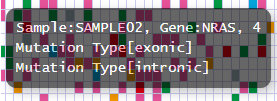
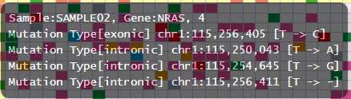

**************************
mutation-matrix
**************************

ここでは、exampleデータ (※) を基にして、それぞれのレポートを出力するために必要な入力データを解説します。

※ exampleデータはpaplotをダウンロードして解凍したディレクトリ中、exampleディレクトリにあります。

.. _mm_minimal:

==========================
1. 最小データセット
==========================

| `view report <http://genomon-project.github.io/paplot/mutation/graph_minimal.html>`_ 
| `view dataset <https://github.com/Genomon-Project/paplot/blob/master/example/mutation_minimal>`_ 
| `download dataset <https://github.com/Genomon-Project/paplot/blob/master/example/mutation_minimal.zip?raw=true>`_ 

paplotでmutation-matrixを作成するために最低限必要な項目はサンプルID(ID)、gene名(gene)、変異タイプ(func) の3つです。

データファイルから一部抜粋

.. code-block:: cfg
  :caption: example/mutation_minimal/data.csv
  
  ID,func,gene
  SAMPLE00,intronic,GATA3
  SAMPLE00,UTR3,CDH1
  SAMPLE00,exonic,GATA3
  SAMPLE01,splicing,WASF3
  SAMPLE01,intronic,WASF3
  SAMPLE01,exonic,NRAS
  SAMPLE02,intronic,FBXW7
  SAMPLE02,intronic,GATA3
  SAMPLE02,ncRNA_intronic,ACVR2B
  SAMPLE03,exonic,CAP2
  SAMPLE03,intronic,PIK3CA
  SAMPLE03,downstream,SEPT12

今回の例では列名はID、gene、funcとしていますが、任意に設定できます。

configファイルの[result_format_mutation]セクションでデータの列名を次のように設定します。

.. code-block:: cfg
  :caption: example/mutation_minimal/paplot.cfg

  [result_format_mutation]
  # column index (required)
  col_func = func
  col_gene = gene
  
  # column index (option)
  col_opt_id = ID

編集したconfigファイルを使用して ``paplot`` を実行します。

.. code-block:: bash

  paplot mutation {unzip_path}/example/mutation_minimal/data.csv ./tmp mutation_minimal \
  --config_file {unzip_path}/example/mutation_minimal/paplot.cfg

----

.. _mm_noheader:

==========================
2. ヘッダなし
==========================

| `view report <http://genomon-project.github.io/paplot/mutation/graph_noheader.html>`_ 
| `view dataset <https://github.com/Genomon-Project/paplot/blob/master/example/mutation_noheader>`_ 
| `download dataset <https://github.com/Genomon-Project/paplot/blob/master/example/mutation_noheader.zip?raw=true>`_ 

データファイルから一部抜粋

.. code-block:: cfg
  :caption: example/mutation_noheader/data.csv

  SAMPLE00,intronic,GATA3
  SAMPLE00,UTR3,CDH1
  SAMPLE00,exonic,GATA3
  SAMPLE01,splicing,WASF3
  SAMPLE01,intronic,WASF3
  SAMPLE01,exonic,NRAS
  SAMPLE02,intronic,FBXW7
  SAMPLE02,intronic,GATA3
  SAMPLE02,ncRNA_intronic,ACVR2B
  SAMPLE03,exonic,CAP2
  SAMPLE03,intronic,PIK3CA
  SAMPLE03,downstream,SEPT12

データにヘッダ行がない場合、列名でなく列番号を設定します。

configファイルの[result_format_mutation]セクションでデータの列番号を次のように設定します。

列番号は左から順に1始まりで数えます。

.. code-block:: cfg
  :caption: example/mutation_noheader/paplot.cfg
  
  [result_format_mutation]
  # column index (required)
  col_func = 2
  col_gene = 3
  
  # column index (option)
  col_opt_id = 1

編集したconfigファイルを使用して ``paplot`` を実行します。

.. code-block:: bash

  paplot mutation {unzip_path}/example/mutation_noheader/data.csv ./tmp mutation_noheader \
  --config_file {unzip_path}/example/mutation_noheader/paplot.cfg

----

.. _mm_option:

===================================
3. ポップアップの情報追加
===================================

| `view report <http://genomon-project.github.io/paplot/mutation/graph_option.html>`_ 
| `view dataset <https://github.com/Genomon-Project/paplot/blob/master/example/mutation_option>`_ 
| `download dataset <https://github.com/Genomon-Project/paplot/blob/master/example/mutation_option.zip?raw=true>`_ 

マウスオーバーで表示する情報をカスタマイズすることができます。

最小構成で表示するポップアップ（グリッド部分）はこのようになっています。

ここに情報を追加してポジションや変異内容を確認できるように変更します。

変更後

データファイルから一部抜粋

.. code-block:: cfg
  :caption: example/mutation_option/data.csv
  
  ID,Chr,Start,End,Ref,Alt,func,gene
  SAMPLE00,chr10,8114472,8114474,A,C,intronic,GATA3
  SAMPLE00,chr13,28644892,28644901,G,-,intronic,FLT3
  SAMPLE00,chr13,28664636,28664638,-,G,intronic,FLT3
  SAMPLE00,chr16,68795521,68795530,-,T,UTR3,CDH1
  SAMPLE00,chr10,8117068,8117069,G,T,exonic,GATA3
  SAMPLE00,chr3,178906688,178906688,G,A,intronic,PIK3CA
  SAMPLE00,chr13,28603715,28603715,G,-,intergenic,FLT3
  SAMPLE00,chr14,103368263,103368270,G,C,intronic,TRAF3
  SAMPLE00,chr1,26505548,26505557,T,C,exonic,CNKSR1
  SAMPLE00,chr7,140619975,140619979,-,G,intronic,BRAF
  SAMPLE00,chr14,103320225,103320225,-,T,downstream,TRAF3

今回の例では、必須項目であるサンプルID(ID)、gene名(gene)、変異タイプ(func) に加えて、
Chromosome(Chr), 変異開始位置(Start),変異終了位置(End), リファレンスの塩基 (Ref), 変異の塩基(Alt)を追加しています。

まず、追加した列名をconfigファイルに記載します。

configファイルの[result_format_mutation]セクションでデータの列名を次のように設定します。

.. code-block:: cfg
  :caption: example/mutation_option/paplot.cfg
  
  [result_format_mutation]
  # column index (option)
  col_opt_chr = Chr
  col_opt_start = Start
  col_opt_end = End
  col_opt_ref = Ref
  col_opt_alt = Alt

オプションの列名は次の形式で記述します。 ``col_opt_{name} = {columun name}`` 

``{name}`` の部分は任意に設定できますが、 ``col_opt_`` を必ず先頭につけてください。

次に、ポップアップの表示内容を変更します。

.. code-block:: cfg
  :caption: example/mutation_option/paplot.cfg
  
  [mutation]
  # 最小構成での設定
  # tooltip_format_checker_partial = type[{func}]
  # 次のように変更
  tooltip_format_checker_partial = type[{func}], {chr}:{start}:{end}, [{ref} -----> {alt}]

編集したconfigファイルを使用して ``paplot`` を実行します。

.. code-block:: bash

  paplot mutation {unzip_path}/example/mutation_option/data.csv ./tmp mutation_option \
  --config_file {unzip_path}/example/mutation_option/paplot.cfg

今回はグリッド部分のポップアップを変更しました。その他のポップアップ設定項目は `ポップアップウィンドウの表示内容 <./config.html#mm_tooltip>`_ を参照してください。

また、記述方法詳細は  :ref:`ユーザ定義フォーマット <user_format>` を参照してください。

.. |new| image:: image/tab_001.gif
