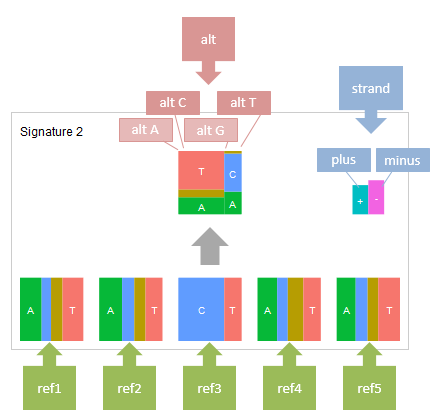

**************************
pmsignature レポート
**************************

ここでは、サンプルデータ (※) を使用して、pmsignature レポートを出力するために必要な入力データと設定方法を解説します。

※ サンプルデータは paplot をダウンロードして解凍したディレクトリ中、example ディレクトリにあります。

:doc:`exec_pmsignature` の手順でデータの準備を行う場合、設定ファイルの変更は必要ありません。

.. _json_ind:

==========================
1. jsonフォーマット
==========================

paplot で pmsignature レポートを作成するためには Mutation Matrix や Chromosomal Aberration、QC とは異なり、json ファイル形式で pmsignature データを用意する必要があります。

ここでは、paplot が使用する pmsignature データのフォーマットについて解説します。

exampleのデータファイルをテキストエディタで開くと次のようになっています。
(長いため一部省略しています)

.. code-block:: python
  :caption: example/pmsignature_stack/data2.json

  {
    "ref":[
            [ # pmsignature 1
              [0.338,0.15,0.183,0.327],  # ref1 (A,C,G,T)
              [0.362,0.191,0.177,0.267], # ref2 (A,C,G,T)
              [0,0.731,0,0.268],         # ref3 (A,C,G,T)
              [0.31,0.165,0.251,0.272],  # ref4 (A,C,G,T)
              [0.295,0.193,0.168,0.341]  # ref5 (A,C,G,T)
            ],
            [ # pmsignature 2
              [0.179,0.414,0.084,0.321],
              [0.007,0.025,0.004,0.962],
              [0,0.999,0,0],
              [0.472,0.104,0.041,0.381],
              [0.277,0.175,0.284,0.262]
            ]
          ],
    "alt":[
            [ # pmsignature 1
              [0,0,0,0],                 # altA (A,C,G,T)
              [0.194,0,0.091,0.445],     # altC (A,C,G,T)
              [0,0,0,0],                 # altG (A,C,G,T)
              [0.093,0.163,0.011,0]      # altT (A,C,G,T)
            ],
            [ # pmsignature 2
              [0,0,0,0],
              [0.059,0,0.437,0.502],
              [0,0,0,0],
              [0,0,0,0]
            ]
          ],
    "strand":[
              [0.461,0.538],  # pmsignature 1
              [0.512,0.487]   # pmsignature 2
             ],
    "id":["PD3851a","PD3890a","PD3904a"],
    "mutation":[[0,0,0.535],[0,1,0.038],[0,2,0.426],[1,0,0.186],[1,1,0.156],[1,2,0.656]],
    "mutation_count":[702,2312,2096]
  }

**pmsignature データフォーマット**

:ref:
  | pmsignatureの各リファレンスの値。
  | pmsignatureごと、リファレンスごとにA → C → G → Tの順に値を記述します。描画時に再計算しますので、合計して1になる必要はありません。
  | 今回の例ではbaseの数が5ですが、3や7など奇数の数値であれば変更可能です。

:alt:
  | pmsignatureのaltの値。
  | pmsignatureごとに16個の値を設定します。
  | 横方向のサイズは ref3 (base=5の場合。base=3であれば ref2、base=7 であれば ref4) の ACGT の各値に従うため、altA と altG については通常は 0 を設定します。

:strand:
  | pmsignatureのstrandの値。
  | pmsignatureごとに plus/minus 2 つの値をそれぞれ設定します。
  | strandが無い場合は `[0,0]` を記入します。

**寄与度グラフ描画データ**

この項目はオプションです。

設定するとサンプル毎にpmsignatureの寄与度グラフ ( `例 <http://genomon-project.github.io/paplot/pmsignature/graph_stack2.html>`_ ) を作成します。

:id:
  | サンプル名リスト

:mutation_count:
  | サンプルごとの変異数
  | 上記の例の場合、PD3851a の変異数=702、PD3890a の変異数=2312、PD3904a の変異数=2096 となります。

:mutation:
  | サンプルごと、pmsignatureごとの割合を設定します。 
  | [sample index, pmsignature index, value] の順に記載します。
  |
  | サンプルのindexは id で記載した順に0からカウントします。
  | 上記の例の場合、PD3851a=0、PD3890a=1、PD3904a=2となります。
  |
  | pmsignatureのindexも ref で記載した順に0からカウントします。
  | backgroundを使用する場合、signature1, signature2, ..., backgroundの順にカウントします。
  | 上記の例の場合、signature1 = 0、signature2 = 1、background = 2となります。

.. note::

  key 名は変更可能です。key 名を変更した場合は設定ファイル ([result_format_pmsignature] key_*) を変更してください。

  .. code-block:: cfg
    :caption:  paplot/example/pmsignature_stack/paplot.cfg
    
    [result_format_pmsignature]
    format = json
    background = True
    key_ref = ref
    key_alt = alt
    key_strand = strand
    key_id = id
    key_mutation = mutation
    key_mutation_count = mutation_count
            
.. note::

  jsonとしての形式の厳密さについては、paplotはpythonのjsonパッケージを使用しているため、次のコマンドで読めれば OK です。

  python jsonパッケージを使用したファイル確認例 (ファイル名が "data2.json" の場合)

  .. code-block:: shell
  
    $ python
    >>> import json
    >>> json.load(open("data2.json"))

----

.. _pm_minimal:

==========================
2. 最小データセット
==========================

| `このセクションで生成するレポートを見る <http://genomon-project.github.io/paplot/pmsignature/graph_pmsignature_minimal2.html>`_ 
| `このセクションで使用するデータセットを見る <https://github.com/Genomon-Project/paplot/blob/master/example/pmsignature_minimal>`_ 
| `このセクションで使用するデータセットをダウンロードする <https://github.com/Genomon-Project/paplot/blob/master/example/pmsignature_minimal.zip?raw=true>`_ 

入力データ形式は :ref:`こちら <json_ind>` 参照。

:doc:`exec_pmsignature` に従いデータの準備を行う場合、設定ファイルの変更は必要ありません。

ここでは paplot コマンドを中心に解説します。

データファイル (変異シグネチャ数は2)

.. code-block:: json
  :caption: example/pmsignature_minimal/data.json
  
  {
    "ref":[[[0.189,0.395,0.088,0.326],[0.019,0.029,0.01,0.94],[0,0.999,0,0],[0.467,0.103,0.054,0.374],[0.278,0.175,0.276,0.268]]],
    "alt":[[[0,0,0,0],[0.063,0,0.415,0.521],[0,0,0,0],[0,0,0,0]]],
    "strand":[[0.514,0.485]]
  }

設定ファイル

.. code-block:: cfg
  :caption: example/signature_minimal/paplot.cfg
  
  [pmsignature]
  tooltip_format_ref1 = A: {a:.2}
  tooltip_format_ref2 = C: {c:.2}
  tooltip_format_ref3 = G: {g:.2}
  tooltip_format_ref4 = T: {t:.2}
  tooltip_format_alt1 = C -> A: {ca:.2}
  tooltip_format_alt2 = C -> G: {cg:.2}
  tooltip_format_alt3 = C -> T: {ct:.2}
  tooltip_format_alt4 = T -> A: {ta:.2}
  tooltip_format_alt5 = T -> C: {tc:.2}
  tooltip_format_alt6 = T -> G: {tg:.2}
  tooltip_format_strand = + {plus:.2} - {minus:.2}
  
  color_A = #06B838
  color_C = #609CFF
  color_G = #B69D02
  color_T = #F6766D
  color_plus = #00BEC3
  color_minus = #F263E2
  
  [result_format_pmsignature]
  format = json
  background = True
  key_ref = ref
  key_alt = alt
  key_strand = strand

``paplot`` を実行します。

.. code-block:: bash

  paplot pmsignature pmsignature_minimal/data.json ./tmp pmsignature_minimal \
  --config_file ./pmsignature_minimal/paplot.cfg

上記のコマンドを実行すると以下の場所にレポートが作成されます。

ここで出力されるレポートは、graph_signature2.html と、pmsignature 数がファイル名に反映されています。

pmsignature数はpaplot実行時に入力ファイル (data.json) から読み取り、自動的に判定します。

::

  ./tmp
    ┗ pmsignature_minimal
        ┗ graph_pmsignature2.html

.. note::

  今回の例ではpmsignatureの出力にbackgroundを設定しているため、実際に出力される pmsignature は 1 少ない数（今回は 1 つだけ）が表示されます。

----

.. _pm_mclass:

===================================
3. 複数タイプのpmsignature
===================================

| このセクションで生成するレポートを見る

 - `pmsignature 2 <http://genomon-project.github.io/paplot/pmsignature/graph_multi_class2.html>`_ 
 - `pmsignature 3 <http://genomon-project.github.io/paplot/pmsignature/graph_multi_class3.html>`_ 
 - `pmsignature 4 <http://genomon-project.github.io/paplot/pmsignature/graph_multi_class4.html>`_ 
 - `pmsignature 5 <http://genomon-project.github.io/paplot/pmsignature/graph_multi_class5.html>`_ 
 - `pmsignature 6 <http://genomon-project.github.io/paplot/pmsignature/graph_multi_class6.html>`_ 

| `このセクションで使用するデータセットを見る <https://github.com/Genomon-Project/paplot/blob/master/example/pmsignature_multi_class>`_ 
| `このセクションで使用するデータセットをダウンロードする <https://github.com/Genomon-Project/paplot/blob/master/example/pmsignature_multi_class.zip?raw=true>`_ 

入力データ形式は :ref:`こちら <json_ind>` 参照。

:doc:`exec_pmsignature` の手順でデータの準備を行う場合、設定ファイルの変更は必要ありません。ここでは paplot コマンドを中心に解説します。

データファイルは pmsignature タイプの数だけ用意し、設定ファイルは形式が同じであれば一つだけ用意します。

今回の場合、以下のファイル構成になります。

::

  example/pmsignature_multi_class/

     # データファイル
    ┣ data2.json  # pmsignature num = 2
    ┣ data3.json  # pmsignature num = 3
    ┣ data4.json  # pmsignature num = 4
    ┣ data5.json  # pmsignature num = 5
    ┣ data6.json  # pmsignature num = 6

     # 設定ファイル
    ┗ paplot.cfg

``paplot`` を実行します。

.. code-block:: bash

  paplot pmsignature pmsignature_multi_class/data2.json ./tmp pmsignature_multi_class \
  --config_file ./pmsignature_multi_class/paplot.cfg

  paplot pmsignature pmsignature_multi_class/data3.json ./tmp pmsignature_multi_class \
  --config_file ./pmsignature_multi_class/paplot.cfg

  paplot pmsignature pmsignature_multi_class/data4.json ./tmp pmsignature_multi_class \
  --config_file ./pmsignature_multi_class/paplot.cfg

  paplot pmsignature pmsignature_multi_class/data5.json ./tmp signature_multi_class \
  --config_file ./pmsignature_multi_class/paplot.cfg

  paplot pmsignature pmsignature_multi_class/data6.json ./tmp pmsignature_multi_class \
  --config_file ./pmsignature_multi_class/paplot.cfg

上記のように一つずつ実行してもよいですが、下記のようにまとめて実行することもできます。

.. code-block:: bash

  paplot pmsignature "pmsignature_multi_class/data*.json" ./tmp pmsignature_multi_class \
  --config_file ./pmsignature_multi_class/paplot.cfg

上記のコマンドを実行すると以下の場所にレポートが作成されます。

ここで出力されるレポートは、graph_signature2.html と、pmsignature数がファイル名に反映されています。

pmsignature 数は paplot 実行時に入力ファイル (data?.json) のデータから読み取り、自動的に判定します。ファイル名称には依存しません。

::

  ./tmp
    ┗ pmsignature_multi_class
        ┣ graph_pmsignature2.html
        ┣ graph_pmsignature3.html
        ┣ graph_pmsignature4.html
        ┣ graph_pmsignature5.html
        ┗ graph_pmsignature6.html

.. note::

  今回の例では pmsignature の出力に background を設定しているため、実際に出力される pmsignature は1少ない数（今回は 1 つだけ）が表示されます。

----

.. _pm_stack:

==========================
4. 寄与度グラフ
==========================

| このセクションで生成するレポートを見る

 - `pmsignature 2 <http://genomon-project.github.io/paplot/pmsignature/graph_stack2.html>`_ 
 - `pmsignature 3 <http://genomon-project.github.io/paplot/pmsignature/graph_stack3.html>`_ 
 - `pmsignature 4 <http://genomon-project.github.io/paplot/pmsignature/graph_stack4.html>`_ 
 - `pmsignature 5 <http://genomon-project.github.io/paplot/pmsignature/graph_stack5.html>`_ 
 - `pmsignature 6 <http://genomon-project.github.io/paplot/pmsignature/graph_stack6.html>`_ 

| `このセクションで使用するデータセットを見る <https://github.com/Genomon-Project/paplot/blob/master/example/pmsignature_stack>`_ 
| `このセクションで使用するデータセットをダウンロードする <https://github.com/Genomon-Project/paplot/blob/master/example/pmsignature_stack.zip?raw=true>`_ 

レポートに変異の内訳グラフを追加します。 :ref:`こちら <json_ind>` で解説に使用しているデータで、:doc:`exec_pmsignature` の手順でデータの準備を行う場合に出力されるデータです。

データフォーマットは :ref:`こちら <json_ind>` 参照。

複数データ実行方法は :ref:`こちら <pm_mclass>` 参照。

----

.. _pm_nobackground:

==========================
5. Backgroundなし
==========================

| `このセクションで生成するレポートを見る <http://genomon-project.github.io/paplot/pmsignature/graph_nobackground2.html>`_ 
| `このセクションで使用するデータセットを見る <https://github.com/Genomon-Project/paplot/blob/master/example/pmsignature_nobackground>`_ 
| `このセクションで使用するデータセットをダウンロードする <https://github.com/Genomon-Project/paplot/blob/master/example/pmsignature_nobackground.zip?raw=true>`_ 

:doc:`exec_pmsignature` の手順でデータの準備を行う場合、background ありで pmsignature を作成しますが、background なしで pmsignature を出力することもできます。

手順詳細は :doc:`exec_pmsignature` を参照ください。

1. pmsignature を background なしで作成します。

.. code-block:: R

  library(pmsignature)
  
  # use sample data
  inputFile <- system.file("extdata/Nik_Zainal_2012.mutationPositionFormat.txt.gz", package="pmsignature")
  G <- readMPFile(inputFile, numBases = 5, trDir = TRUE)
  
  # background を使用する場合
  # BG_prob <- readBGFile(G)
  # Param <- getPMSignature(G, K = 3, BG = BG_prob)
  # Boot <- bootPMSignature(G, Param0 = Param, bootNum = 100, BG = BG_prob)

  # background を使用しない場合
  Param <- getPMSignature(G, K = 3)
  Boot <- bootPMSignature(G, Param0 = Param, bootNum = 100)
  
  # save .Rdata
  resultForSave <- list(Param, Boot)
  save(resultForSave, file="pmsignature_ind3.Rdata")

2. 作成した Rdata を json に変換します。

.. code-block:: bash

  R --vanilla --slave --args ./pmsignature_ind3.Rdata ./pmsignature_ind3.json < {path to genomon_Rscripts}/pmsignature/convert_toJson_ind.R

3. 設定ファイルで background オプションを False に設定します。

.. code-block:: cfg
  :caption: example/pmsignature_nobackground/paplot.cfg

  [result_format_pmsignature]
  background = False

4. ``paplot`` を実行します。

.. code-block:: bash

  paplot pmsignature pmsignature_nobackground/data.json ./tmp pmsignature_nobackground \
  --config_file ./pmsignature_nobackground/paplot.cfg

.. |new| image:: image/tab_001.gif
