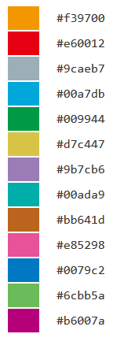

**************************
QC レポート
**************************

ここでは、サンプルデータ [*]_ を使用して、QC レポートを出力するために必要な入力データと設定方法を解説します。

.. [*] サンプルデータは paplot をダウンロードして解凍したディレクトリ中、example ディレクトリにあります。

.. _qc_minimal:

==========================
1. 最小データセット
==========================

| `このセクションで生成するレポートを見る <http://genomon-project.github.io/paplot/qc_minimal/graph_minimal.html>`_ 
| `このセクションで使用するデータセットを見る <https://github.com/Genomon-Project/paplot/blob/master/example/qc_minimal>`_ 
| `このセクションで使用するデータセットをダウンロードする <https://github.com/Genomon-Project/paplot/blob/master/example/qc_minimal.zip?raw=true>`_ 

paplot で QC レポートを作成するために最低限必要な情報はサンプルID (Sample) と QC の値 (最低 1 項目) です。
今回の例では、QC の値に depth 平均値 (AverageDepth) を使用していますが、別の値でも問題ありません。

.. code-block:: cfg
  :caption: データファイルから一部抜粋 (example/qc_minimal/data.csv)
  
  Sample,AverageDepth
  SAMPLE1,70.0474
  SAMPLE2,65.7578
  SAMPLE3,63.3750
  SAMPLE4,70.9654
  SAMPLE5,69.9653

まず、設定ファイルの [result_format_qc] セクションに入力データの列名を登録します。

.. code-block:: cfg
  :caption: example/qc_minimal/paplot.cfg
  
  [result_format_qc]
  col_opt_id = Sample
  col_opt_key1 = AverageDepth

列名は次の形式で記述します。 ``col_opt_{キーワード} = {実際の列名}`` 

 - ``{キーワード}`` の部分は任意に設定できますが、 ``col_opt_`` を必ず先頭につけてください。
 - ``{キーワード}`` には半角英数字 (1-9, a-z, A-Z) および "_" のみ使用できます。
 - ``col_opt_id`` は予約済みですので、サンプルID 以外の用途には使用できません。
  
次に、設定ファイルに [qc_chart_1] セクションを追加し、次のように設定します。

.. code-block:: cfg
  :caption: example/qc_minimal/paplot.cfg
  
  [qc_chart_1]
  
  # グラフのタイトル
  title = Depth average
  
  # Y 軸のラベル
  title_y = Average of depth
  
  # 積み上げ要素
  # 今回は 1 項目のみなので、通常の棒グラフとして表現されます
  stack1 = {key1}
  
  # グラフの色と凡例
  name_set = Average depth:#2478B4
  
  # ポップアップのフォーマット
  tooltip_format1 = Sample:{id}
  tooltip_format2 = {key1:.2}

.. note::

  ここで使用している ``{key1}`` は [result_format_qc] セクションで入力した ``{キーワード}`` です。
  
  - name_set の記入方法詳細は `name_set の書き方 <./data_qc.html#qc-nameset>`_ を参照してください。
  - tooltip_format の記入方法詳細は `ユーザ定義フォーマット <./data_common.html#user-format>`_ を参照してください。

編集した設定ファイルを使用して ``paplot`` を実行します。

.. code-block:: bash

  paplot qc {unzip_path}/example/qc_minimal/data.csv ./tmp qc_minimal \
  --config_file {unzip_path}/example/qc_minimal/paplot.cfg

----

.. _qc_noheader:

==========================
2. ヘッダなし
==========================

| `このセクションで生成するレポートを見る <http://genomon-project.github.io/paplot/qc_noheader/graph_noheader.html>`_ 
| `このセクションで使用するデータセットを見る <https://github.com/Genomon-Project/paplot/blob/master/example/qc_noheader>`_ 
| `このセクションで使用するデータセットをダウンロードする <https://github.com/Genomon-Project/paplot/blob/master/example/qc_noheader.zip?raw=true>`_ 

.. code-block:: cfg
  :caption: データファイルから一部抜粋 (example/qc_noheader/data.csv)
  
  SAMPLE1,70.0474
  SAMPLE2,65.7578
  SAMPLE3,63.3750
  SAMPLE4,70.9654
  SAMPLE5,69.9653

データにヘッダ行がない場合、列名でなく列番号を設定します。

設定ファイルの [result_format_qc] セクションでデータの列番号を次のように設定します。

列番号は左から順に 1 始まりで数えます。

.. code-block:: cfg
  :caption: example/qc_noheader/paplot.cfg
  
  [result_format_qc]
  # ヘッダオプションを False に設定する
  header = False

  col_opt_id = 1
  col_opt_average_depth = 2

編集した設定ファイルを使用して ``paplot`` を実行します。

.. code-block:: bash

  paplot qc {unzip_path}/example/qc_noheader/data.csv ./tmp qc_noheader \
  --config_file {unzip_path}/example/qc_noheader/paplot.cfg

----

.. _qc_stack:

==========================
3. 積み上げグラフ
==========================

| `このセクションで生成するレポートを見る <http://genomon-project.github.io/paplot/qc_stack/graph_stack.html>`_ 
| `このセクションで使用するデータセットを見る <https://github.com/Genomon-Project/paplot/blob/master/example/qc_stack>`_ 
| `このセクションで使用するデータセットをダウンロードする <https://github.com/Genomon-Project/paplot/blob/master/example/qc_stack.zip?raw=true>`_ 

最小構成では 1 つの棒グラフを作成しました。今回はさらに積み上げグラフを追加します。

.. code-block:: cfg
  :caption: データファイルから一部抜粋 (example/qc_stack/data.csv)
  
  Sample,AverageDepth,ReadLengthR1,ReadLengthR2
  SAMPLE1,70.0474,265,270
  SAMPLE2,65.7578,140,200
  SAMPLE3,63.375,120,175
  SAMPLE4,70.9654,120,140
  SAMPLE5,69.9653,230,110

ここでは以下の構成でグラフを作成します。

 - chart_1　[棒グラフ] AverageDepth (最小構成と同じ)
 - chart_2　[積み上げグラフ] ReadLengthR1, ReadLengthR2

完成したグラフは `ここ <http://genomon-project.github.io/paplot/qc_stack/graph_stack.html>`_ を参照してください。

まず、設定ファイルの [result_format_qc] セクションに入力データの列名を登録します。

.. code-block:: cfg
  :caption: example/qc_multi_plot/paplot.cfg
  
  [result_format_qc]
  col_opt_id = Sample
  
  # chart_1 で使用するデータ
  col_opt_keyA1 = AverageDepth
  
  # chart_2 で使用するデータ
  col_opt_keyB1 = ReadLengthR1
  col_opt_keyB2 = ReadLengthR2

列名は次の形式で記述します。 ``col_opt_{キーワード} = {実際の列名}`` 

 - ``{キーワード}`` の部分は任意に設定できますが、 ``col_opt_`` を必ず先頭につけてください。
 - ``{キーワード}`` には半角英数字 (1-9, a-z, A-Z) および "_" のみ使用できます。
 - ``col_opt_id`` は予約済みですので、サンプルID以外の用途には使用できません。
 
次に、設定ファイルに [qc_chart_1]、[qc_chart_2] ... セクションを追加し、順番に設定します。

| QC レポートは [qc_chart_1] → [qc_chart_2] → [qc_chart_3] の順番に表示し、必要な数だけ [qc_chart_*] セクションを増やすことができます。
| ``*`` には 1 から始まる連番を入れてください。1 から順に表示します。

完成した設定ファイルは `ここ <https://github.com/Genomon-Project/paplot/blob/master/example/qc_stack/paplot.cfg>`_ を参照してください。

3-1. 単純な棒グラフ
---------------------------

chart_1 は単純な棒グラフです。

記載方法は最小構成と同じですので、ここでは割愛します。

3-2. 積み上げグラフ
-----------------------

chart_2 は積み上げグラフです。

.. code-block:: cfg
  :caption: example/qc_multi_plot/paplot.cfg
  
  [qc_chart_2]
  
  # 表示する文字列を設定します
  title = Read length
  title_y = Read length

  # グラフの積み上げ要素
  # stack1 → 2 → ... の順に下から表示します。stack1 を一番下に表示します
  stack1 = {keyB1}
  stack2 = {keyB2}
  
  # 凡例の文字列と色を設定します
  # stack1 → 2 → ... の順に , で区切って書きます
  name_set = Read length r1:#2478B4, Read length r2:#FF7F0E
  
  # ポップアップの表示内容
  tooltip_format1 = Sample:{id}
  tooltip_format2 = Read1: {keyB1: ,}
  tooltip_format3 = Read2: {keyB2: ,}

.. note::

  ここで使用している ``{key*}`` は [result_format_qc] セクションで入力した ``{キーワード}`` です。
  
  - name_set の記入方法詳細は `name_set の書き方 <./data_qc.html#qc-nameset>`_ を参照してください。
  - tooltip_format の記入方法詳細は `ユーザ定義フォーマット <./data_common.html#user-format>`_ を参照してください。

編集した設定ファイルを使用して ``paplot`` を実行します。

.. code-block:: bash

  paplot qc {unzip_path}/example/qc_multi_plot/data.csv ./tmp qc_multi_plot \
  --config_file {unzip_path}/example/qc_multi_plot/paplot.cfg

----

.. _qc_nameset:

3-3. name_set の書き方
------------------------------

凡例名と色を定義します。

``{要素の凡例名}:{セルの色}`` を積み上げ要素ごとに記入します。セルの色は省略可能です。

.. code-block:: cfg
  
  name_set = average_depth:#2478B4
  
  # 複数ある場合は , で区切って書きます
  # stack1 → 2 → ... の順に stack の数だけ書きます
  name_set = Read length r1:#2478B4, Read length r2:#FF7F0E
  
セルの色を省略した場合、以下の色を上から順にローテーションで使用します。

----

.. _qc_variation:

=================================
4. 様々なグラフ
=================================

| `このセクションで生成するレポートを見る <http://genomon-project.github.io/paplot/qc_variation/graph_variationt.html>`_ 
| `このセクションで使用するデータセットを見る <https://github.com/Genomon-Project/paplot/blob/master/example/qc_variation>`_ 
| `このセクションで使用するデータセットをダウンロードする <https://github.com/Genomon-Project/paplot/blob/master/example/qc_variation.zip?raw=true>`_ 

前章では 1 つの棒グラフと積み上げグラフを作成しました。今回は複数のグラフを作成します。

.. code-block:: cfg
  :caption: データファイルから一部抜粋 (example/qc_variation/data.csv)
  
  Sample,AverageDepth,ReadLengthR1,ReadLengthR2,TotalReads,MappedReads,2xRatio,10xRatio,20xRatio,30xRatio
  SAMPLE1,70.0474,265,270,94315157,56262203,0.9796,0.768,0.6844,0.6747
  SAMPLE2,65.7578,140,200,50340277,33860998,0.8489,0.7725,0.7655,0.6131
  SAMPLE3,63.375,120,175,90635480,88010999,0.9814,0.8236,0.6045,0.5889
  SAMPLE4,70.9654,120,140,72885114,89163960,0.9047,0.8303,0.7032,0.6801
  SAMPLE5,69.9653,230,110,92572101,28793615,0.9776,0.9452,0.672,0.6518

ここでは以下の構成でグラフを作成します。

 - chart_1　[棒グラフ] AverageDepth (最小構成と同じ)
 - chart_2　[積み上げグラフ] ReadLengthR1, ReadLengthR2 (前章と同じ)
 - chart_3　[棒グラフ] MappedReads を TotalReads で割る
 - chart_4　[積み上げグラフ] 2xRatio, 10xRatio, 20xRatio, 30xRatio (下段の値を引く)

完成したグラフは `ここ <http://genomon-project.github.io/paplot/qc_variation/graph_variation.html>`_ を参照してください。

まず、設定ファイルの [result_format_qc] セクションに入力データの列名を登録します。

.. code-block:: cfg
  :caption: example/qc_variation/paplot.cfg
  
  [result_format_qc]
col_opt_id = Sample

# chart_1 で使用するデータ
col_opt_average_depth = AverageDepth

# chart_2 で使用するデータ
col_opt_read_length_r1 = ReadLengthR1
col_opt_read_length_r2 = ReadLengthR2

# chart_3 で使用するデータ
col_opt_mapped_reads = MappedReads
col_opt_total_reads = TotalReads

# chart_4 で使用するデータ
col_opt_ratio_2x = 2xRatio
col_opt_ratio_10x = 10xRatio
col_opt_ratio_20x = 20xRatio
col_opt_ratio_30x = 30xRatio

列名は次の形式で記述します。 ``col_opt_{キーワード} = {実際の列名}`` 

 - ``{キーワード}`` の部分は任意に設定できますが、 ``col_opt_`` を必ず先頭につけてください。
 - ``{キーワード}`` には半角英数字 (1-9, a-z, A-Z) および "_" のみ使用できます。
 - ``col_opt_id`` は予約済みですので、サンプルID以外の用途には使用できません。
 
次に、設定ファイルに [qc_chart_1]、[qc_chart_2]、[qc_chart_3] ... セクションを追加し、順番に設定します。

| QC レポートは [qc_chart_1] → [qc_chart_2] → [qc_chart_3] の順番に表示し、必要な数だけ [qc_chart_*] セクションを増やすことができます。
| ``*`` には 1 から始まる連番を入れてください。1 から順に表示します。

完成した設定ファイルは `ここ <https://github.com/Genomon-Project/paplot/blob/master/example/qc_variation/paplot.cfg>`_ を参照してください。

4-1. 単純な棒グラフ
---------------------------

chart_1 (Depth average) は単純な棒グラフです。

記載方法は最小構成と同じですので、ここでは割愛します。

4-2. 単純な積み上げグラフ
-------------------------------------

chart_2 (Read length) は積み上げグラフです。

記載方法は前章と同じですので、ここでは割愛します。

4-3. 列同士の数値演算 (棒グラフ)
--------------------------------------

chart_3 (Mapped reads) は列同士で計算 (今回は割り算) させて出力します。

.. code-block:: cfg
  :caption: example/qc_variation/paplot.cfg

  [qc_chart_3]
  
  # 表示する文字列を設定します
  title = Mapped reads/Total reads
  title_y = Rate
  
  # 凡例の文字列と色を設定します
  name_set = Mapped reads/Total reads:#2478B4
  
  # グラフの値
  stack1 = {mapped_reads/total_reads}
  
  # ポップアップの表示内容
  tooltip_format1 = Sample:{id}
  tooltip_format2 = {mapped_reads/total_reads:.2}

グラフの要素について

| 上記では、 ``stack1 = {mapped_reads/total_reads}`` と記入しています。
| ここで ``{mapped_reads-total_reads}`` と書くと引き算に、 ``{mapped_reads+total_reads}`` と書くと足し算させることができます。
| 
| なお、ポップアップでも同様に数値演算させています。
| ``tooltip_format2 = {mapped_reads/total_reads:.2}``
| 
| もし、ポップアップではそれぞれの値を表示したい場合は
| ``tooltip_format2 = Mapped: {mapped_reads}, Total: {total_reads}`` 等と書くとそれぞれの値が表示されます。
|
| ポップアップ記述方法詳細は  :ref:`ユーザ定義フォーマット <user_format>` を参照してください。
|

4-4. 列同士の数値演算 (積み上げグラフ)
-----------------------------------------------

chart_4 (Depth coverage) は積み上げグラフです。

単純に積み上げず、数値演算を加えて前段の値を引き算します。

.. code-block:: cfg
  :caption: example/qc_variation/paplot.cfg
  
  [qc_chart_2]
  
  # 表示する文字列を設定します
  title = Depth coverage
  title_y = Coverage
  
  # 凡例の文字列と色を設定します
  name_set = Ratio 30x:#2478B4, Ratio 20x:#FF7F0E, Ratio 10x:#2CA02C, Ratio 2x:#D62728
  
  # グラフの値
  stack1 = {ratio_30x}
  stack2 = {ratio_20x-ratio_30x}
  stack3 = {ratio_10x-ratio_20x}
  stack4 = {ratio_2x-ratio_10x}
  
  # ポップアップの表示内容
  tooltip_format1 = ID:{id}
  tooltip_format2 = ratio__2x: {ratio_2x:.2}
  tooltip_format3 = ratio_10x: {ratio_10x:.2}
  tooltip_format4 = ratio_20x: {ratio_20x:.2}
  tooltip_format5 = ratio_30x: {ratio_30x:.2}

上記では、stack1 に ratio_30x を、stack2 に ratio_20x から ratio_30x を引いたものを表示しています。

編集した設定ファイルを使用して ``paplot`` を実行します。

.. code-block:: bash

  paplot qc {unzip_path}/example/qc_variation/data.csv ./tmp qc_variation \
  --config_file {unzip_path}/example/qc_variation/paplot.cfg

----

.. _qc_brush:

==========================
5. 範囲選択用
==========================

| `このセクションで生成するレポートを見る <http://genomon-project.github.io/paplot/qc_brush/graph_brush.html>`_ 
| `このセクションで使用するデータセットを見る <https://github.com/Genomon-Project/paplot/blob/master/example/qc_brush>`_ 
| `このセクションで使用するデータセットをダウンロードする <https://github.com/Genomon-Project/paplot/blob/master/example/qc_brush.zip?raw=true>`_ 

前章で作成した複数のグラフに対し、範囲選択用のグラフを追加します。

完成したグラフは `ここ <http://genomon-project.github.io/paplot/qc_brush/graph_brush.html>`_ を参照してください。

データ列は AverageDepth を使用します。

もし、新しいデータ列を使用する場合は設定ファイルの [result_format_qc] セクションに col_opt_{name} として登録してください。

範囲選択用のグラフは [qc_chart_brush] というセクション名で一つだけ追加することができます。

.. code-block:: cfg
  :caption: example/qc_brush/paplot.cfg
  
  [qc_chart_brush]
  stack = {average_depth}
  name_set = average:#E3E5E9

編集した設定ファイルを使用して ``paplot`` を実行します。

.. code-block:: bash

  paplot qc {unzip_path}/example/qc_brush/data.csv ./tmp qc_brush \
  --config_file {unzip_path}/example/qc_brush/paplot.cfg

.. |new| image:: image/tab_001.gif
