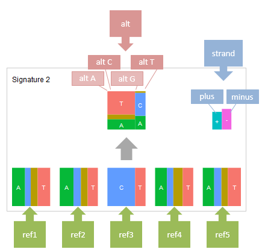

**************************
データフォーマット
**************************

ここでは、exampleデータ (※) を基にして、それぞれのレポートを出力するために必要な入力データを解説します。

※ exampleデータはpaplotをダウンロードして解凍したディレクトリ中、exampleディレクトリにあります。

.. _data_mm:

----------------------
1. mutation-matrix
----------------------

.. _mm_minimal:

==========================
1-1. 最小データセット
==========================

| `view report <http://genomon-project.github.io/paplot/mutation/graph_minimal.html>`_ 
| `view dataset <https://github.com/Genomon-Project/paplot/blob/master/example/mutation_minimal>`_ 
| `download dataset <https://github.com/Genomon-Project/paplot/blob/master/example/mutation_minimal.zip?raw=true>`_ 

paplotでmutation-matrixを作成するために最低限必要な項目はサンプルID(ID)、gene名(gene)、変異タイプ(func) の3つです。

データファイルから一部抜粋

.. code-block:: cfg
  :caption: example/mutation_minimal/data.csv
  
  ID,func,gene
  SAMPLE00,intronic,GATA3
  SAMPLE00,UTR3,CDH1
  SAMPLE00,exonic,GATA3
  SAMPLE01,splicing,WASF3
  SAMPLE01,intronic,WASF3
  SAMPLE01,exonic,NRAS
  SAMPLE02,intronic,FBXW7
  SAMPLE02,intronic,GATA3
  SAMPLE02,ncRNA_intronic,ACVR2B
  SAMPLE03,exonic,CAP2
  SAMPLE03,intronic,PIK3CA
  SAMPLE03,downstream,SEPT12

今回の例では列名はID、gene、funcとしていますが、任意に設定できます。

configファイルの[result_format_mutation]セクションでデータの列名を次のように設定します。

.. code-block:: cfg
  :caption: example/mutation_minimal/paplot.cfg

  [result_format_mutation]
  # column index (required)
  col_func = func
  col_gene = gene
  
  # column index (option)
  col_opt_id = ID


編集したconfigファイルを使用して ``paplot`` を実行します。

.. code-block:: bash

  paplot mutation {unzip_path}/example/mutation_minimal/data.csv ./tmp mutation_minimal \
  --config_file {unzip_path}/example/mutation_minimal/paplot.cfg

----

.. _mm_noheader:

==========================
1-2. ヘッダなし
==========================

| `view report <http://genomon-project.github.io/paplot/mutation/graph_noheader.html>`_ 
| `view dataset <https://github.com/Genomon-Project/paplot/blob/master/example/mutation_noheader>`_ 
| `download dataset <https://github.com/Genomon-Project/paplot/blob/master/example/mutation_noheader.zip?raw=true>`_ 

データファイルから一部抜粋

.. code-block:: cfg
  :caption: example/mutation_noheader/data.csv

  SAMPLE00,intronic,GATA3
  SAMPLE00,UTR3,CDH1
  SAMPLE00,exonic,GATA3
  SAMPLE01,splicing,WASF3
  SAMPLE01,intronic,WASF3
  SAMPLE01,exonic,NRAS
  SAMPLE02,intronic,FBXW7
  SAMPLE02,intronic,GATA3
  SAMPLE02,ncRNA_intronic,ACVR2B
  SAMPLE03,exonic,CAP2
  SAMPLE03,intronic,PIK3CA
  SAMPLE03,downstream,SEPT12

データにヘッダ行がない場合、列名でなく列番号を設定します。

configファイルの[result_format_mutation]セクションでデータの列番号を次のように設定します。

列番号は左から順に1始まりで数えます。

.. code-block:: cfg
  :caption: example/mutation_noheader/paplot.cfg
  
  [result_format_mutation]
  # column index (required)
  col_func = 2
  col_gene = 3
  
  # column index (option)
  col_opt_id = 1

編集したconfigファイルを使用して ``paplot`` を実行します。

.. code-block:: bash

  paplot mutation {unzip_path}/example/mutation_noheader/data.csv ./tmp mutation_noheader \
  --config_file {unzip_path}/example/mutation_noheader/paplot.cfg

----

.. _mm_option:

===================================
1-3. ポップアップの情報追加
===================================

| `view report <http://genomon-project.github.io/paplot/mutation/graph_option.html>`_ 
| `view dataset <https://github.com/Genomon-Project/paplot/blob/master/example/mutation_option>`_ 
| `download dataset <https://github.com/Genomon-Project/paplot/blob/master/example/mutation_option.zip?raw=true>`_ 

マウスオーバーで表示する情報をカスタマイズすることができます。

最小構成で表示するポップアップ（グリッド部分）はこのようになっています。

.. image:: image/data_mut1.png

ここに情報を追加してポジションや変異内容を確認できるように変更します。

変更後

.. image:: image/data_mut2.png

データファイルから一部抜粋

.. code-block:: cfg
  :caption: example/mutation_option/data.csv
  
  ID,Chr,Start,End,Ref,Alt,func,gene
  SAMPLE00,chr10,8114472,8114474,A,C,intronic,GATA3
  SAMPLE00,chr13,28644892,28644901,G,-,intronic,FLT3
  SAMPLE00,chr13,28664636,28664638,-,G,intronic,FLT3
  SAMPLE00,chr16,68795521,68795530,-,T,UTR3,CDH1
  SAMPLE00,chr10,8117068,8117069,G,T,exonic,GATA3
  SAMPLE00,chr3,178906688,178906688,G,A,intronic,PIK3CA
  SAMPLE00,chr13,28603715,28603715,G,-,intergenic,FLT3
  SAMPLE00,chr14,103368263,103368270,G,C,intronic,TRAF3
  SAMPLE00,chr1,26505548,26505557,T,C,exonic,CNKSR1
  SAMPLE00,chr7,140619975,140619979,-,G,intronic,BRAF
  SAMPLE00,chr14,103320225,103320225,-,T,downstream,TRAF3

今回の例では、必須項目であるサンプルID(ID)、gene名(gene)、変異タイプ(func) に加えて、
Chromosome(Chr), 変異開始位置(Start),変異終了位置(End), リファレンスの塩基 (Ref), 変異の塩基(Alt)を追加しています。

まず、追加した列名をconfigファイルに記載します。

configファイルの[result_format_mutation]セクションでデータの列名を次のように設定します。

.. code-block:: cfg
  :caption: example/mutation_option/paplot.cfg
  
  [result_format_mutation]
  # column index (option)
  col_opt_chr = Chr
  col_opt_start = Start
  col_opt_end = End
  col_opt_ref = Ref
  col_opt_alt = Alt

オプションの列名は次の形式で記述します。 ``col_opt_{name} = {columun name}`` 

``{name}`` の部分は任意に設定できますが、 ``col_opt_`` を必ず先頭につけてください。

次に、ポップアップの表示内容を変更します。

.. code-block:: cfg
  :caption: example/mutation_option/paplot.cfg
  
  [mutation]
  # 最小構成での設定
  # tooltip_format_checker_partial = type[{func}]
  # 次のように変更
  tooltip_format_checker_partial = type[{func}], {chr}:{start}:{end}, [{ref} -----> {alt}]

編集したconfigファイルを使用して ``paplot`` を実行します。

.. code-block:: bash

  paplot mutation {unzip_path}/example/mutation_option/data.csv ./tmp mutation_option \
  --config_file {unzip_path}/example/mutation_option/paplot.cfg

今回はグリッド部分のポップアップを変更しました。その他のポップアップ設定項目は `ポップアップウィンドウの表示内容 <./config.html#mm_tooltip>`_ を参照してください。

また、記述方法詳細は  :ref:`ユーザ定義フォーマット <user_format>` を参照してください。

----

.. _data_qc:

------------
2. QC
------------

.. _qc_minimal:

==========================
2-1. 最小データセット
==========================

| `view report <http://genomon-project.github.io/paplot/qc/graph_minimal.html>`_ 
| `view dataset <https://github.com/Genomon-Project/paplot/blob/master/example/qc_minimal>`_ 
| `download dataset <https://github.com/Genomon-Project/paplot/blob/master/example/qc_minimal.zip?raw=true>`_ 

paplotでQCレポートを作成するために最低限必要な情報はサンプルID(ID)とQCの値（最低1項目）です。

今回の例では、depth-averageを使用していますが、ほかの値でも問題ありません。

データファイルから一部抜粋

.. code-block:: cfg
  :caption: example/qc_minimal/data.csv
  
  ID,average_depth
  SAMPLE1,70.0474
  SAMPLE2,65.7578
  SAMPLE3,63.3750
  SAMPLE4,70.9654
  SAMPLE5,69.9653

まず、configファイルの[result_format_qc]セクションに入力データの列名を登録します。

.. code-block:: cfg
  :caption: example/qc_minimal/paplot.cfg
  
  [result_format_qc]
  # column index (option)
  col_opt_average_depth = average_depth
  col_opt_id = ID

オプションの列名は次の形式で記述します。 ``col_opt_{name} = {columun name}`` 

``{name}`` の部分は任意に設定できますが、 ``col_opt_`` を必ず先頭につけてください。

次に、configファイルに[qc_chart_1]セクションを追加し、次のように設定します。

.. code-block:: cfg
  :caption: example/qc_minimal/paplot.cfg
  
  [qc_chart_1]
  
  # グラフのタイトル
  title = depth average
  
  # Y軸のラベル
  title_y = average of depth
  
  # 積み上げ要素（今回は1項目のみなので、通常の棒グラフとなる）
  stack1 = {average_depth}
  
  # グラフの色と凡例 (欄外参照)
  name_set = average_depth:#2478B4
  
  # マウスオーバーで表示する情報のフォーマット
  tooltip_format1 = ID:{id}
  tooltip_format2 = {average_depth:.2}

ここで、 ``average_depth`` という値を変数のとして使用していますが、これは [result_format_qc]セクションで指定した ``col_opt_average_depth`` 項目のうち、``col_opt_`` を除いた名前です。

編集したconfigファイルを使用して ``paplot`` を実行します。

.. code-block:: bash

  paplot qc {unzip_path}/example/qc_minimal/data.csv ./tmp qc_minimal \
  --config_file {unzip_path}/example/qc_minimal/paplot.cfg


2-1-1. name_setの書き方
------------------------------

凡例名と色を定義します。

``{要素の凡例名}:{セルの色}`` を積み上げ要素ごとに記入します。セルの色は省略可能です。

.. code-block:: cfg
  
  name_set = average_depth:#2478B4
  
  # 複数ある場合は,で区切って書きます。
  name_set = ratio_30x:#2478B4, ratio_20x:#FF7F0E, ratio_10x:#2CA02C, ratio_2x:#D62728
  
セルの色を省略した場合、以下の色を上から順に使用します。

.. image:: image/default_color.PNG
  :scale: 100%

----

.. _qc_noheader:

==========================
2-2. ヘッダなし
==========================

| `view report <http://genomon-project.github.io/paplot/qc/graph_noheader.html>`_ 
| `view dataset <https://github.com/Genomon-Project/paplot/blob/master/example/qc_noheader>`_ 
| `download dataset <https://github.com/Genomon-Project/paplot/blob/master/example/qc_noheader.zip?raw=true>`_ 

データファイルから一部抜粋

.. code-block:: cfg
  :caption: example/qc_noheader/data.csv
  
  SAMPLE1,70.0474
  SAMPLE2,65.7578
  SAMPLE3,63.3750
  SAMPLE4,70.9654
  SAMPLE5,69.9653

データにヘッダ行がない場合、列名でなく列番号を設定します。

configファイルの[result_format_qc]セクションでデータの列番号を次のように設定します。

列番号は左から順に1始まりで数えます。

.. code-block:: cfg
  :caption: example/qc_noheader/paplot.cfg
  
  [result_format_qc]
  col_opt_average_depth = 2
  col_opt_id = 1

編集したconfigファイルを使用して ``paplot`` を実行します。

.. code-block:: bash

  paplot qc {unzip_path}/example/qc_noheader/data.csv ./tmp qc_noheader \
  --config_file {unzip_path}/example/qc_noheader/paplot.cfg

----

.. _qc_mplot:

==========================
2-3. 複数グラフ
==========================

| `view report <http://genomon-project.github.io/paplot/qc/graph_multi_plot.html>`_ 
| `view dataset <https://github.com/Genomon-Project/paplot/blob/master/example/qc_multi_plot>`_ 
| `download dataset <https://github.com/Genomon-Project/paplot/blob/master/example/qc_multi_plot.zip?raw=true>`_ 

最小構成では1つのグラフを作成しました。今回は複数のグラフを作成します。

データファイルから一部抜粋

.. code-block:: cfg
  :caption: example/qc_multi_plot/data.csv
  
  ID,average_depth,read_length_r1,read_length_r2,total_reads,mapped_reads,mean_insert_size,duplicate_reads,2x_rt,10x_rt,20x_rt,30x_rt
  SAMPLE1,70.0474,265,270,94315157,56262203,343.92,7964009,0.9796,0.7680,0.6844,0.6747
  SAMPLE2,65.7578,140,200,50340277,33860998,351.23,5297450,0.8489,0.7725,0.7655,0.6131
  SAMPLE3,63.3750,120,175,90635480,88010999,496.34,8347508,0.9814,0.8236,0.6045,0.5889
  SAMPLE4,70.9654,120,140,72885114,89163960,696.23,6726021,0.9047,0.8303,0.7032,0.6801
  SAMPLE5,69.9653,230,110,92572101,28793615,731.98,9794813,0.9776,0.9452,0.6720,0.6518

ここでは以下の構成でグラフを作成します。

 - chart_1　[棒グラフ] average_depth (最小構成と同じ)
 - chart_2　[積み上げグラフ] 2x_rt,10x_rt,20x_rt,30x_rt
 - chart_3　[棒グラフ] mapped_readsをtotal_readsで割る
 - chart_4　[棒グラフ] mean_insert_size
 - chart_5　[棒グラフ] duplicate_readsをtotal_readsで割る
 - chart_6　[積み上げグラフ] read_length_r1,read_length_r2

完成したグラフはここ `view <http://genomon-project.github.io/paplot/qc/graph_multi_plot.html>`_ を参照してください。

まず、configファイルの[result_format_qc]セクションに入力データの列名を登録します。

.. code-block:: cfg
  :caption: example/qc_multi_plot/paplot.cfg
  
  [result_format_qc]
  # column index (option)
  col_opt_average_depth = average_depth
  col_opt_id = ID
  col_opt_duplicate_reads = duplicate_reads
  col_opt_mapped_reads = mapped_reads
  col_opt_total_reads = total_reads
  col_opt_mean_insert_size = mean_insert_size
  col_opt_ratio_2x = 2x_rt
  col_opt_ratio_10x = 10x_rt
  col_opt_ratio_20x = 20x_rt
  col_opt_ratio_30x = 30x_rt
  col_opt_read_length_r1 = read_length_r1
  col_opt_read_length_r2 = read_length_r2

オプションの列名は次の形式で記述します。 ``col_opt_{name} = {columun name}`` 

``{name}`` の部分は任意に設定できますが、 ``col_opt_`` を必ず先頭につけてください。

次に、configファイルに[qc_chart_1],[qc_chart_2],[qc_chart_3]... セクションを追加し、順番に設定します。

| QCレポートは[qc_chart_1],[qc_chart_2],[qc_chart_3] の順番に表示し、必要な数だけ [qc_chart_*] セクションを増やすことができます。
| ``*`` には1から始まる連番を入れてください。1から順に表示します。

完成したconfigファイルはここ `config <https://github.com/Genomon-Project/paplot/blob/master/example/qc_multi_plot/paplot.cfg>`_ を参照してください。

2-3-1. 単純な棒グラフ
---------------------------

chart_1 (average_depth) と chart_4 (mean_insert_size) は単純な棒グラフです。

記載方法は最小構成と同じですので、ここでは割愛します。

2-3-2. 列同士の数値演算
-----------------------

chart_3 (mapped_reads) と chart_5 (duplicate_reads) は列同士で計算（今回は割り算）させて出力します。

.. code-block:: cfg
  :caption: example/qc_multi_plot/paplot.cfg

  [qc_chart_3]
  
  # 表示する文字列を設定します
  title = mapped_reads/total_reads
  title_y = rate
  
  # 凡例の文字列と色を設定します
  name_set = mapped_reads/total_reads:#2478B4
  
  # グラフの値
  stack1 = {mapped_reads/total_reads}
  
  # ポップアップの表示内容
  tooltip_format1 = ID:{id}
  tooltip_format2 = {mapped_reads/total_reads:.2}

グラフの要素について

| 上記では、 ``stack1 = {mapped_reads/total_reads}`` と記入しています。
| ここで ``{mapped_reads-total_reads}`` と書くと引き算に、 ``{mapped_reads+total_reads}`` と書くと足し算させることができます。
| 
| なお、ポップアップウィンドウでも同様に数値演算させています。
| ``tooltip_format2 = {mapped_reads/total_reads:.2}``
| 
| もし、ポップアップウィンドウではそれぞれの値を表示したい場合は
| ``tooltip_format2 = mapped: {mapped_reads}, total: {total_reads}`` 等と書くとそれぞれの値が表示されます。
|
| ポップアップウィンドウ記述方法詳細は  :ref:`ユーザ定義フォーマット <user_format>` を参照してください。
|

2-3-3. 積み上げグラフ　その１
-------------------------------------

chart_6 (read_length_r1,read_length_r2) は積み上げグラフです。

.. code-block:: cfg
  :caption: example/qc_multi_plot/paplot.cfg
  
  [qc_chart_6]
  
  # 表示する文字列を設定します
  title = read_length_r1, read_length_r2
  title_y = read_length

  # 凡例の文字列と色を設定します
  name_set = read_length_r1:#2478B4, read_length_r2:#FF7F0E
  
  # グラフの値
  stack1 = {read_length_r1}
  stack2 = {read_length_r2}
  
  # ポップアップの表示内容
  tooltip_format1 = ID:{id}
  tooltip_format2 = r1: {read_length_r1: ,}
  tooltip_format3 = r2: {read_length_r2: ,}

上記では、 stack1にread_length_r1を、stack2にread_length_r2を記入しています。

1，2，3の順に下から表示します。1を一番下に表示します。

2-3-4. 積み上げグラフ　その２
-------------------------------------

chart_6 (2x_rt,10x_rt,20x_rt,30x_rt) は積み上げグラフですが数値演算もしています。

.. code-block:: cfg
  :caption: example/qc_multi_plot/paplot.cfg
  
  [qc_chart_2]
  
  # 表示する文字列を設定します
  title = depth coverage
  title_y = coverage
  
  # 凡例の文字列と色を設定します
  name_set = ratio_30x:#2478B4, ratio_20x:#FF7F0E, ratio_10x:#2CA02C, ratio_2x:#D62728
  
  # グラフの値
  stack1 = {ratio_30x}
  stack2 = {ratio_20x-ratio_30x}
  stack3 = {ratio_10x-ratio_20x}
  stack4 = {ratio_2x-ratio_10x}
  
  # ポップアップの表示内容
  tooltip_format1 = ID:{id}
  tooltip_format2 = ratio__2x: {ratio_2x:.2}
  tooltip_format3 = ratio_10x: {ratio_10x:.2}
  tooltip_format4 = ratio_20x: {ratio_20x:.2}
  tooltip_format5 = ratio_30x: {ratio_30x:.2}

上記では、 stack1にratio_30xを、stack2にratio_20xからratio_30xを引いたものを表示ししています。

編集したconfigファイルを使用して ``paplot`` を実行します。

.. code-block:: bash

  paplot qc {unzip_path}/example/qc_multi_plot/data.csv ./tmp qc_multi_plot \
  --config_file {unzip_path}/example/qc_multi_plot/paplot.cfg

----

.. _qc_brush:

==========================
2-4. データ選択
==========================

| `view report <http://genomon-project.github.io/paplot/qc/graph_brush.html>`_ 
| `view dataset <https://github.com/Genomon-Project/paplot/blob/master/example/qc_brush>`_ 
| `download dataset <https://github.com/Genomon-Project/paplot/blob/master/example/qc_brush.zip?raw=true>`_ 

前章で作成した複数のグラフに対し、領域選択用のグラフを追加します。

完成したグラフはここ `view <http://genomon-project.github.io/paplot/qc/graph_brush.html>`_ を参照してください。

データ列はaverage_depthを使用します。

もし、新しいデータ列を使用する場合は設定ファイルの[result_format_qc]セクションにcol_opt_{name} として登録してください。

領域選択用のグラフは[qc_chart_brush]というセクション名で一つだけ追加することができます。

.. code-block:: cfg
  :caption: example/qc_brush/paplot.cfg
  
  [qc_chart_brush]
  stack = {average_depth}
  name_set = average:#E3E5E9

編集したconfigファイルを使用して ``paplot`` を実行します。

.. code-block:: bash

  paplot qc {unzip_path}/example/qc_brush/data.csv ./tmp qc_brush \
  --config_file {unzip_path}/example/qc_brush/paplot.cfg

----

.. _data_ca:

--------------
3. CA
--------------

.. _ca_minimal:

==========================
3-1. 最小データセット
==========================

| `view report <http://genomon-project.github.io/paplot/ca/graph_minimal.html>`_ 
| `view dataset <https://github.com/Genomon-Project/paplot/blob/master/example/ca_minimal>`_ 
| `download dataset <https://github.com/Genomon-Project/paplot/blob/master/example/ca_minimal.zip?raw=true>`_ 

paplotでcaレポートを作成するために最低限必要な項目はサンプルID(ID)、ブレークポイント1のchromosome (Chr1) とposition(Break1)、ブレークポイント2のchromosome (Chr2) とposition(Break2) の5つです。

データファイルから一部抜粋

.. code-block:: cfg
  :caption: example/ca_minimal/data.csv
  
  ID,Chr1,Break1,Chr2,Break2,
  SAMPLE1,14,16019088,12,62784483,
  SAMPLE1,9,99412502,7,129302434,
  SAMPLE1,13,84663781,18,52991509,
  SAMPLE2,11,101374238,22,26701405,
  SAMPLE2,2,121708638,7,137424167,
  SAMPLE3,22,34268355,10,19871820,
  SAMPLE3,8,107868940,hs37d5,20517614,
  SAMPLE4,8,135644313,3,116748248,
  SAMPLE4,7,6037836,21,34855497,
  SAMPLE4,7,109724564,14,106387943,

configファイルの[result_format_ca]セクションでデータの列名を次のように設定します。

.. code-block:: cfg
  :caption: example/ca_minimal/paplot.cfg
  
  [result_format_ca]
  # column index (required)
  col_chr1 = Chr1
  col_break1 = Break1
  col_chr2 = Chr2
  col_break2 = Break2
  
  # column index (option)
  col_opt_id = ID

編集したconfigファイルを使用して ``paplot`` を実行します。

.. code-block:: bash

  paplot ca {unzip_path}/example/ca_minimal/data.csv ./tmp ca_minimal \
  --config_file {unzip_path}/example/ca_minimal/paplot.cfg

----

.. _ca_noheader:

==========================
3-2. ヘッダなし
==========================

| `view report <http://genomon-project.github.io/paplot/ca/graph_noheader.html>`_ 
| `view dataset <https://github.com/Genomon-Project/paplot/blob/master/example/ca_noheader>`_ 
| `download dataset <https://github.com/Genomon-Project/paplot/blob/master/example/ca_noheader.zip?raw=true>`_ 

データファイルから一部抜粋

.. code-block:: cfg
  :caption: example/ca_noheader/data.csv
  
  SAMPLE00,intronic,GATA3
  SAMPLE00,UTR3,CDH1
  SAMPLE00,exonic,GATA3
  SAMPLE01,splicing,WASF3
  SAMPLE01,intronic,WASF3
  SAMPLE01,exonic,NRAS
  SAMPLE02,intronic,FBXW7
  SAMPLE02,intronic,GATA3
  SAMPLE02,ncRNA_intronic,ACVR2B
  SAMPLE03,exonic,CAP2
  SAMPLE03,intronic,PIK3CA
  SAMPLE03,downstream,SEPT12

データにヘッダ行がない場合、列名でなく列番号を設定します。

configファイルの[result_format_ca]セクションでデータの列番号を次のように設定します。

列番号は左から順に1始まりで数えます。

.. code-block:: cfg
  :caption: example/ca_noheader/paplot.cfg
  
  # column index (required)
  col_chr1 = 2
  col_break1 = 3
  col_chr2 = 4
  col_break2 = 5
  
  # column index (option)
  col_opt_id = 1

編集したconfigファイルを使用して ``paplot`` を実行します。

.. code-block:: bash

  paplot ca {unzip_path}/example/ca_noheader/data.csv ./tmp ca_noheader \
  --config_file {unzip_path}/example/ca_noheader/paplot.cfg

----

.. _ca_group:

==========================
3-3. 変異のグルーピング
==========================

| `view report <http://genomon-project.github.io/paplot/ca/graph_group.html>`_ 
| `view dataset <https://github.com/Genomon-Project/paplot/blob/master/example/ca_group>`_ 
| `download dataset <https://github.com/Genomon-Project/paplot/blob/master/example/ca_group.zip?raw=true>`_ 

最小構成で作成した変異には自動的にグループ機能が働いており、クロモソーム内の変異（緑）とクロモソーム間の変異（紫）に色分けされています。

ここでは、グループを手動で設定するように変更します。

データファイルから一部抜粋

.. code-block:: cfg
  :caption: example/ca_group/data.csv
  
  ID,Chr1,Break1,Chr2,Break2,type
  SAMPLE1,14,16019088,12,62784483,C
  SAMPLE1,9,99412502,7,129302434,B
  SAMPLE1,13,84663781,18,52991509,A
  SAMPLE2,11,101374238,22,26701405,B
  SAMPLE2,2,121708638,7,137424167,C
  SAMPLE2,16,43027789,22,23791492,C
  SAMPLE3,22,34268355,10,19871820,A
  SAMPLE3,14,56600342,hs37d5,5744957,B
  SAMPLE3,Y,12191863,hs37d5,29189687,A
  SAMPLE4,8,135644313,3,116748248,D
  SAMPLE4,7,6037836,21,34855497,D
  SAMPLE4,7,109724564,14,106387943,A

今回の例では、必須項目であるID、Chr1、Break1、Chr2、Break2 に加えて、type が追加してあります。

まず、グルーピングに使用する列名、type をconfigファイルに記載します。

configファイルの[result_format_ca]セクションでデータの列名を次のように設定します。

.. code-block:: cfg
  :caption: example/ca_group/paplot.cfg
  
  [result_format_ca]
  col_opt_group = type

オプションの列名は通常任意に設定できますが、グルーピングにおいては ``col_opt_group`` 固定にしてください。

これで ``type`` 列を使用してグルーピングされますが、追加で色も指定できます。

.. code-block:: cfg
  :caption: example/ca_group/paplot.cfg

  [ca]
  # グループの色指定
  group_colors = A:#66C2A5,B:#FC8D62,C:#8DA0CB,D:#E78AC3

  # 指定したグループのみ表示する
  limited_group = 
  
  # 指定したグループを表示しない
  nouse_group = 


編集したconfigファイルを使用して ``paplot`` を実行します。

.. code-block:: bash

  paplot ca {unzip_path}/example/ca_group/data.csv ./tmp ca_group \
  --config_file {unzip_path}/example/ca_group/paplot.cfg

----

.. _ca_option:

===================================
3-4. ポップアップの情報追加
===================================

| `view report <http://genomon-project.github.io/paplot/ca/graph_option.html>`_ 
| `view dataset <https://github.com/Genomon-Project/paplot/blob/master/example/ca_option>`_ 
| `download dataset <https://github.com/Genomon-Project/paplot/blob/master/example/ca_option.zip?raw=true>`_ 

マウスオーバーで表示する情報をカスタマイズすることができます。

最小構成で表示するポップアップはこのようになっています。

.. image:: image/data_ca1.png

ここにもう少し情報を追加して変異の詳細を確認できるように変更します。

変更後

.. image:: image/data_ca2.png


データファイルから一部抜粋

.. code-block:: cfg
  :caption: example/ca_option/data.csv
  
  ID,Chr1,Break1,Dir1,Chr2,Break2,Dir2,Ref,Alt,func,gene1,gene2
  SAMPLE1,14,16019088,-,12,62784483,+,---,GACTC,deletion,LS7T1EG444,4GRRIO5AVR
  SAMPLE1,9,99412502,-,7,129302434,+,---,C-CT-,translocation,FQFW16UF5U,QP779MLPNV
  SAMPLE1,13,84663781,+,18,52991509,-,---,GTAAA,deletion,Q9VX1I9U3I,7XM09ETN40
  SAMPLE2,11,101374238,+,22,26701405,+,---,TGGGT,translocation,FZ7LOS66RD,9WYBJR57E0
  SAMPLE2,2,121708638,-,7,137424167,-,---,G-TGA,translocation,5655M5E46B,HB14VJXDHV
  SAMPLE2,16,43027789,+,22,23791492,-,---,CCTCA,inversion,REFSIL0H2M,L5EA31R8U0
  SAMPLE3,22,34268355,+,10,19871820,+,---,TC-GT,tandem_duplication,9SVRQCFVCO,2BEWSO91FZ
  SAMPLE3,14,56600342,-,hs37d5,5744957,+,---,--CAA,deletion,UTLVCZ63SK,5I74M5NKDC
  SAMPLE3,Y,12191863,-,hs37d5,29189687,-,---,TG-G-,inversion,3PLD4C20IZ,BVYMBTIFKD

今回の例では、必須項目であるID、Chr1、Break1、Chr2、Break2 に加えて、次の7つを追加してあります。

 - リファレンスの塩基 (Ref)
 - 変異の塩基(Alt)
 - 変異タイプ(func)
 - ブレークポイント1の遺伝子名(gene1)
 - ブレークポイント2の遺伝子名(gene2)
 - ブレークポイント1のDirection(Dir1)
 - ブレークポイント2のDirection(Dir2)

このうち、変異タイプ(func)と遺伝子名(gene1, gene2)、Direction(Dir1, Dir2)を使用します。

まず、ポップアップの情報として追加したい列名をconfigファイルに記載します。

configファイルの[result_format_ca]セクションでデータの列名を次のように設定します。

.. code-block:: cfg
  :caption: example/ca_option/paplot.cfg
  
  [result_format_ca]
  col_opt_type = func
  col_opt_gene_name1 = gene1
  col_opt_gene_name2 = gene2
  col_opt_dir1 = Dir1
  col_opt_dir2 = Dir2

オプションの列名は次の形式で記述します。 ``col_opt_{name} = {columun name}`` 

``{name}`` の部分は任意に設定できますが、 ``col_opt_`` を必ず先頭につけてください。

次に、ポップアップの表示内容を変更します。

.. code-block:: cfg
  :caption: example/ca_option/paplot.cfg
  
  [ca]
  # 最小構成での設定
  # tooltip_format = [{chr1}] {break1:,}; [{chr2}] {break2:,}
  # 次のように変更
  tooltip_format = [{chr1}] {break1:,} ({dir1}) {gene_name1}; [{chr2}] {break2:,} ({dir2}) {gene_name2}; {type}

編集したconfigファイルを使用して ``paplot`` を実行します。

.. code-block:: bash

  paplot ca {unzip_path}/example/ca_option/data.csv ./tmp ca_option \
  --config_file {unzip_path}/example/ca_option/paplot.cfg

ポップアップ ( ``tooltip_format`` ) 記述方法詳細は  :ref:`ユーザ定義フォーマット <user_format>` を参照してください。

----

.. _data_signature:

---------------------------
4. signature
---------------------------

:doc:`exec_signature` の手順でデータの準備を行う場合、configファイルの変更は必要ありません。

signatureデータ準備方法については :doc:`exec_signature` に記載しています。

----

.. _json_full:

==========================
4-1. jsonフォーマット
==========================

paplotでsignatureレポートを作成するためにはこれまでの、mutation-matrixやca,qcとは異なり、jsonファイル形式でsignatureデータを用意する必要があります。

ここでは、paplotが使用するsignatureデータのフォーマットについて解説します。

`example/signature_integral/data2.json` ファイルをテキストエディタで開くと次のようになっています。

(長いため一部省略しています)

.. code-block:: python
  :caption: example/signature_integral/data2.json

  {
    "signature":[
                  [ # signature 1
                    [0.0018,0.0003,0.0002,0.0005,0.0014,0.0008,0.0002,0.0007,0.0012,0.0003,0.0002,0.0004,0.0271,0.0107,0.0016,0.0145],  # C > A
                    [0.0023,0.0007,0.0001,0.002,0.0027,0.0005,0.0004,0.0032,0.0007,0.0004,0.0001,0.0013,0.1546,0.0306,0.0055,0.1931],   # C > G
                    [0.0043,0.0016,0.0027,0.0019,0.0096,0.0026,0.0046,0.0053,0.0045,0.0021,0.0034,0.0028,0.2612,0.0517,0.0284,0.1335],  # C > T
                    [0.0012,0.0007,0.0004,0.0003,0.0003,0.0003,0,0,0.0003,0.0001,0.0003,0,0.0005,0.0001,0.0001,0.0002],                 # T > A
                    [0.0008,0.0003,0.0008,0.0007,0.0002,0.0004,0.0009,0.0005,0.0004,0.0003,0.0006,0.0003,0.0003,0.0004,0.0002,0.0004],  # T > C
                    [0.0001,0.0001,0.0001,0.0001,0,0.0001,0.0001,0,0.0001,0.0001,0.0009,0.0002,0.0001,0,0.0001,0.0005]                  # T > G
                  ],
                  [ # signature 2
                    [0.0266,0.0222,0.0026,0.02,0.0205,0.0145,0.0012,0.0155,0.0155,0.0094,0.0009,0.011,0.0224,0.0177,0.0019,0.0307],
                    [0.0127,0.0079,0.0035,0.0145,0.0058,0.0048,0.0015,0.0115,0.0034,0.0032,0,0.0071,0.0047,0.0145,0.0006,0.0246],
                    [0.0232,0.0099,0.042,0.0184,0.014,0.0108,0.0219,0.02,0.0137,0.0102,0.0264,0.0128,0.0048,0.0186,0.0153,0.0165],
                    [0.0096,0.0084,0.0094,0.0175,0.0075,0.0076,0.0046,0.0123,0.0044,0.0035,0.0028,0.008,0.0176,0.0047,0.0031,0.0139],
                    [0.0245,0.0087,0.0144,0.0235,0.0098,0.0096,0.0051,0.0102,0.0105,0.0053,0.0042,0.0108,0.0114,0.0081,0.0038,0.0098],
                    [0.0046,0.0006,0.0036,0.0035,0.0025,0.0009,0.0028,0.0082,0.0023,0.0005,0.004,0.0048,0.0041,0.0012,0.0056,0.0104]
                  ]
                ],
    "id":["PD3851a","PD3890a","PD3904a"],
    "mutation":[[0,0,0.0594],[0,1,0.7677],[0,2,0.1727],[1,0,0.1474],[1,1,0.4064],[1,2,0.4461]],
    "mutation_count":[4001,7174,5804]
  }

**signature描画データ**

:signature:
  | signatureの各barの値。
  | signatureごと、変化パターン (C > A など) ごとに値を記述します。
  | 変化パターンの数を変えることはできません。
  | baseの数は3か5のいずれかのみ設定できます。

今回の例ではbase=3のため次の順に16ケースの値を記述します。(R=Reference) 

::

  ARA,ARC,ARG,ART,CRA,CRA,CRG,CRT,GRA,GRC,GRG,GRT,TRA,TRA,TRG,TRT

もしbase=5とする場合は、次の順に256ケースの記述が必要です。(R=Reference) 

::

  AARAA,AARAC,AARAG,AARAT,AARCA,AARCC,AARCG,AARCT,AARGA,AARGC,AARGG,AARGT,AARTA,AARTC,AARTG,AARTT,
  ACRAA,ACRAC,ACRAG,ACRAT,ACRCA,ACRCC,ACRCG,ACRCT,ACRGA,ACRGC,ACRGG,ACRGT,ACRTA,ACRTC,ACRTG,ACRTT,
  AGRAA,AGRAC,AGRAG,AGRAT,AGRCA,AGRCC,AGRCG,AGRCT,AGRGA,AGRGC,AGRGG,AGRGT,AGRTA,AGRTC,AGRTG,AGRTT,
  ATRAA,ATRAC,ATRAG,ATRAT,ATRCA,ATRCC,ATRCG,ATRCT,ATRGA,ATRGC,ATRGG,ATRGT,ATRTA,ATRTC,ATRTG,ATRTT,
  CARAA,CARAC,CARAG,CARAT,CARCA,CARCC,CARCG,CARCT,CARGA,CARGC,CARGG,CARGT,CARTA,CARTC,CARTG,CARTT,
  CCRAA,CCRAC,CCRAG,CCRAT,CCRCA,CCRCC,CCRCG,CCRCT,CCRGA,CCRGC,CCRGG,CCRGT,CCRTA,CCRTC,CCRTG,CCRTT,
  CGRAA,CGRAC,CGRAG,CGRAT,CGRCA,CGRCC,CGRCG,CGRCT,CGRGA,CGRGC,CGRGG,CGRGT,CGRTA,CGRTC,CGRTG,CGRTT,
  CTRAA,CTRAC,CTRAG,CTRAT,CTRCA,CTRCC,CTRCG,CTRCT,CTRGA,CTRGC,CTRGG,CTRGT,CTRTA,CTRTC,CTRTG,CTRTT,
  GARAA,GARAC,GARAG,GARAT,GARCA,GARCC,GARCG,GARCT,GARGA,GARGC,GARGG,GARGT,GARTA,GARTC,GARTG,GARTT,
  GCRAA,GCRAC,GCRAG,GCRAT,GCRCA,GCRCC,GCRCG,GCRCT,GCRGA,GCRGC,GCRGG,GCRGT,GCRTA,GCRTC,GCRTG,GCRTT,
  GGRAA,GGRAC,GGRAG,GGRAT,GGRCA,GGRCC,GGRCG,GGRCT,GGRGA,GGRGC,GGRGG,GGRGT,GGRTA,GGRTC,GGRTG,GGRTT,
  GTRAA,GTRAC,GTRAG,GTRAT,GTRCA,GTRCC,GTRCG,GTRCT,GTRGA,GTRGC,GTRGG,GTRGT,GTRTA,GTRTC,GTRTG,GTRTT,
  TARAA,TARAC,TARAG,TARAT,TARCA,TARCC,TARCG,TARCT,TARGA,TARGC,TARGG,TARGT,TARTA,TARTC,TARTG,TARTT,
  TCRAA,TCRAC,TCRAG,TCRAT,TCRCA,TCRCC,TCRCG,TCRCT,TCRGA,TCRGC,TCRGG,TCRGT,TCRTA,TCRTC,TCRTG,TCRTT,
  TGRAA,TGRAC,TGRAG,TGRAT,TGRCA,TGRCC,TGRCG,TGRCT,TGRGA,TGRGC,TGRGG,TGRGT,TGRTA,TGRTC,TGRTG,TGRTT,
  TTRAA,TTRAC,TTRAG,TTRAT,TTRCA,TTRCC,TTRCG,TTRCT,TTRGA,TTRGC,TTRGG,TTRGT,TTRTA,TTRTC,TTRTG,TTRTT

**積み上げグラフ描画データ**

この項目はオプションです。

設定するとサンプル毎にsignatureの積算グラフ ( `例 <http://genomon-project.github.io/paplot/signature/graph_integral2.html>`_ ) を作成します。

:id:
  | サンプル名リスト

:mutation_count:
  | サンプルごとのmutation数
  | 上記の例の場合、PD3851a のmutation数=4001, PD3890a のmutation数=7174, PD3904a のmutation数=5804 となります。

:mutation:
  | サンプルごと、signatureごとの割合を設定します。 
  | [sample index, signature index, value] の順に記載します。
  |
  | サンプルのindexは id で記載した順に0からカウントします。
  | 上記の例の場合、PD3851a=0, PD3890a=1, PD3904a=2となります。
  |
  | signatureのindexも signature で記載した順に0からカウントします。
  | 上記の例の場合、signature1 = 0, signature2 = 1, signature3 = 2となります。

.. note::

  key名は変更可能です。key名を変更した場合は設定ファイル ([result_format_signature] key_*)を変更してください。

  .. code-block:: cfg
    :caption:  paplot/example/signature_integral/paplot.cfg
    
    [result_format_signature]
    # jsonファイルのkey名
    key_signature = signature
    key_id = id
    key_mutation = mutation
    key_mutation_count = mutation_count
            
.. note::

  jsonとしての形式の厳密さについては、paplotはpythonのjsonパッケージを使用しているため、次のコマンドで読めればOKです。

  python jsonパッケージを使用したファイル確認例 (ファイル名が "data2.json" の場合)

  .. code-block:: shell
  
    $ python
    >>> import json
    >>> json.load(open("data2.json"))
  
----

.. _sig_minimal:

==========================
4-2. 最小データセット
==========================

| `view report <http://genomon-project.github.io/paplot/signature/graph_signature_minimal2.html>`_ 
| `view dataset <https://github.com/Genomon-Project/paplot/blob/master/example/signature_minimal>`_ 
| `download dataset <https://github.com/Genomon-Project/paplot/blob/master/example/signature_minimal.zip?raw=true>`_ 

入力データ形式は :ref:`こちら <json_full>` 参照。

:doc:`exec_signature` の手順でデータの準備を行う場合、configファイルの変更は必要ありません。

ここではpaplotコマンドを中心に解説します。

データファイル (シグネチャ数は2)

.. code-block:: python
  :caption: example/signature_minimal/data.json
  
  {
    "signature":[
      # signature 1
      [ 
        [0.0021,0.0006,0.0002,0.0007,0.0017,0.001,0.0003,0.0009,0.0014,0.0006,0.0003,0.0006,0.027,0.0108,0.0016,0.0147],
        [0.0025,0.0009,0.0002,0.0022,0.0029,0.0007,0.0005,0.0034,0.0009,0.0006,0.0002,0.0014,0.1504,0.0301,0.0053,0.1884],
        [0.0046,0.0018,0.0031,0.0021,0.0097,0.0029,0.0049,0.0055,0.0047,0.0024,0.0037,0.003,0.2557,0.0513,0.0286,0.1312],
        [0.0014,0.0009,0.0007,0.0006,0.0004,0.0005,0.0003,0.0003,0.0004,0.0003,0.0005,0.0002,0.0008,0.0003,0.0003,0.0005],
        [0.001,0.0004,0.0011,0.001,0.0003,0.0007,0.0012,0.0008,0.0006,0.0004,0.0007,0.0005,0.0005,0.0007,0.0004,0.0007],
        [0.0003,0.0003,0.0003,0.0003,0.0001,0.0003,0.0003,0.0003,0.0002,0.0002,0.0011,0.0004,0.0003,0.0002,0.0003,0.0009]
      ],
      # signature 2
      [ 
        [0.022,0.0183,0.0028,0.0171,0.0192,0.0148,0.0026,0.0157,0.0143,0.0108,0.0018,0.0116,0.0181,0.016,0.0021,0.0246],
        [0.0133,0.0088,0.0037,0.0136,0.0095,0.008,0.003,0.0131,0.0065,0.0063,0.0016,0.0095,0.0044,0.0135,0.0016,0.0171],
        [0.0195,0.0098,0.0283,0.0159,0.0138,0.0112,0.0156,0.0183,0.0128,0.0108,0.0186,0.0127,0,0.0146,0.0095,0.0115],
        [0.0095,0.0085,0.0102,0.0155,0.0077,0.0102,0.0096,0.0135,0.0054,0.0052,0.0058,0.0089,0.0145,0.0076,0.0058,0.016],
        [0.0192,0.0089,0.0135,0.0198,0.0089,0.0113,0.0092,0.0117,0.0092,0.0063,0.0064,0.01,0.0107,0.0096,0.0061,0.0123],
        [0.0059,0.0028,0.0068,0.0063,0.0039,0.0044,0.0076,0.0101,0.004,0.0028,0.007,0.0064,0.006,0.0046,0.008,0.0132]
      ]
    ]
  }

configファイル

.. code-block:: cfg
  :caption: example/signature_minimal/paplot.cfg
  
  [signature]
  tooltip_format_signature_title = {sig}
  tooltip_format_signature_partial = {route}: {#sum_item_value:6.2}
  
  signature_y_max = -1
  
  alt_color_CtoA = #1BBDEB
  alt_color_CtoG = #211D1E
  alt_color_CtoT = #E62623
  alt_color_TtoA = #CFCFCF
  alt_color_TtoC = #ACD577
  alt_color_TtoG = #EDC7C4
  
  [result_format_signature]
  format = json
  background = False
  key_signature = signature

``paplot`` を実行します。

.. code-block:: bash

  paplot signature signature_minimal/data.json ./tmp signature_minimal \
  --config_file ./signature_minimal/paplot.cfg


上記のコマンドを実行すると以下の場所にレポートが作成されます。

ここで出力されるレポートは、graph_signature2.html と、signature数がファイル名に反映されています。

signature数はpaplot実行時に入力ファイル (data.json) から読み取り、自動的に判定します。

::

  ./tmp
    ┗ signature_minimal
        ┗ graph_signature2.html

.. _data_signature_multi:

----

.. _sig_mclass:

===================================
4-3. 複数タイプのsignature
===================================

| view report

 - `signature 2 <http://genomon-project.github.io/paplot/signature/graph_multi_class2.html>`_ 
 - `signature 3 <http://genomon-project.github.io/paplot/signature/graph_multi_class3.html>`_ 
 - `signature 4 <http://genomon-project.github.io/paplot/signature/graph_multi_class4.html>`_ 
 - `signature 5 <http://genomon-project.github.io/paplot/signature/graph_multi_class5.html>`_ 
 - `signature 6 <http://genomon-project.github.io/paplot/signature/graph_multi_class6.html>`_ 

| `view dataset <https://github.com/Genomon-Project/paplot/blob/master/example/signature_multi_class>`_ 
| `download dataset <https://github.com/Genomon-Project/paplot/blob/master/example/signature_multi_class.zip?raw=true>`_ 

入力データ形式は :ref:`こちら <json_full>` 参照。

:doc:`exec_signature` の手順でデータの準備を行う場合、configファイルの変更は必要ありません。ここではpaplotコマンドを中心に解説します。

データファイルはsignatureタイプの数だけ用意し、configファイルは形式が同じであれば一つだけ用意します。

今回の場合、以下のファイル構成になります。

::

  example/signature_multi_class/

     # データファイル
    ┣ data2.json  # signature num = 2
    ┣ data3.json  # signature num = 3
    ┣ data4.json  # signature num = 4
    ┣ data5.json  # signature num = 5
    ┣ data6.json  # signature num = 6

     # configファイル
    ┗ paplot.cfg

``paplot`` を実行します。

.. code-block:: bash

  paplot signature signature_multi_class/data2.json ./tmp signature_multi_class \
  --config_file ./signature_multi_class/paplot.cfg

  paplot signature signature_multi_class/data3.json ./tmp signature_multi_class \
  --config_file ./signature_multi_class/paplot.cfg

  paplot signature signature_multi_class/data4.json ./tmp signature_multi_class \
  --config_file ./signature_multi_class/paplot.cfg

  paplot signature signature_multi_class/data5.json ./tmp signature_multi_class \
  --config_file ./signature_multi_class/paplot.cfg

  paplot signature signature_multi_class/data6.json ./tmp signature_multi_class \
  --config_file ./signature_multi_class/paplot.cfg

上記のように一つずつ実行してもよいですが、下記のようにまとめて実行することもできます。

.. code-block:: bash

  paplot "signature signature_multi_class/data*.json" ./tmp signature_multi_class \
  --config_file ./signature_multi_class/paplot.cfg

上記のコマンドを実行すると以下の場所にレポートが作成されます。

ここで出力されるレポートは、graph_signature2.html と、signature数がファイル名に反映されています。

signature数はpaplot実行時に入力ファイル (data?.json) のデータから読み取り、自動的に判定します。ファイル名称には依存しません。

::

  ./tmp
    ┗ signature_multi_class
        ┣ graph_signature2.html
        ┣ graph_signature3.html
        ┣ graph_signature4.html
        ┣ graph_signature5.html
        ┗ graph_signature6.html

----

.. _sig_integral:

==========================
4-4. 積算グラフ
==========================

| view report

 - `signature 2 <http://genomon-project.github.io/paplot/signature/graph_integral2.html>`_ 
 - `signature 3 <http://genomon-project.github.io/paplot/signature/graph_integral3.html>`_ 
 - `signature 4 <http://genomon-project.github.io/paplot/signature/graph_integral4.html>`_ 
 - `signature 5 <http://genomon-project.github.io/paplot/signature/graph_integral5.html>`_ 
 - `signature 6 <http://genomon-project.github.io/paplot/signature/graph_integral6.html>`_ 

| `view dataset <https://github.com/Genomon-Project/paplot/blob/master/example/signature_integral>`_ 
| `download dataset <https://github.com/Genomon-Project/paplot/blob/master/example/signature_integral.zip?raw=true>`_ 

レポートに変異の内訳グラフを追加します。 :ref:`こちら <json_full>` で解説に使用しているデータであり、:doc:`exec_signature` によりデータの準備を行う場合に出力されるデータです。

データフォーマットは :ref:`こちら <json_full>` 参照。

複数データ実行方法は :ref:`こちら <sig_mclass>` 参照。

----

.. _data_pmsignature:

---------------------------
5. pmsignature
---------------------------

:doc:`exec_pmsignature` の手順でデータの準備を行う場合、configファイルの変更は必要ありません。

pmsignatureデータ準備方法については :doc:`exec_pmsignature` に記載しています。

----

.. _json_ind:

==========================
5-1. jsonフォーマット
==========================

paplotでpmsignatureレポートを作成するためにはmutation-matrixやca,qcとは異なり、jsonファイル形式でpmsignatureデータを用意する必要があります。

ここでは、paplotが使用するpmsignatureデータのフォーマットについて解説します。

exampleのデータファイルをテキストエディタで開くと次のようになっています。
(長いため一部省略しています)

.. code-block:: python
  :caption: example/pmsignature_integral/data2.json

  {
    "ref":[
            [ # pmsignature 1
              [0.338,0.15,0.183,0.327],  # ref1 (A,C,G,T)
              [0.362,0.191,0.177,0.267], # ref2 (A,C,G,T)
              [0,0.731,0,0.268],         # ref3 (A,C,G,T)
              [0.31,0.165,0.251,0.272],  # ref4 (A,C,G,T)
              [0.295,0.193,0.168,0.341]  # ref5 (A,C,G,T)
            ],
            [ # pmsignature 2
              [0.179,0.414,0.084,0.321],
              [0.007,0.025,0.004,0.962],
              [0,0.999,0,0],
              [0.472,0.104,0.041,0.381],
              [0.277,0.175,0.284,0.262]
            ]
          ],
    "alt":[
            [ # pmsignature 1
              [0,0,0,0],                 # altA (A,C,G,T)
              [0.194,0,0.091,0.445],     # altC (A,C,G,T)
              [0,0,0,0],                 # altG (A,C,G,T)
              [0.093,0.163,0.011,0]      # altT (A,C,G,T)
            ],
            [ # pmsignature 2
              [0,0,0,0],
              [0.059,0,0.437,0.502],
              [0,0,0,0],
              [0,0,0,0]
            ]
          ],
    "strand":[
              [0.461,0.538],  # pmsignature 1
              [0.512,0.487]   # pmsignature 2
             ],
    "id":["PD3851a","PD3890a","PD3904a"],
    "mutation":[[0,0,0.535],[0,1,0.038],[0,2,0.426],[1,0,0.186],[1,1,0.156],[1,2,0.656]],
    "mutation_count":[702,2312,2096]
  }



**pmsignature描画データ**

:ref:
  | pmsignatureの各リファレンスの値。
  | pmsignatureごと、リファレンスごとにA,C,G,Tの順に値を記述します。描画時に再計算しますので、合計して1になる必要はありません。
  | 今回の例ではbaseの数が5ですが、3や7など奇数の数値であれば変更可能です。

:alt:
  | pmsignatureのaltの値。
  | pmsignatureごとに16個の値を設定します。
  | 横方向のサイズはref3 (base=5の場合。base=3であればref2, base=7であればref4) のACGTの各値に従うため、altAとaltGについては通常は0を設定します。

:strand:
  | pmsignatureのstrandの値。
  | pmsignatureごとにplus, minus2つの値をそれぞれ設定します。
  | strandが無い場合は `[0,0]` を記入します。

**積み上げグラフ描画データ**

この項目はオプションです。

設定するとサンプル毎にpmsignatureの積算グラフ ( `例 <http://genomon-project.github.io/paplot/pmsignature/graph_integral2.html>`_ ) を作成します。

:id:
  | サンプル名リスト

:mutation_count:
  | サンプルごとのmutation数
  | 上記の例の場合、PD3851a のmutation数=702, PD3890a のmutation数=2312, PD3904a のmutation数=2096 となります。

:mutation:
  | サンプルごと、pmsignatureごとの割合を設定します。 
  | [sample index, pmsignature index, value] の順に記載します。
  |
  | サンプルのindexは id で記載した順に0からカウントします。
  | 上記の例の場合、PD3851a=0, PD3890a=1, PD3904a=2となります。
  |
  | pmsignatureのindexも ref で記載した順に0からカウントします。
  | backgroundを使用する場合、signature1, signature2, ..., backgroundの順にカウントします。
  | 上記の例の場合、signature1 = 0, signature2 = 1, background = 2となります。

.. note::

  key名は変更可能です。key名を変更した場合は設定ファイル ([result_format_pmsignature] key_*)を変更してください。

  .. code-block:: cfg
    :caption:  paplot/example/pmsignature_integral/paplot.cfg
    
    [result_format_pmsignature]
    format = json
    background = True
    key_ref = ref
    key_alt = alt
    key_strand = strand
    key_id = id
    key_mutation = mutation
    key_mutation_count = mutation_count
            
.. note::

  jsonとしての形式の厳密さについては、paplotはpythonのjsonパッケージを使用しているため、次のコマンドで読めればOKです。

  python jsonパッケージを使用したファイル確認例 (ファイル名が "data2.json" の場合)

  .. code-block:: shell
  
    $ python
    >>> import json
    >>> json.load(open("data2.json"))

----

.. _pm_minimal:

==========================
5-2. 最小データセット
==========================

| `view report <http://genomon-project.github.io/paplot/pmsignature/graph_pmsignature_minimal2.html>`_ 
| `view dataset <https://github.com/Genomon-Project/paplot/blob/master/example/pmsignature_minimal>`_ 
| `download dataset <https://github.com/Genomon-Project/paplot/blob/master/example/pmsignature_minimal.zip?raw=true>`_ 

入力データ形式は :ref:`こちら <json_ind>` 参照。

:doc:`exec_pmsignature` に従いデータの準備を行う場合、configファイルの変更は必要ありません。

ここではpaplotコマンドを中心に解説します。

データファイル (シグネチャ数は2)

.. code-block:: json
  :caption: example/pmsignature_minimal/data.json
  
  {
    "ref":[[[0.189,0.395,0.088,0.326],[0.019,0.029,0.01,0.94],[0,0.999,0,0],[0.467,0.103,0.054,0.374],[0.278,0.175,0.276,0.268]]],
    "alt":[[[0,0,0,0],[0.063,0,0.415,0.521],[0,0,0,0],[0,0,0,0]]],
    "strand":[[0.514,0.485]]
  }

configファイル

.. code-block:: cfg
  :caption: example/signature_minimal/paplot.cfg
  
  [pmsignature]
  tooltip_format_ref1 = A: {a:.2}
  tooltip_format_ref2 = C: {c:.2}
  tooltip_format_ref3 = G: {g:.2}
  tooltip_format_ref4 = T: {t:.2}
  tooltip_format_alt1 = C -> A: {ca:.2}
  tooltip_format_alt2 = C -> G: {cg:.2}
  tooltip_format_alt3 = C -> T: {ct:.2}
  tooltip_format_alt4 = T -> A: {ta:.2}
  tooltip_format_alt5 = T -> C: {tc:.2}
  tooltip_format_alt6 = T -> G: {tg:.2}
  tooltip_format_strand = + {plus:.2} - {minus:.2}
  
  color_A = #06B838
  color_C = #609CFF
  color_G = #B69D02
  color_T = #F6766D
  color_plus = #00BEC3
  color_minus = #F263E2
  
  [result_format_pmsignature]
  format = json
  background = True
  key_ref = ref
  key_alt = alt
  key_strand = strand

``paplot`` を実行します。

.. code-block:: bash

  paplot pmsignature pmsignature_minimal/data.json ./tmp pmsignature_minimal \
  --config_file ./pmsignature_minimal/paplot.cfg


上記のコマンドを実行すると以下の場所にレポートが作成されます。

ここで出力されるレポートは、graph_signature2.html と、pmsignature数がファイル名に反映されています。

pmsignature数はpaplot実行時に入力ファイル (data.json) から読み取り、自動的に判定します。

::

  ./tmp
    ┗ pmsignature_minimal
        ┗ graph_pmsignature2.html

.. note::

  今回の例ではpmsignatureの出力にbackgroundを設定しているため、実際に出力されるpmsignatureは1少ない数（今回は1つだけ）が表示されます。

----

.. _pm_mclass:

===================================
5-3. 複数タイプのpmsignature
===================================

| view report

 - `pmsignature 2 <http://genomon-project.github.io/paplot/pmsignature/graph_multi_class2.html>`_ 
 - `pmsignature 3 <http://genomon-project.github.io/paplot/pmsignature/graph_multi_class3.html>`_ 
 - `pmsignature 4 <http://genomon-project.github.io/paplot/pmsignature/graph_multi_class4.html>`_ 
 - `pmsignature 5 <http://genomon-project.github.io/paplot/pmsignature/graph_multi_class5.html>`_ 
 - `pmsignature 6 <http://genomon-project.github.io/paplot/pmsignature/graph_multi_class6.html>`_ 

| `view dataset <https://github.com/Genomon-Project/paplot/blob/master/example/pmsignature_multi_class>`_ 
| `download dataset <https://github.com/Genomon-Project/paplot/blob/master/example/pmsignature_multi_class.zip?raw=true>`_ 

入力データ形式は :ref:`こちら <json_ind>` 参照。

:doc:`exec_pmsignature` の手順でデータの準備を行う場合、configファイルの変更は必要ありません。ここではpaplotコマンドを中心に解説します。

データファイルはpmsignatureタイプの数だけ用意し、configファイルは形式が同じであれば一つだけ用意します。

今回の場合、以下のファイル構成になります。

::

  example/pmsignature_multi_class/

     # データファイル
    ┣ data2.json  # pmsignature num = 2
    ┣ data3.json  # pmsignature num = 3
    ┣ data4.json  # pmsignature num = 4
    ┣ data5.json  # pmsignature num = 5
    ┣ data6.json  # pmsignature num = 6

     # configファイル
    ┗ paplot.cfg

``paplot`` を実行します。

.. code-block:: bash

  paplot pmsignature pmsignature_multi_class/data2.json ./tmp pmsignature_multi_class \
  --config_file ./pmsignature_multi_class/paplot.cfg

  paplot pmsignature pmsignature_multi_class/data3.json ./tmp pmsignature_multi_class \
  --config_file ./pmsignature_multi_class/paplot.cfg

  paplot pmsignature pmsignature_multi_class/data4.json ./tmp pmsignature_multi_class \
  --config_file ./pmsignature_multi_class/paplot.cfg

  paplot pmsignature pmsignature_multi_class/data5.json ./tmp signature_multi_class \
  --config_file ./pmsignature_multi_class/paplot.cfg

  paplot pmsignature pmsignature_multi_class/data6.json ./tmp pmsignature_multi_class \
  --config_file ./pmsignature_multi_class/paplot.cfg

上記のように一つずつ実行してもよいですが、下記のようにまとめて実行することもできます。

.. code-block:: bash

  paplot pmsignature "pmsignature_multi_class/data*.json" ./tmp pmsignature_multi_class \
  --config_file ./pmsignature_multi_class/paplot.cfg

上記のコマンドを実行すると以下の場所にレポートが作成されます。

ここで出力されるレポートは、graph_signature2.html と、pmsignature数がファイル名に反映されています。

pmsignature数はpaplot実行時に入力ファイル (data?.json) のデータから読み取り、自動的に判定します。ファイル名称には依存しません。

::

  ./tmp
    ┗ pmsignature_multi_class
        ┣ graph_pmsignature2.html
        ┣ graph_pmsignature3.html
        ┣ graph_pmsignature4.html
        ┣ graph_pmsignature5.html
        ┗ graph_pmsignature6.html

.. note::

  今回の例ではpmsignatureの出力にbackgroundを設定しているため、実際に出力されるpmsignatureは1少ない数（今回は1つだけ）が表示されます。

----

.. _pm_integral:

==========================
5-4. 積算グラフ
==========================

| view report

 - `pmsignature 2 <http://genomon-project.github.io/paplot/pmsignature/graph_integral2.html>`_ 
 - `pmsignature 3 <http://genomon-project.github.io/paplot/pmsignature/graph_integral3.html>`_ 
 - `pmsignature 4 <http://genomon-project.github.io/paplot/pmsignature/graph_integral4.html>`_ 
 - `pmsignature 5 <http://genomon-project.github.io/paplot/pmsignature/graph_integral5.html>`_ 
 - `pmsignature 6 <http://genomon-project.github.io/paplot/pmsignature/graph_integral6.html>`_ 

| `view dataset <https://github.com/Genomon-Project/paplot/blob/master/example/pmsignature_integral>`_ 
| `download dataset <https://github.com/Genomon-Project/paplot/blob/master/example/pmsignature_integral.zip?raw=true>`_ 

レポートに変異の内訳グラフを追加します。 :ref:`こちら <json_ind>` で解説に使用しているデータで、:doc:`exec_pmsignature` の手順でデータの準備を行う場合に出力されるデータです。

データフォーマットは :ref:`こちら <json_ind>` 参照。

複数データ実行方法は :ref:`こちら <pm_mclass>` 参照。

----

.. _pm_nobackground:

==========================
5-5. Backgroundなし
==========================

| `view report <http://genomon-project.github.io/paplot/pmsignature/graph_nobackground2.html>`_ 
| `view dataset <https://github.com/Genomon-Project/paplot/blob/master/example/pmsignature_nobackground>`_ 
| `download dataset <https://github.com/Genomon-Project/paplot/blob/master/example/pmsignature_nobackground.zip?raw=true>`_ 

:doc:`exec_pmsignature` の手順でデータの準備を行う場合、backgroundありでpmsignatureを作成しますが、backgroundなしでpmsignatureを出力することもできます。

手順詳細は :doc:`exec_pmsignature` を参照ください。

1. pmsignatureをbackgroundなしで作成します。

.. code-block:: R

  library(pmsignature)
  
  # use sample data
  inputFile <- system.file("extdata/Nik_Zainal_2012.mutationPositionFormat.txt.gz", package="pmsignature")
  G <- readMPFile(inputFile, numBases = 5, trDir = TRUE)
  
  # backgroundを使用する場合
  # BG_prob <- readBGFile(G)
  # Param <- getPMSignature(G, K = 3, BG = BG_prob)
  # Boot <- bootPMSignature(G, Param0 = Param, bootNum = 100, BG = BG_prob)

  # backgroundを使用しない場合
  Param <- getPMSignature(G, K = 3)
  Boot <- bootPMSignature(G, Param0 = Param, bootNum = 100)
  
  # save .Rdata
  resultForSave <- list(Param, Boot)
  save(resultForSave, file="pmsignature_ind3.Rdata")

2. 作成したRdataをjsonに変換します。

.. code-block:: bash

  R --vanilla --slave --args ./pmsignature_ind3.Rdata ./pmsignature_ind3.json < {path to genomon_Rscripts}/pmsignature/convert_toJson_ind.R

3. 設定ファイルでbackgroundオプションをFalseに設定します。

.. code-block:: cfg
  :caption: example/pmsignature_nobackground/paplot.cfg

  [result_format_pmsignature]
  background = False

4. ``paplot`` を実行します。

.. code-block:: bash

  paplot pmsignature pmsignature_nobackground/data.json ./tmp pmsignature_nobackground \
  --config_file ./pmsignature_nobackground/paplot.cfg

----

---------------
6. 共通項目
---------------

.. _sept:

==========================
6-1. データ区切り
==========================

データファイルがタブ区切りであった場合、次のように設定します。

.. code-block:: cfg
  
  [result_format_mutation]
  sept = \t

  # スペース区切りの場合
  sept = " "

ここではmutation-matrixを例にとりましたが、qc, caの場合も同様です。
qc, caの場合、configは[result_format_qc]、[result_format_ca]セクションを変更してください。

----

.. _comment:

==========================
6-2. コメント行
==========================

.. code-block:: cfg
  
  # This is comment.
  # Please skip this line.
  
  ID,func,gene
  SAMPLE00,intronic,GATA3
  SAMPLE00,UTR3,CDH1

このようにデータファイルにコメント行がある場合、次のようにコメント行の開始文字を設定することで、読み飛ばしできます。
開始文字がない場合は読み飛ばしできませんので、手動で削除してください。

.. code-block:: cfg
  
  [result_format_mutation]
  comment = #

ここではmutation-matrixを例にとりましたが、qc, caの場合も同様です。
qc, caの場合、configは[result_format_qc]、[result_format_ca]セクションを変更してください。

----

.. _suffix:

======================================
6-3. データファイルが分かれている場合
======================================

paplotではサンプル名が必須ですが、以下の2通りで指定することができます。

 - case1: マージされたファイルを入力する
 
   複数サンプルの結果が、1ファイルにすべてまとめられていると想定しています。サンプル名となる列を ``col_opt_ID`` で必ず指定してください。

 - case2: サンプルごとに分かれた複数のファイルを入力し、データ中にサンプル名となるものはない。
 
   ファイル名の一部をサンプル名として使用します。 ``suffix`` を必ず指定してください。
   サンプル名となる列がある場合は ``col_opt_ID`` で指定することもできます。

これまでのサンプルでは、case1について記述してきました。ここではcase2の入力方法を解説します。

| `view dataset <https://github.com/Genomon-Project/paplot/blob/master/example/mutation_split_file>`_ 
| `download dataset <https://github.com/Genomon-Project/paplot/blob/master/example/mutation_split_file.zip?raw=true>`_ 

今回の例ではサンプル毎にデータが分かれています。

::

  example/mutation_split_file/

     # データファイル
    ┣ SAMPLE00.data.csv  # SAMPLE00の結果ファイル
    ┣ SAMPLE01.data.csv  # SAMPLE01の結果ファイル
    ┣ SAMPLE02.data.csv  # SAMPLE02の結果ファイル
    ┣ SAMPLE03.data.csv  # SAMPLE03の結果ファイル
    ┣ SAMPLE04.data.csv  # SAMPLE04の結果ファイル

     # configファイル
    ┗ paplot.cfg

データファイルから一部抜粋

.. code-block:: cfg
  :caption: example/mutation_split_file/SAMPLE00.data.csv

  func,gene
  intronic,GATA3
  intronic,FLT3
  intronic,FLT3
  UTR3,CDH1
  exonic,GATA3

configファイルでsuffixを設定します。

.. code-block:: cfg
  :caption: example/mutation_split_file/paplot.cfg

   [result_format_mutation]
   suffix = .data.csv
   
   # id設定は削除する
   col_opt_id = 

suffixを指定すると、suffix手前までのファイル名をサンプル名として使用します。

.. image:: image/id_suffix.PNG
  :scale: 100%

編集したconfigファイルを使用して ``paplot`` を実行します

.. code-block:: bash

  paplot mutation "{unzip_path}/example/mutation_split_file/*.csv" ./tmp mutation_split_file \
  --config_file {unzip_path}/example/mutation_split_file/paplot.cfg

ここではmutation-matrixを例にとりましたが、qc, caの場合も同様です。
qc, caの場合、configは[result_format_qc]、[result_format_ca]セクションを変更してください。

.. _user_format:

==============================
6-4. ユーザ定義フォーマット
==============================

マウスオーバーにより表示するポップアップのようにグラフそのものに影響を与えないような文字列はある程度変更することができます。

表示箇所ごとにそれぞれ設定しますが、書き方は同一です。

設定例

::

  tooltip_format_checker_partial = type[{func}], {chr}:{start}:{end}, [{ref} -----> {alt}]
  
  表示例：
  type[exome], chr1:2000:2001, [A -----> T]

{}で囲った文字がキーワードで、実際の値に置き換えられます。
キーワードとはconfigファイルで各データ列を設定した項目のうち、``col_`` もしくは ``col_opt_`` を除いた名前です。
大文字と小文字の区別はありません。
たとえば、CHR, Chr, chr はすべて同一とみなしますので、ご注意ください。

キーワードは任意で増やすことができます。(signature, pmsignatureは追加できません)
```col_opt_{任意の名前}``` として追加し、{}には実際のデータの列名を指定してください。

::

  col_opt_new_option = column_name

数値計算させることもできます。その場合、計算式を{}で囲います。

::
  
  {#number_mutaion_gene/#number_id*100}%
  
  表示例：
  3.33333333333333%

表示桁数を指定したい場合は計算式の後に ":.2" と書きます。小数点以下3桁の場合は ":.3" と書きます。

::

  {#number_mutaion_gene/#number_id*100:.2}%
  
  表示例：
  3.33%

.. |new| image:: image/tab_001.gif
