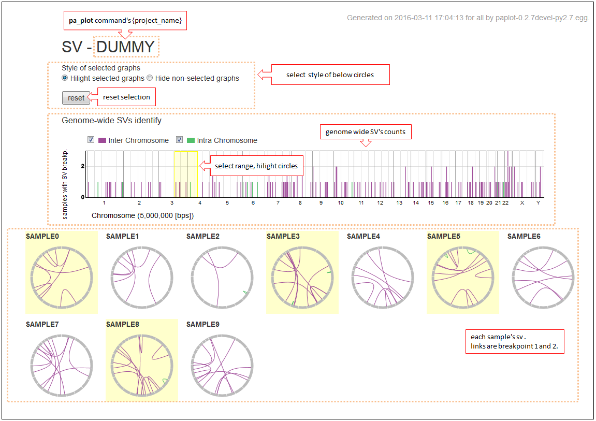
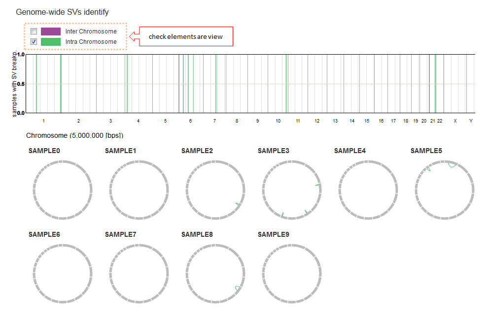
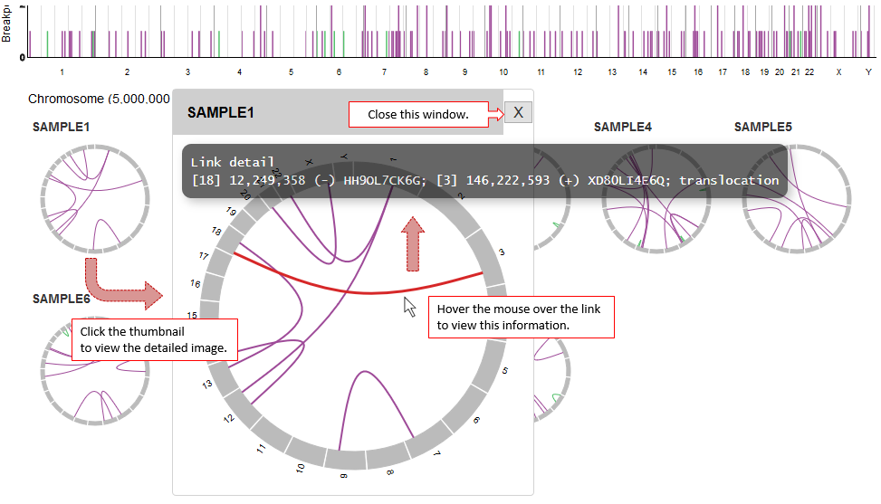

==========================================
Chromosomal Aberration レポート
==========================================

| CA (Chromosomal Aberration) レポートではStructural Variation (SV) 等、染色体間の変異を円形のプロットで可視化し、棒グラフでその分布を表示します。

* 棒グラフでは全サンプルで切断点を集計した数を表示します。
* 円形のプロットでは、サンプルごとに切断点 1 と 2 を線でつないで表示します。

| 棒グラフを選択すると選択されたゲノム領域に切断点を持つサンプルが選択されます。
| 選択方法は [ハイライト] と [選択したもののみ表示（他を隠す）] の 2 通りあり、先頭のオプションボタンで選択できます。

| 棒グラフの積み上げ要素は2つあり、2つの切断点が染色体をまたいでいるか、もしくは同一染色体内かで色を分けています。（※）
| チェックを外すと、その要素は表示されません。
|
| ※ グループ化について
| ここに示しているグループ化はデフォルトの設定です。
| 設定ファイルによりグループ要素を変更できます。設定方法は `変異のグルーピング <./data_ca.html#ca-group>`_ を参照してください。

| サンプルごとの円形のグラフをクリックすると拡大表示します。
| 切断点をつなぐ線の上にマウスを乗せると詳細を表示します。

