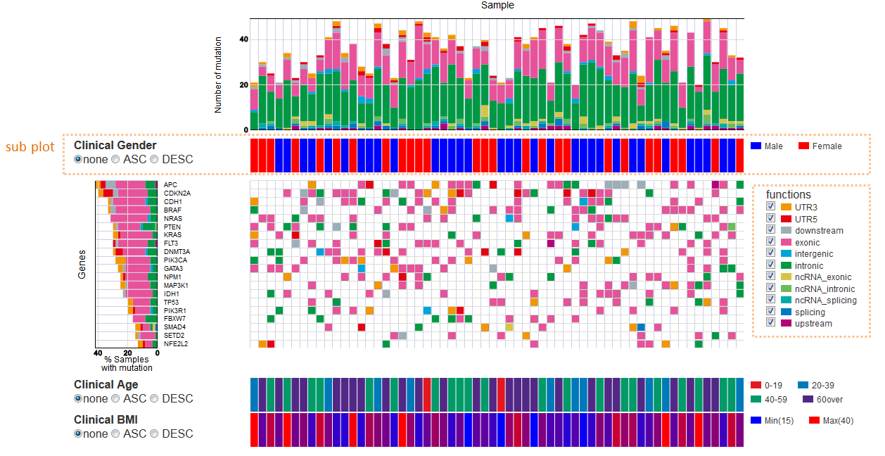
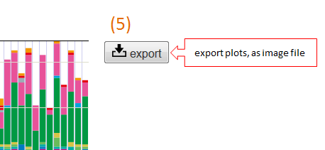
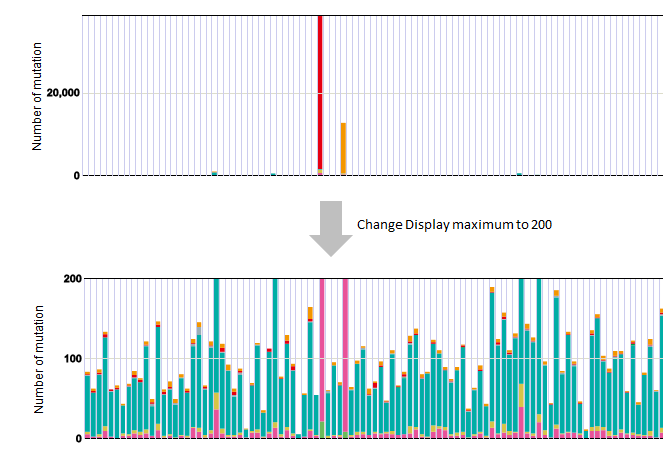

===========================
Mutation Matrix レポート
===========================

Mutation Matrix レポートは検出した変異について縦軸を遺伝子(Gene)、横軸をサンプル(Sample) として、変異タイプ別に表示します。

:横長の棒グラフ (Sample): サンプルごとに検出された変異の数を表示します。
:縦長の棒グラフ (Gene): 遺伝子ごとの変異数をサンプル数における割合 (%) で表示します。

  - 同一のサンプルが同じ遺伝子に対して複数の変異を持っていた場合、変異数を 1 としてカウントします。
  - 同一のサンプルが同じ遺伝子に対して複数の変異タイプを持っていた場合、優先順位の高い変異タイプにカウントします。

:Mutation type: 変異タイプ別に色分けして表示します。表示したくない変異タイプがある場合、Mutation type のチェックを外すことで除外できます。
:Subplot: 変異データとは別にサンプルに対するデータがある場合、サブプロットとして表示することができます。このファイルは ``paplot`` コマンド実行前に設定ファイルに記入しておく必要があります。

**操作方法**

.. image:: image/mut_operation2.PNG
  :scale: 100%

1. Axis-X sort 
---------------

横軸の並び順を変更します。

 - None ... ソートしない
 - ASC ... 昇順
 - DESC ... 降順

以下の要素でソートでき、ソート条件を複数指定することが可能です。

:Sample ID: サンプルの名前順
:Mutation number: サンプルごとの変異数
:Genes: 遺伝子ごとの変異数。ASC/DESC どちらかを選択したのち、横のリストボックスから遺伝子名を選択し、[Add sort key] ボタンをクリックしてください。
:Automatic Gantt-chart:
  自動的にGantt-chartを作成します。
  と、いっても技術者におなじみのガントチャートではありません。次で説明します。
  使用する遺伝子の数を横のエディットボックスに入力したのち、[Gantt-chart] ボタンをクリックしてください。

**Gantt-chart**

| 縦軸を遺伝子 (Gene) の変異数の多い順に並べ、横軸をその遺伝子の変異を持っているかどうかで並び替えます。
| まず、先頭の遺伝子から並べ、指定された遺伝子の数だけ繰り返します。
| 検出された遺伝子の数だけ繰り返すのが理想ですが、処理が重くなるため、関心のある遺伝子までに絞ったほうが処理が早くなります。
|

.. image:: image/mut_operation3.PNG
  :scale: 100%

2. Axis-Y sort
----------------

縦軸の並び順を変更します。

 - None ... ソートしない
 - ASC ... 昇順
 - DESC ... 降順

以下の要素でソートでき、複数ソート可能です。

:Mutation number: 遺伝子ごとの変異数
:Gene name: 遺伝子の名前順

3. Sample filter
------------------

| 横長の棒グラフ (Sample) の縦軸の最大値を設定します。
|
| いくつかのサンプルだけ飛びぬけて変異数が多く、他はそれほど変異がないような場合、この機能を使用することで、グラフが見やすくなることがあります。
| 表示したい最大値を横のエディットボックスに入力したのち、[Update filter] ボタンをクリックしてください。
| 空白にすると、すべてを表示します。(初期値)
|

**フィルター適用前と適用後**

| 最大値を 200 に設定した場合の表示例
| 

4. Genes filter
-----------------

縦軸に表示する遺伝子に対してフィルタを設定します。

:Rate: 検出された遺伝子のサンプル数における割合 (%)。初期値は 0% (フィルタリングなし) です。
:Display maximum: 表示する遺伝子の最大数。

いずれも横のエディットボックスに入力したのち、[Update filter] ボタンをクリックしてください。

