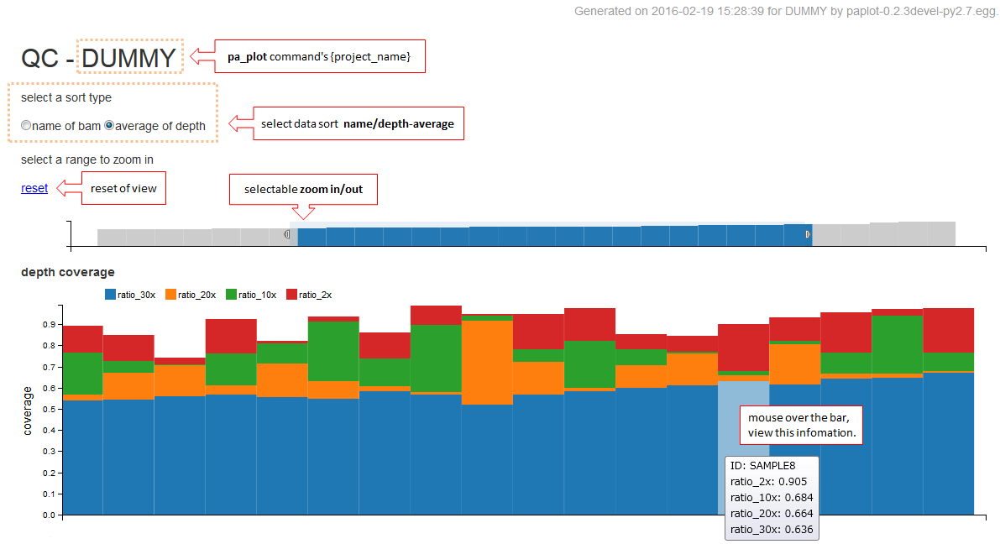

==============
QC レポート
==============

| QC (Quality Control) レポートではアライメント率やカバレッジ率など、シーケンスデータの品質を表示します。
|
| 先頭の背の低いグラフはbamファイルごとのdepth 平均値です。
| このグラフを範囲選択することで他のグラフの拡大ができます。
| それぞれのグラフではマウスを乗せると詳細を表示します。
|

.. |new| image:: image/tab_001.gif
