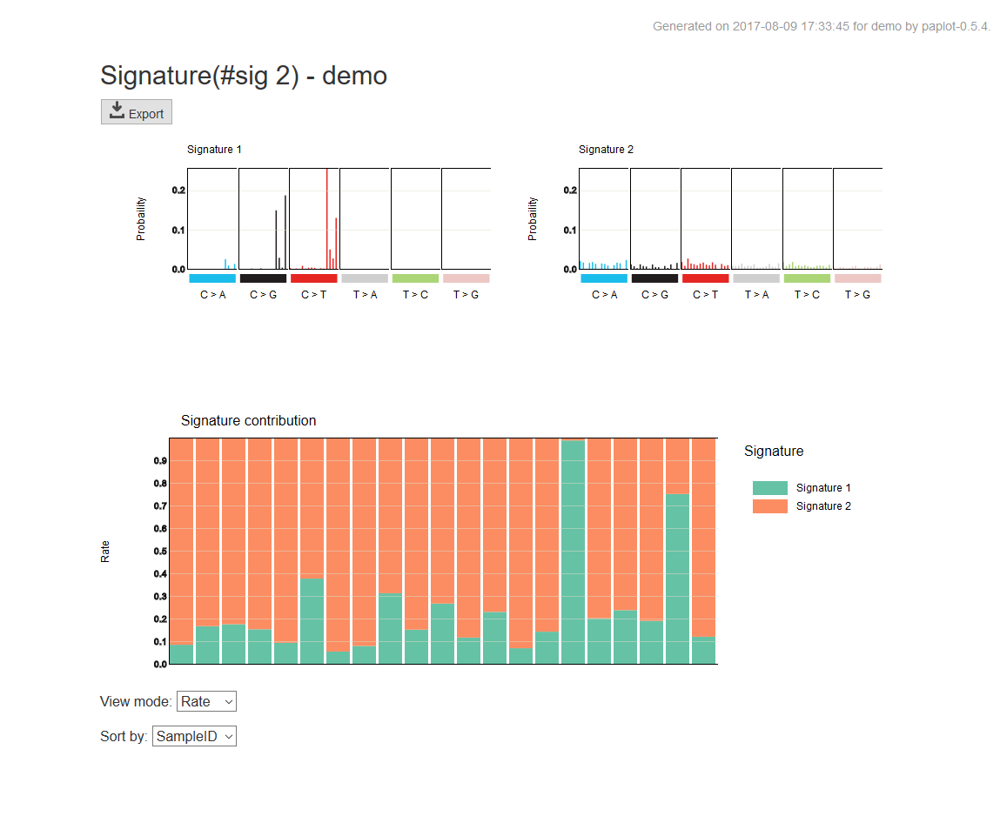
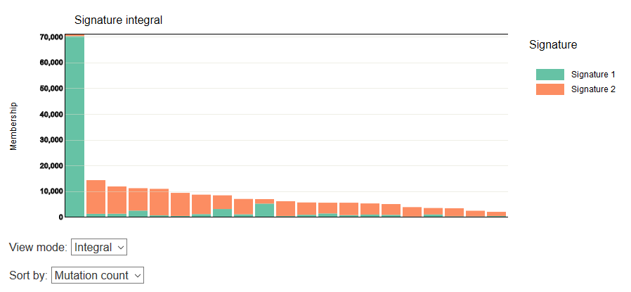
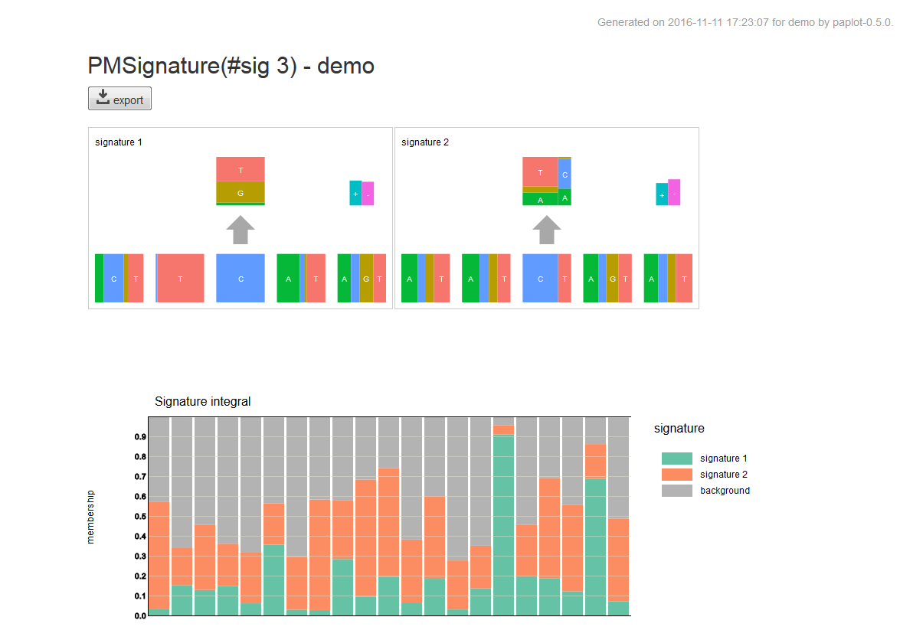

=============================
Mutaitonal Signature レポート
=============================

Mutaitonal Signature レポートでは検出した変異についての特徴的なパターン (変異シグネチャ) を表示します。

:上段 (Signature):
  変異シグネチャを表示します。

:下段 (寄与度グラフ):
  サンプルごとの変異について、変異シグネチャの寄与度を表示します。

また、最下段のリストボックスにより表示モード (View mode) を切り替えることができます。

:View mode:
  - Rate ... 変異の数を 1 としたときの変異シグネチャの割合を % で表示します。
  - Count ... 実際の変異数に占める割合を表示します。

:Sort by:
  - Sample ID ... サンプルID順
  - Mutation count ... 変異数の降順 (View mode が Count の場合のみ選択可能)

[View mode] で[Count] を選択し、[Sort by] で [Mutation count] を選択した場合の表示例

pmsignatureについても同様です。

.. |new| image:: image/tab_001.gif
