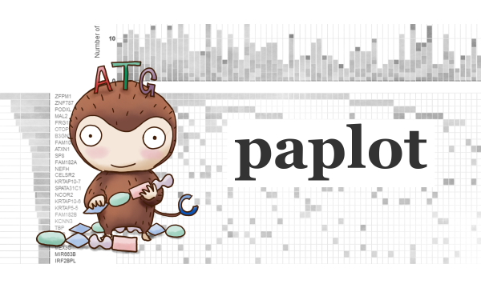

.. image:: https://img.shields.io/badge/python-2.7-blue.svg
    :target: https://img.shields.io/badge/python-2.7-blue.svg
.. image:: https://img.shields.io/badge/python-3.5-blue.svg
    :target: https://img.shields.io/badge/python-3.5-blue.svg

https://img.shields.io/badge/python-3.5-blue.svg

paplot documentation
========================

Contents:

.. toctree:: 
   :maxdepth: 2
   :caption: quick start
   :name: quick_start_toc
   
   about.rst
   quick_start.rst

.. toctree:: 
   :maxdepth: 2
   :caption: how to use graphs
   :name: how_to_toc
   
   howto_qc.rst
   howto_ca.rst
   howto_mat.rst
   howto_signature.rst

.. toctree:: 
   :maxdepth: 2
   :caption: install & setting
   :name: install_toc
   
   install.rst
   genomon.rst
   config.rst
   command.rst

.. toctree:: 
   :maxdepth: 2
   :caption: for advance
   :name: advance_toc
   
   config_qc.rst
   config_ca.rst
   config_mat.rst
   config_signature.rst
   config_pmsignature.rst
   style.rst

.. toctree:: 
   :maxdepth: 1
   :caption: Q & A
   :name: qa_toc
   
   qa.rst

.. toctree:: 
   :maxdepth: 1
   :caption: infomation
   :name: info_toc
   
   info.rst
   
Javascript Libraries
====================

paplot は次のjavascript パッケージを使用しています。

* `D3.js <https://d3js.org/>`_
* `d3-legend <http://d3-legend.susielu.com>`_

.. |new| image:: image/tab_001.gif
