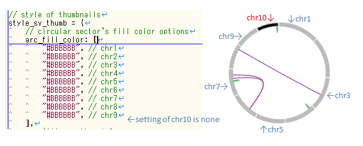

***************************
about install
***************************

``pa_plot conf`` でエラー
---------------------------

| ``PATH`` もしくは ``LD_LIBRARY_PATH`` の設定が不足しているときにおこります。
| :doc:`install` を確認してください。
|
| このようなエラーの場合、``PATH`` の設定が正しくありません。
|

.. code-block:: bash

  $ pa_plot conf
  -bash: /usr/bin/pa_plot: No such file or directory

| このようなエラーの場合、``LD_LIBRARY_PATH`` の設定が正しくありません。
|

.. code-block:: bash

  $ pa_plot conf
  Traceback (most recent call last):
    File "/usr/bin/pa_plot", line 4, in <module>
      __import__('pkg_resources').run_script('paplot===0.2.7devel', 'pa_plot')
  (省略)
  pkg_resources.DistributionNotFound: The 'paplot===0.2.7devel' distribution was not found and is required by the application

| ``pa_plot`` ファイルがない場合はインストールが成功していない可能性があります。
| 成功した場合は最後の3行がこのように表示されます。
| paplot-0.2.7の数字はバージョンによって変化します。
|

.. code-block:: bash

  $ python setup.py build install

  (最後の3行)
  Installed /usr/lib/python2.7/site-packages/paplot-0.2.7devel-py2.7.egg
  Processing dependencies for paplot===0.2.7devel
  Finished processing dependencies for paplot===0.2.7devel

***************************
about graphs
***************************

グラフを画像で保存したい
----------------------------

| 画像で保存する機能はありません。
| ブラウザやOSに付属のスクリーンショットで代用ください。
|
| スクリーンショットでを作成するには以下のようなアプリケーションがあります。
| 

* 1. ブラウザのアドオンを使用する。

代表的なアドオン

 - firefox ... Screengrab
 - chrome ... Full Page Screen Capture
 - IE ... `Snapcrab for IE <http://www.fenrir-inc.com/jp/snapcrab/plugin.html>`_

* 2. OS 標準アプリケーション

 - Windows ... Snipping Tool (「スタート」→「すべてのプログラム」→「アクセサリ」→「Snipping Tool」)
 - MacOSX ... グラブ (Finder → 「移動」メニュー → 「アプリケーション」を選択 → 「ユーティリティ」ディレクトリを開く → 「グラブ」)

グラフの色が黒くなる
----------------------------

| 設定が不足していると黒色で表示されます。
| styleファイルで該当する項目を設定してください。
|
|
| デフォルトのままであれば、styleファイルは ``{html出力ディレクトリ}/style/default.js`` にあります。
| 該当する項目は :doc:`style` で確認してください。
| 

svでchr10の設定が不足している例。

SVで表示するchromosomeを限定するにはどうしたらよいか
------------------------------------------------------------

configファイルで次の項目を編集してください。

.. code-block:: cfg

  [sv]
  # 使用するchromosomes (,で区切る)
  # default
  # use_chrs = 1,2,3,4,5,6,7,8,9,10,11,12,13,14,15,16,17,18,19,20,21,22,X,Y
  
  # chromosome 1,5,7を使用する場合
  use_chrs = 1,5,7

編集したconfigファイルは次のようにしてコマンドから指定します。

``pa_plot {input files} {output directory} {title} --config_file {config file}``

SVでヒト以外のゲノムを使用するにはどうしたらよいか
------------------------------------------------------------

genomeサイズが入力されたファイルが必要です。

先頭列にchromosome名、2列目にサイズをカンマ ``,`` 区切りで入力してください。

.. code-block:: cfg
  
  1,249250621
  2,243199373
  3,198022430
  7,159138663
  8,146364022
  X,141213431
  Y,135534747
  9_gl000201_random,36148
  11_gl000202_random,40103
  17_gl000204_random,81310
  17_gl000205_random,174588
  Un_gl000214,137718

chromosome名は分析したいファイルのChr1, Chr2で使用されている名称と同じでなければなりません。

.. image:: image/qa_genome_size.PNG

configファイルで用意したゲノムサイズのファイルを指定してください。

.. code-block:: cfg

  [genome]
  # ゲノムサイズのファイル（CSV形式）（デフォルトはhg19, installディレクトリ配下のgenomeディレクトリにあります）
  #
  # for example.
  # (linux)
  # path = ~/tmp/genome/hg19.csv
  # (windows)
  # path = C:\genome\hg19_part.csv
  path = {ここにゲノムサイズのファイルのパスを指定する}

編集したconfigファイルは次のようにしてコマンドから指定します。

``pa_plot {input files} {output directory} {title} --config_file {config file}``

