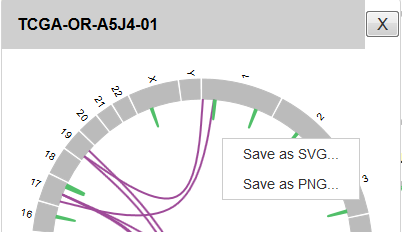

***************************
インストールに関すること
***************************

``paplot conf`` でエラー
---------------------------

| ``PATH`` もしくは ``LD_LIBRARY_PATH`` の設定が不足しているときにおこります。
| :doc:`install` を確認してください。
|
| このようなエラーの場合、``PATH`` の設定が正しくありません。

.. code-block:: bash

  $ paplot conf
  -bash: /usr/bin/paplot: No such file or directory

| このようなエラーの場合、``LD_LIBRARY_PATH`` の設定が正しくありません。

.. code-block:: bash

  $ paplot conf
  Traceback (most recent call last):
    File "/usr/bin/paplot", line 4, in <module>
      __import__('pkg_resources').run_script('paplot===0.2.7devel', 'paplot')
  (省略)
  pkg_resources.DistributionNotFound: The 'paplot===0.2.7devel' distribution was not found and is required by the application

| paplot ファイルがない場合はインストールが成功していない可能性があります。
| 成功した場合は最後の 3 行がこのように表示されます。
| paplot-0.2.7 の数字はバージョンによって変化します。
|

.. code-block:: bash

  $ python setup.py build install

  (最後の 3 行)
  Installed /usr/lib/python2.7/site-packages/paplot-0.2.7devel-py2.7.egg
  Processing dependencies for paplot===0.2.7devel
  Finished processing dependencies for paplot===0.2.7devel

***************************
各レポートに関すること
***************************

グラフを画像で保存したい
----------------------------

| paplot v0.4.0 より画像保存機能が追加されました。
| それぞれのプロットにある [Export] ボタンをクリックしてください。
| メニューが表示されますので、SVG / PNG どちらか希望するフォーマットを選択してください。
|

.. image:: image/qa_export.PNG

| 出力フォーマット
|

 - SVG ... タグで記載されたテキストファイルです。SVG 対応の画像編集ソフトウェアのほか、各種ウェブブラウザでも表示できます。
 - PNG ... 画像ファイルです。背景透過処理を施しています。
 
| なお、1 プロットのみ保存したい場合は、それぞれのプロットの上で右クリックで保存することも可能です。
|

.. note::

  この機能は以下のウェブブラウザで確認しています。うまく動かない場合は、最新のバージョンにアップデートするか、別のウェブブラウザをお試しください。
  
  + Windows
  
    - Firefox (47.0)
    - Chrome (51.0)
    - Internet Explorer11 (11.0)
   
  + Mac
   
    - Firefox (45.2)
    - Chrome (52.0)
    - Safari (9.1.2)

Chromeの場合
+++++++++++++++++++++++++++

フォーマット選択後、自動的にダウンロードされます。

Firefoxの場合
+++++++++++++++++++++++++++

フォーマット選択後、ダウンロードに関するメッセージが表示されますので、任意の場所に保存してください。

.. image:: image/qa_export_firefox.PNG

IEの場合
+++++++++++++++++++++++++++

 - SVG ... フォーマット選択後、ダウンロード画面が表示されますので、任意の場所に保存してください。
 - PNG ... 画像が新しいタブで表示されますので、右クリックして「名前を付けて画像を保存…」を選択してください。

Safariの場合
+++++++++++++++++++++++++++

 - SVG ... 画像が新しいタブで表示されますので、右クリックして「ページを別名で保存…」を選択してください。

 | 各項目は次のように指定してください。
 |   書き出し名「{任意の名前}.svg」
 |   フォーマット「ページのソース」
 |
 
 - PNG ... 画像が新しいタブで表示されますので、右クリックして「イメージを別名で保存…」を選択してください。

.. attention::

  新しいタブが開かない場合、以下の設定を確認ください。
  Safari→環境設定→セキュリティ→Webコンテンツ→「ポップアップウィンドウを開かない」チェックを外す

表示に時間がかかる
---------------------

| データの数が多すぎると表示に時間がかかる、もしくは表示されないことがあります。
| 
| データの数 (変異の数)、サンプル数および表示マシンの性能に依存しますので一概には規定できませんが、表示されない場合はサンプル数や検出ソフトのフィルタ条件の見直し等が必要です。

.. |new| image:: image/tab_001.gif
