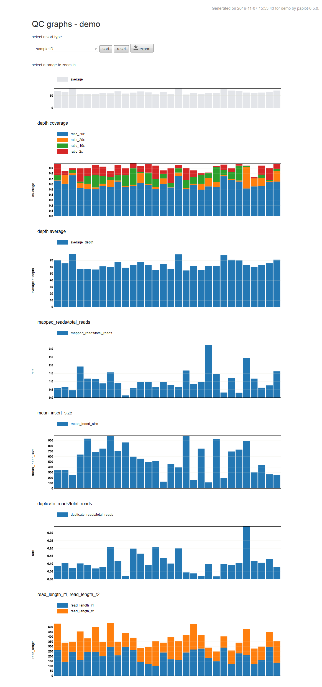
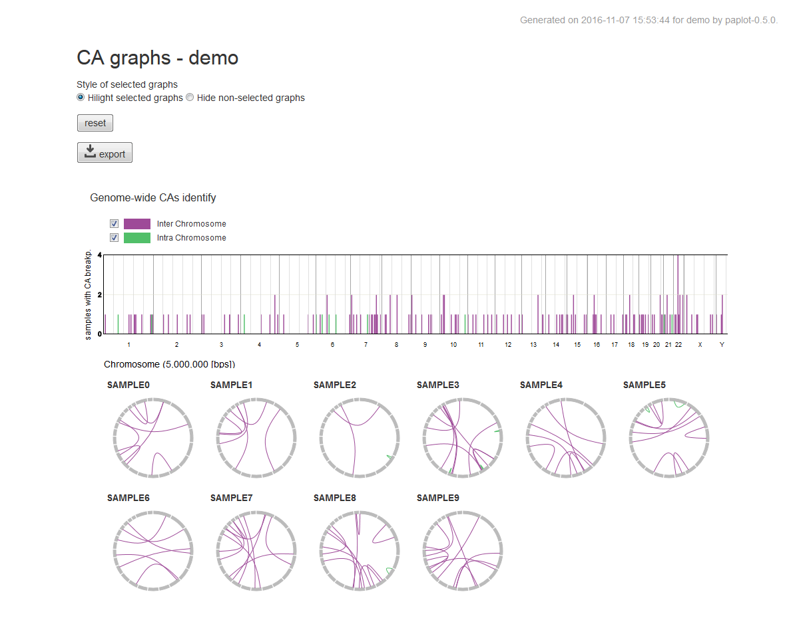

*****************
quick start
*****************

#. paplotをインストール
#. testサンプルでコマンドを実行
#. 結果ファイルを表示

1. paplotをインストール
---------------------------

| paplotはPython2.7およびPython 3.5で動作確認しています。
| また、paplotは追加パッケージを必要としません。
| より詳しいインストール手順は :doc:`install` を参照してください。
|

.. code-block:: bash

  cd {install したいディレクトリ}
  # v0.5.3の場合
  wget https://github.com/Genomon-Project/paplot/archive/v0.5.3.zip
  unzip v0.5.3.zip
  cd paplot-0.5.3/

  python setup.py build install

| 正しくインストールされたか確認します。
|

**installの確認**

| 以下を入力してください。

.. code-block:: bash

  paplot conf

| このように表示されればインストール成功です。

.. code-block:: bash

  **********************
     hello paplot !!!
  **********************
  
  config file:/usr/lib/python2.7/site-packages/{paplot-versoion}-py2.7.egg/config/paplot.cfg
  (このあとにデフォルト設定の内容が表示されます)

2. サンプルデータでコマンドを実行
---------------------------------

| paplotはコマンドから使用します。
| 
| 基本的な使い方次の通りです。
| 詳細なオプションは :doc:`command` を参照してください。
|

.. code-block:: bash

  paplot subcommand [--config_file CONFIG_FILE] [--title TITLE]
                    [--ellipsis ELLIPSIS] [--overview OVERVIEW]
                    [--remarks REMARKS]
                    input output_dir project_name

|

**必須**

:subcommand:
  paplotのサブコマンドです。いずれかを選択します。
  
  - qc
  - ca
  - mutation
  - signature
  - pmsignature

:input:
  入力ファイルです。

:output_dir:
  出力ディレクトリを指定します。ディレクトリ構成は次の章を参照してください。

:project_name:
  プロジェクト名です。出力ファイルのタイトルに使用します。

サンプルデータを用意していますので実行します。

.. code-block:: bash

  cd {paplotをインストールしたディレクトリ}

  # QCレポート
  paplot qc example/qc_brush/data.csv ./tmp demo

  # CAレポート
  paplot ca example/ca_option/data.csv ./tmp demo

  # mutation-matrixレポート
  paplot mutation example/mutation_option/data.csv ./tmp demo

  # signatureレポート
  paplot signature "example/signature_integral/data*.json" ./tmp demo

  # pmsignatureレポート
  paplot pmsignature "example/pmsignature_integral/data*.json" ./tmp demo

3. 結果ファイルを表示
------------------------

HTMLファイルができていますか？

.. code-block:: bash

  {output_dir} で指定したディレクトリ
    ├ demo
    │   ├ graph_ca.html            <--- ca レポート
    │   ├ graph_mut.html           <--- mutation-matrix レポート
    │   ├ graph_pmsignature2.html  <--- pmsignature レポート (数字はsignature数)
    │   ├ graph_pmsignature3.html
    │   ├ graph_pmsignature4.html
    │   ├ graph_pmsignature5.html
    │   ├ graph_pmsignature6.html
    │   ├ graph_qc.html            <--- qc レポート
    │   ├ graph_signature2.html    <--- signature レポート (数字はsignature数)
    │   ├ graph_signature3.html
    │   ├ graph_signature4.html
    │   ├ graph_signature5.html
    │   └ graph_signature6.html
    │
    ├ js          <--- この4つのディレクトリはHTMLファイルを表示するために必要です。消さないでください。
    ├ layout
    ├ lib
    ├ style
    │
    └ index.html             <--- このファイルを web ブラウザで開いてください。

| index.htmlファイルを web ブラウザで開いてください。
|
| ※HGCスパコン等、サーバ上で実行した場合はファイルをローカルに転送するか、サーバ上の仮想ウィンドウ(NoMachime等)で表示してください。
|   ローカルに転送する場合は、:file:`tmp` ディレクトリを丸ごとコピーしてください。
| 
| 次のように見えていますか?
| 
| **QC レポート**

| **CA レポート**

| **mutation-matrix レポート**

.. image:: image/mut_dummy.PNG
  :scale: 100%

| **signature レポート**

.. image:: image/sig_dummy.PNG
  :scale: 100%

| **pmsignature レポート**

.. image:: image/pmsig_dummy.PNG
  :scale: 100%

| それぞれのレポートの使い方は `how to use graphs <./index.html#how-to-toc>`_ を参照してください。
|

.. |new| image:: image/tab_001.gif
