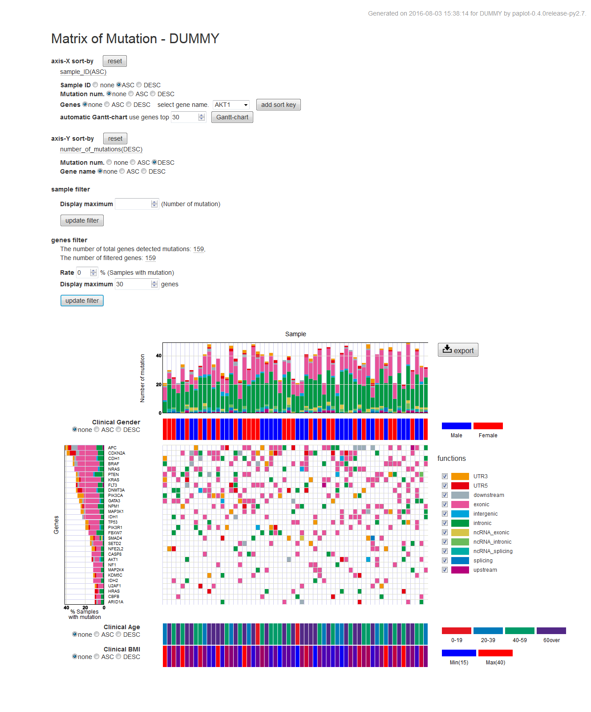

*****************
quick start
*****************

#. paplotをインストール
#. testサンプルでコマンドを実行
#. 結果ファイルを表示

1. paplotをインストール
---------------------------

| ここではサーバサイドでのインストールを記載しています。
| ここでうまくいかない方、個人のPCにインストールする方は :doc:`install` を参照してください。
|
| HGCスパコンで使用する場合、事前に ``qlogin`` してください。
|

.. code-block:: bash

  git clone -b master https://github.com/Genomon-Project/paplot.git
  cd paplot
  
  python setup.py build install --user

**installの確認**

| 以下を入力してください。

.. code-block:: bash

  pa_plot conf

| このように表示されればインストール成功です。

.. code-block:: bash

  **********************
     hello paplot !!!
  **********************
  
  config file:/usr/lib/python2.7/site-packages/{paplot-versoion}-py2.7.egg/config/paplot.cfg
  (このあとにデフォルト設定の内容が表示されます)

2. testサンプルでコマンドを実行
---------------------------------

テストサンプルを用意していますので実行します。

.. code-block:: bash

  cd {paplotをインストールしたディレクトリ}

  # create bar graphs of qc
  pa_plot qc "example/qc/*.csv" ./tmp DUMMY --config_file example/example.cfg

  # create bundle graphs of Structural Variation (SV)
  pa_plot sv "example/sv/*.txt" ./tmp DUMMY --config_file example/example.cfg

  # create bundle graphs of Structural Variation (mutation-matrix)
  pa_plot mutation example/mutation/sample_merge.csv ./tmp DUMMY --config_file example/example.cfg

3. 結果ファイルを表示
------------------------

HTMLファイルができていますか？

.. code-block:: bash

  {paplot をインストールしたディレクトリ}
    └ tmp
        ├ DUMMY
        │   ├ graph_mut.html    <--- mutation-matrix グラフ
        │   ├ graph_qc.html     <--- qc グラフ
        │   └ graph_ca.html     <--- ca グラフ
        │
        ├ js          <--- この4つのディレクトリはHTMLファイルを表示するために必要です。消さないでください。
        ├ layout
        ├ lib
        ├ style
        |
        └ index.html             <--- このファイルを web ブラウザで開いてください。

| HTMLファイルを web ブラウザで開いてください。
|
| ※HGCスパコン等、サーバ上で実行した場合はファイルをローカルに転送するか、サーバ上の仮想ウィンドウ(NoMachime等)で表示してください。
|   ローカルに転送する場合は、:file:`tmp` ディレクトリを丸ごとコピーしてください。
| 
| 次のように見えていますか?
| 
| **QC グラフ**

.. image:: image/qc_dummy.png
  :scale: 100%

| **CA グラフ**

.. image:: image/sv_dummy.png
  :scale: 100%

| **mutation-matrix グラフ**

| それぞれのグラフの使い方は :doc:`how to use graphs<use_graph>` を参照してください。
|
