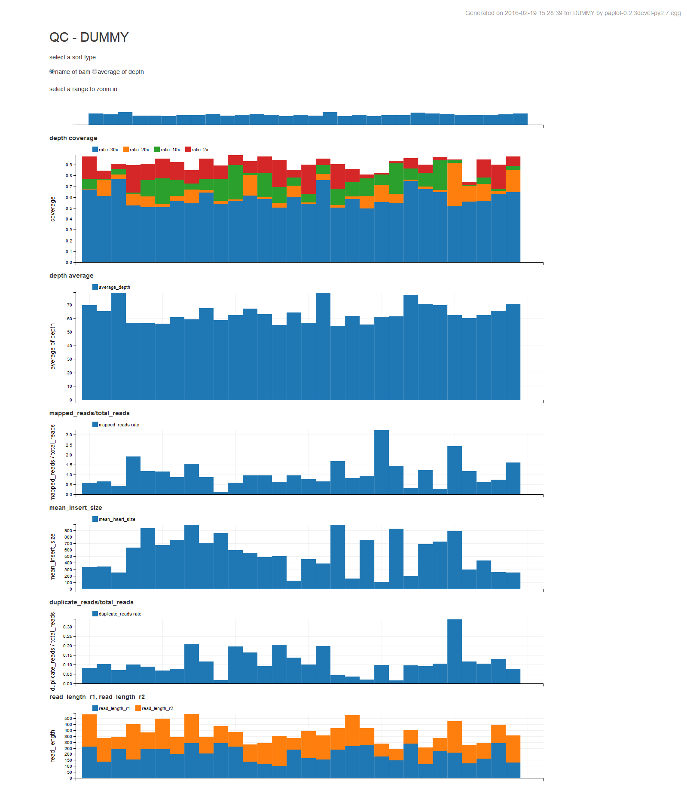
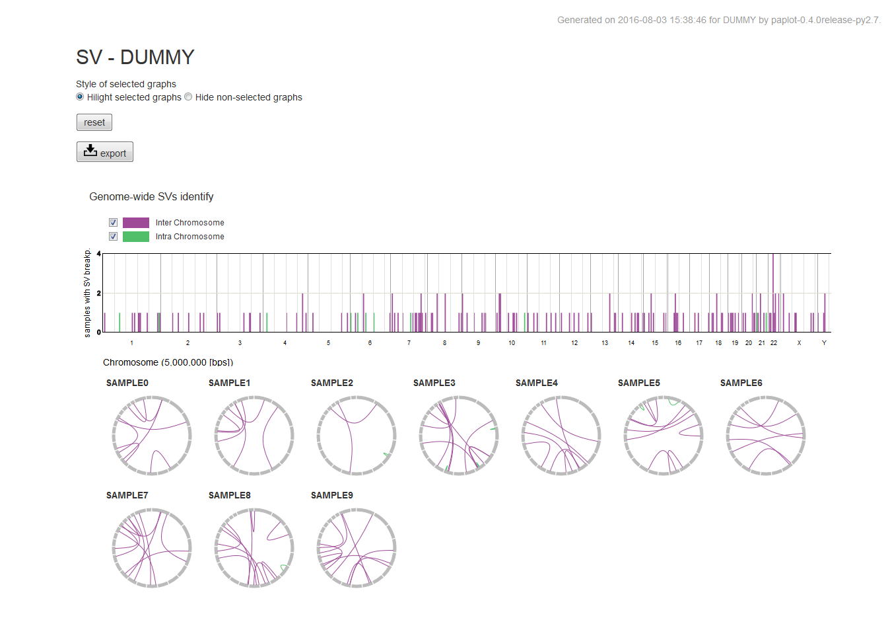

*****************
quick start
*****************

#. paplotをインストール
#. testサンプルでコマンドを実行
#. 結果ファイルを表示

0. python環境を用意
======================

| すでに持っている方は次へ進んでください。
| 持っていない方は :doc:`install` を参照してください。

1. paplotをインストール
---------------------------

| HGCスパコンで使用する場合、事前に :command:`qlogin` してください。

.. code-block:: bash

  git clone https://github.com/Genomon-Project/paplot.git
  cd paplot
  
  # 通常のパソコンの場合
  python setup.py build install

  # サーバの場合
  python setup.py build install --user

| installの確認
| 以下を入力してください。

.. code-block:: bash

  pa_plot conf

| 次の内容が表示されればインストール成功です。

.. code-block:: bash

  **********************
     hello paplot !!!
  **********************
  (このあとにデフォルト設定の内容が表示されます)

2. testサンプルでコマンドを実行
---------------------------------

テストサンプルを用意していますので実行します。

.. code-block:: bash

  cd {paplotをインストールしたディレクトリ}

  # create bar graphs of qc
  pa_plot qc "example/qc/*.csv" ./tmp DUMMY --config_file example/example.cfg

  # create bundle graphs of Structural Variation (SV)
  pa_plot sv "example/sv/*.txt" ./tmp DUMMY --config_file example/example.cfg

3. 結果ファイルを表示
------------------------

次の場所にHTMLファイルが2つできていますか？

.. code-block:: bash

  {paplot をインストールしたディレクトリ}
    └ tmp
        ├ DUMMY
        │   ├ graph_qc.html     <--- qc グラフ 
        │   └ graph_sv.html     <--- sv グラフ
        │
        ├ js          <--- この3つのディレクトリはHTMLファイルを表示するために必要です。消さないでください。
        ├ lib
        └ style

| HTMLファイルを web ブラウザで開いてください。
|
| ※HGCスパコン等、サーバ上で実行した場合はファイルをローカルに転送するか、サーバ上の仮想ウィンドウ(NoMachime等)で表示してください。
|   ローカルに転送する場合は、:file:`tmp` ディレクトリを丸ごとコピーしてください。
| 
| 次のように見えていますか?

