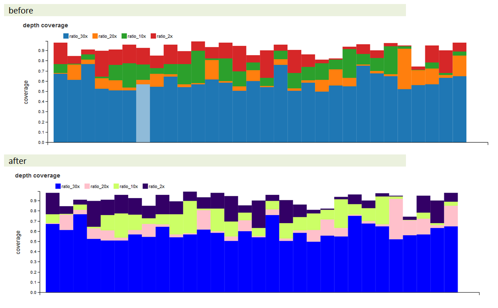
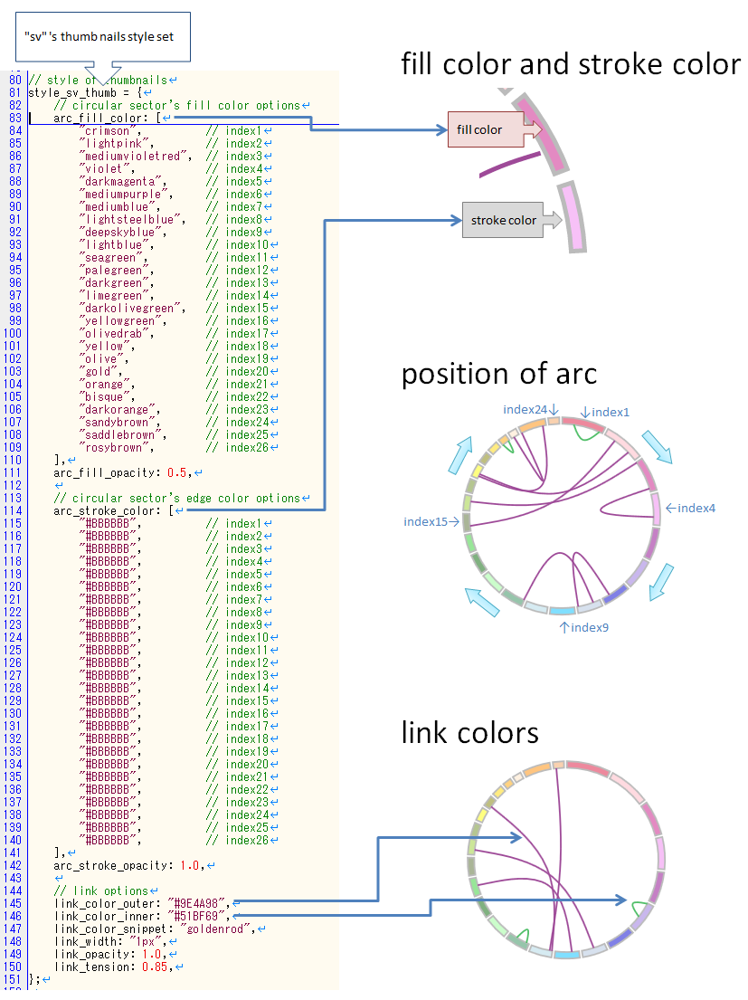
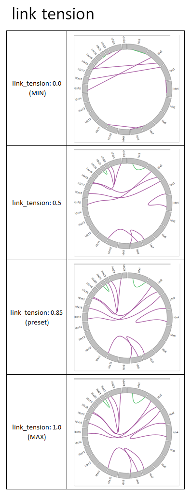

***************************
グラフの色を変更する
***************************

1. 変更方法
=======================

グラフのスタイル情報はある程度変更することができます。

サンプルを用意していますので変更してみます。

1-1. スタイルファイルを編集する
---------------------------------

``{paplotをインストールしたディレクトリ}/example/default.js``

このファイルをコピーして ``{paplotをインストールしたディレクトリ}/example/mystyle.js`` というファイルを作成します。

※ファイル名は任意ですが、拡張子は ``.js`` にしてください。

作成したファイルを開いて次の箇所を変更します。

今回はqcグラフのcoverage グラフの色を変更します。

.. code-block:: javascript

  // 7行目
  // 変更前
  bar_coverage_color: [
    "#1F77B4", // ratio_30x
    "#FF7F0E", // ratio_20x
    "#2CA02C", // ratio_10x
    "#D62728", // ratio_2x
  ],
  
  // 変更後
   bar_coverage_color: [
    "blue",    // ratio_30x
    "pink",    // ratio_20x
    "#CCFF66", // ratio_10x
    "#330066", // ratio_2x
  ],

----

補足

色の指定はRGBもしくは色名で指定することができます。

.. code-block:: javascript

  // RGBで指定する場合
  bar_select_color: "#1F77B4",
  // color nameで指定する場合
  bar_select_color: "red",

1-2. 設定ファイルを編集する
---------------------------------

``{paplotをインストールしたディレクトリ}/example/example.cfg``

このファイルを開いて次の箇所を変更します。

スタイルファイルを今回作成したものを使用するように変更します。

.. code-block:: cfg

  [style]
  path = {paplotをインストールしたディレクトリ}/example/mystyle.js
  
  # ~/tmpにインストールした場合はこのようになる
  # ~/tmp/paplot/example/mystyle.js

1-3. 出力する
---------------------

.. code-block:: bash

  cd {paplotをインストールしたディレクトリ}
  pa_plot qc "example/qc/*.csv" ./tmp STYLE --config_file example/example.cfg

作成されたHTMLファイルをブラウザで開いてください。

次のようにQCのcoverageグラフの色が変更されていますか？

1-4. 出力されたファイルを変更する
--------------------------------------

上で作成したファイルは次のディレクトリにコピーされています。

すでにpaplotで出力したHTMLファイルを変更する場合、スタイルファイル (mystyle.js) を編集し、再読み込み(ブラウザで ``F5`` )すれば反映されます。

.. code-block:: bash

  ./tmp
    ├ STYLE
    │   ├ graph_qc.html
    │   └ graph_sv.html
    │
    ├ js
    ├ lib
    └ style
        ├ default.js     <--- デフォルト
        └ mystyle.js     <--- 今回作成したファイル

2. qcグラフ
=======================

スタイルの対応は次の通りです。

.. image:: image/style-qc.PNG
  :scale: 100%

3. sv (サムネイル)
=======================

スタイルの対応は次の通りです。

  
linkのテンション(張り具合)について、設定値と見た目は次の通りです。

  
linkの透過度について、設定値と見た目は次の通りです。

.. image:: image/link-opacity.PNG
  :scale: 100%
  
4. sv (詳細表示)
=======================

スタイルの対応は次の通りです。

.. image:: image/style-sv-detail.PNG
  :scale: 100%
