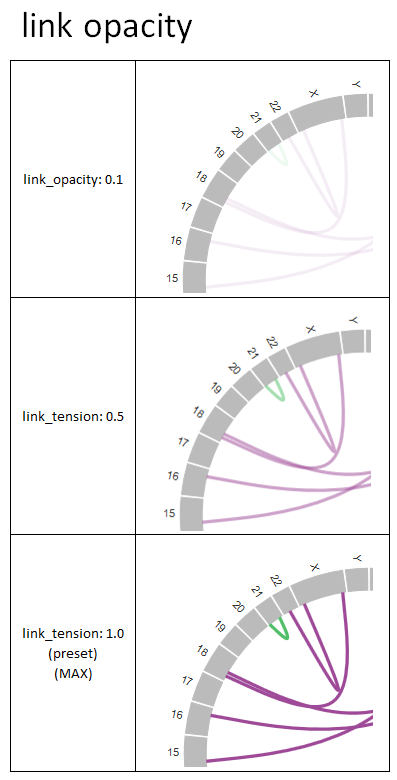

***************************
グラフをカスタマイズする
***************************

1. 変更方法
=======================

| 色やテキストなど、グラフの見た目はある程度変更することができます。
| グラフの見た目は 2 つのファイルで設定します。
| 
| 1 つ目は設定ファイルです。
| 入力データに依存する要素 （グラフのバーの色や凡例、ポップアップの文字列など）は設定ファイルで設定します。
| 設定ファイルの記入例は以下を参照ください。
|

 - :doc:`config`
 - :doc:`config_qc` 
 - :doc:`config_ca` 
 - :doc:`config_mat` 
 - :doc:`config_signature` 
 - :doc:`config_pmsignature` 

| 2 つ目は style ファイルです。
| 入力データに依存しない要素を設定します。
| ここでは、style ファイルについて記載します。
|

1-1. style ファイルを編集する
---------------------------------

デフォルトの style ファイルはここにあります。

``{paplot をインストールしたディレクトリ}/example/default.js``

このファイルをコピーして 新しい style ファイルを作成します。

ここでは、例としてこのように作成します。 ``{paplotをインストールしたディレクトリ}/example/mystyle.js``

※ファイル名は任意ですが、拡張子は ``.js`` にしてください。

作成したファイルを開いて変更します。

.. note::

  色の指定は RGB もしくは色名で指定することができます。
  
  .. code-block:: javascript
  
    // RGB で指定する場合
    bar_select_color: "#1F77B4",
    // 色名で指定する場合
    bar_select_color: "red",
  
  **RGB で指定する場合**
  
  | Red → Green → Blueの順に ``00～FF`` まで、6 桁の 16 進表記で指定し、先頭に ``#`` をつけてください。
  |
  
  **色名について**
  
  | UNIX X11 カラーともいい、わかりやすくするために 140 色に名称がついています。
  | ここで定義されている色名であれば、RGB 値の代わりに指定することができます。
  | 
  | https://www.w3.org/TR/css3-color/#svg-color
  

1-2. 設定ファイルを編集する
---------------------------------

今回作成したスタイルファイルを使用するように設定ファイルを変更します。

``{paplot をインストールしたディレクトリ}/example/example.cfg``

このファイルを開いて次の箇所を変更します。

.. code-block:: cfg

  [style]
  path = {paplot をインストールしたディレクトリ}/example/mystyle.js
  
  # ~/tmp にインストールした場合はこのようになる
  # ~/tmp/paplot/example/mystyle.js

1-3. paplot を実行する
----------------------------------

.. code-block:: bash

  cd {paplot をインストールしたディレクトリ}
  paplot qc "example/qc/*.csv" ./tmp style_test --config_file example/example.cfg

1-4. 出力されたファイルを変更する
--------------------------------------

上で作成したファイルは次のディレクトリにコピーされています。

すでに paplot で出力した HTML ファイルを変更する場合、スタイルファイル (mystyle.js) を編集し、再読み込み (ウェブブラウザで ``F5``) すれば反映されます。

.. code-block:: bash

  ./tmp
    ├ style_test
    │   └ graph_qc.html
    │
    ├ js
    ├ layout
    ├ lib
    └ style
        ├ default.js     <--- デフォルト
        └ mystyle.js     <--- 今回作成したファイル

2. 設定項目
=======================

.. code-block:: javascript

  (function(){
  style_general = {
      font_family: "'Helvetica Neue', Helvetica, Arial, sans-serif",
  }
  
  // style of quality check graphs
  style_qc = {
      brush_border_y_color: "#DDDDCC",
      brush_border_y_opacity: 0.5,
      plot_border_y_color: "#DDDDCC",
      plot_border_y_opacity: 0.2,
      title_y_font_size: "12px",
      legend_title_font_size: "16px",
      legend_text_font_size: "12px",
  };
  
  // style of genome-wide bar plot
  style_sv_bar = {
      // title's text options
      title_y: "samples with CA breakp.",
      title_y_font_size: "12px",
  
      title_x: "Chromosome",
      title_x_font_size: "14px",
      
      legend_title: "Genome-wide CAs identify",
      legend_title_font_size: "16px",
      legend_text_font_size: "12px",
      
      border_x_main_color: "#E0E0E0",
      border_x_main_width: "1px",
      border_x_sub_color: "#A6A6A6",
      border_x_sub_width: "1px",
      border_y_color: "#DDDDCC",
      border_y_opacity: 0.5,
      
      axis_x_font_size: "9px",
  };
  
  // style of thumbnails
  style_sv_thumb = {
      // circular sector's color options
      arc_fill_opacity: 1.0,
      arc_stroke_opacity: 1.0,
      
      // link options
      link_width: "1px",
      link_opacity: 1.0,
  };
  
  // style of detail image (on click)
  style_sv_detail = {
      // windows header
      win_header_text_color: "#000000",
      win_header_background_color: "#CFCFCF",
      win_border_color: "#D3D3D3",
      win_border_width: "1px",
      win_background_color: "white",
      
      // circular sector's color options
      arc_fill_opacity: 1.0,
      arc_stroke_opacity: 1.0,
      
      // circular sector's label options
      arc_label_fontsize: "10px",
      arc_label_color: "#333333",
      
      // link options
      link_width: "2px",
      link_opacity: 1.0,
      
      // link(on mouse) options
      link_select_color: "#d62728",
      link_select_width: "3px",
      link_select_opacity: 1.0,
  };
  
  // style of Mutaion Matrix
  style_mut = {
      // title's text options
      title_sample: "Sample",
      title_sample_font_size: "14px",
      title_sample_y: "Number of mutation",
      title_sample_y_font_size: "12px",
      virtical_border_x_color: "#CCCCEE",
      virtical_border_x_width: "1px",
      virtical_border_y_color: "#DDDDCC",
      virtical_border_y_opacity: 0.5,
      
      title_gene: "Genes",
      title_gene_font_size: "14px",
      title_gene_y1: "% Samples",
      title_gene_y2: "with mutationg",
      title_gene_y1_font_size: "12px",
      title_gene_y2_font_size: "12px",
      horizon_border_x_color: "#CCCCEE",
      horizon_border_x_width: "1px",
      horizon_border_y_color: "#DDDDCC",
      horizon_border_y_opacity: 0.5,
      
      // legend
      legend_title: "functions",
      legend_title_font_size: "16px",
      legend_text_font_size: "12px",
      
      // gene
      gene_text_font_size: "9px",
      
      // subplot
      sub_border_color: "#FFFFFF",
      sub_border_width: "1px",
      
  };
  
  // style of Mutational Signature
  style_signature = {
      // stack-integral
      title_integral: "Signature integral",
      title_integral_font_size: "16px",
      title_integral_y: "membership",
      title_integral_y_font_size: "12px",
      legend_integral_title_font_size: "16px",
      legend_integral_text_font_size: "12px",
      
      // stack-rate
      title_rate: "Signature rate",
      title_rate_font_size: "16px",
      title_rate_y: "membership",
      title_rate_y_font_size: "12px",
      legend_rate_title_font_size: "16px",
      legend_rate_text_font_size: "12px",
      
      //stack-common
      plot_border_y_color: "#DDDDCC",
      plot_border_y_opacity: 0.5,
      
      // signature
      signature_title_font_size: "12px",
      signature_title_y: "probaility",
      signature_title_y_font_size: "12px",
      signature_title_x_font_size: "12px",
      border_y_color: "#DDDDCC",
      border_y_opacity: 0.5,
  };
  
  // style of pmsignature
  style_pmsignature = {
      // stack-integral
      title_integral: "Signature integral",
      title_integral_font_size: "16px",
      title_integral_y: "membership",
      title_integral_y_font_size: "12px",
      legend_integral_title_font_size: "16px",
      legend_integral_text_font_size: "12px",
      
      // stack-rate
      title_rate: "Signature rate",
      title_rate_font_size: "16px",
      title_rate_y: "membership",
      title_rate_y_font_size: "12px",
      legend_rate_title_font_size: "16px",
      legend_rate_text_font_size: "12px",
      
      //stack-common
      plot_border_y_color: "#DDDDCC",
      plot_border_y_opacity: 0.5,
      
      // signature
      signature_alt_font_size: "10px",
      signature_ref_font_size: "10px",
      signature_strand_font_size: "10px",
      signature_title_font_size: "12px",
  };
  })();

| 透過度 (opacity) について、設定値と見た目は次の通りです。
| 0~1 の間で設定することができ、0 で透明、1 で不透明となります。

  
.. |new| image:: image/tab_001.gif
